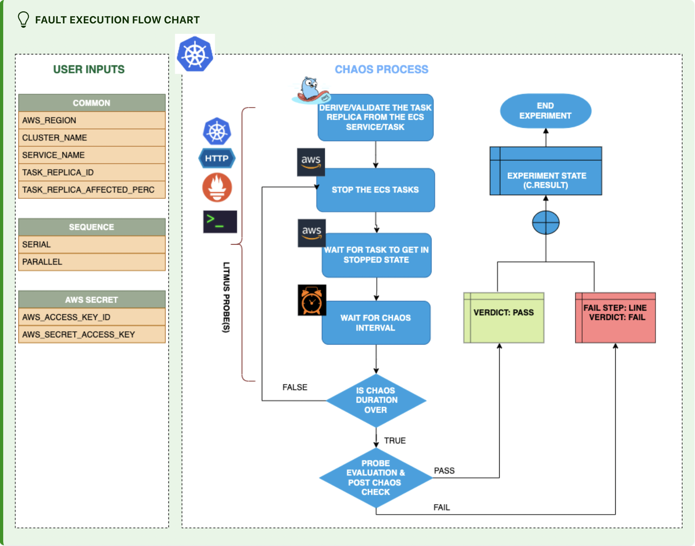

## Introduction

- It inject chaos to stop the ECS tasks based on the services or task replica Id and checks the task availability.

:::tip Fault execution flow chart

:::

## Uses

<details>
<summary>View the uses of the fault</summary>
<div>
ECS task stop chaos is another very common and frequent scenario we find with ECS clusters that can result in unavailability of the application running on the Tasks.
</div>
</details>

## Prerequisites

:::info

- Ensure that Kubernetes Version >= 1.17

- Ensure that you have sufficient AWS access to stop the ECS tasks.

- Ensure to create a Kubernetes secret having the AWS access configuration(key) in the `CHAOS_NAMESPACE`. A sample secret file looks like:

```yaml
apiVersion: v1
kind: Secret
metadata:
  name: cloud-secret
type: Opaque
stringData:
  cloud_config.yml: |-
    # Add the cloud AWS credentials respectively
    [default]
    aws_access_key_id = XXXXXXXXXXXXXXXXXXX
    aws_secret_access_key = XXXXXXXXXXXXXXX
```

- If you change the secret key name (from `cloud_config.yml`) please also update the `AWS_SHARED_CREDENTIALS_FILE` ENV value in the ChaosExperiment CR with the same name.
:::

## Permission Requirement

- Here is an example AWS policy to execute this fault.

<details>
<summary>View policy for this fault</summary>

```json
{
    "Version": "2012-10-17",
    "Statement": [
        {
            "Sid": "VisualEditor0",
            "Effect": "Allow",
            "Action": [
                "ecs:ListServices",
                "ecs:ListTasks",
                "ecs:StopTask",
                "ecs:DescribeServices",
                "ecs:DescribeTasks"
            ],
            "Resource": "*"
        }
    ]
}
```
</details>

- Refer a [superset permission/policy](../policy-for-all-aws-faults) to execute all AWS faults.

## Default Validations

:::info

- Target ECS tasks should be in healthy state.

:::

## Fault Tunables   

<details>
    <summary>Check the Fault Tunables</summary>
    <h2>Mandatory Fields</h2>
    <table>
        <tr>
        <th> Variables </th>
        <th> Description </th>
        <th> Notes </th>
        </tr>
        <tr> 
        <td> CLUSTER_NAME </td>
        <td> Name of the target ECS cluster</td>
        <td> Eg. cluster-1 </td>
        </tr>
        <tr>
        <td> REGION </td>
        <td> The region name of the target ECS cluster</td>
        <td> Eg.us-east-1 </td>
        </tr>
        <tr>
        <td> SERVICE_NAME </td>
        <td> The target ECS service name</td>
        <td> Eg. app-svc </td>
        </tr>
        <tr>
        <td> TASK_REPLICA_ID </td>
        <td> The target task replica Ids comma seperated</td>
        <td> SERVICE_NAME and TASK_REPLICA_ID are mutually exclusive, If both are provided SERVICE_NAME will be prioritized. </td>
        </tr>
    </table>
    <h2>Optional Fields</h2>
    <table>
      <tr>
        <th> Variables </th>
        <th> Description </th>
        <th> Notes </th>
      </tr>
      <tr>
        <td> TOTAL_CHAOS_DURATION </td>
        <td> The total time duration for chaos insertion (sec) </td>
        <td> Defaults to 30s </td>
      </tr>
      <tr>
        <td> CHAOS_INTERVAL </td>
        <td> The interval (in sec) between successive instance termination.</td>
        <td> Defaults to 30s </td>
      </tr>
      <tr>
        <td> TASK_REPLICA_AFFECTED_PERC </td>
        <td> Percentage of total task to be targeted </td>
        <td> Defaults to 100 </td>
      </tr>
      <tr>
        <td> SEQUENCE </td>
        <td> It defines sequence of chaos execution for multiple instance</td>
        <td> Default value: parallel. Supported: serial, parallel </td>
      </tr>
      <tr>
        <td> RAMP_TIME </td>
        <td> Period to wait before and after injection of chaos in sec </td>
        <td> Eg. 30 </td>
      </tr>
      <tr> 
        <td> AWS_SHARED_CREDENTIALS_FILE </td>
        <td> Provide the path for aws secret credentials</td>
        <td> Defaults to <code>/tmp/cloud_config.yml</code> </td>
      </tr>
    </table>
</details>

## Fault Examples

### Common and AWS specific tunables

Refer the [common attributes](../common-tunables-for-all-faults) and [AWS specific tunable](./aws-fault-tunables) to tune the common tunables for all faults and aws specific tunables.

### ECS Service Name

It will stop the tasks that are part of the particular service by using `SERVICE_NAME` ENV as shown below. 

Use the following example to tune this:

[embedmd]:# (./static/manifests/ecs-task-stop/task-stop-svc.yaml yaml)
```yaml
# stop the tasks of an ECS cluster
apiVersion: litmuschaos.io/v1alpha1
kind: ChaosEngine
metadata:
  name: engine-nginx
spec:
  engineState: "active"
  annotationCheck: "false"
  chaosServiceAccount: litmus-admin
  experiments:
  - name: ecs-task-stop
    spec:
      components:
        env:
        # provide the name of ECS cluster
        - name: CLUSTER_NAME
          value: 'demo'
        - name: SERVICE_NAME
          vale: 'test-svc'
        - name: REGION
          value: 'us-east-1'
        - name: TOTAL_CHAOS_DURATION
          VALUE: '60'
```

### ECS Task Replica Ids

It will stop all the task are set by using `TASK_REPLICA_ID` ENV as shown below.

Use the following example to tune this:

[embedmd]:# (./static/manifests/ecs-task-stop/task-stop-task.yaml yaml)
```yaml
# stop the tasks of an ECS cluster
apiVersion: litmuschaos.io/v1alpha1
kind: ChaosEngine
metadata:
  name: engine-nginx
spec:
  engineState: "active"
  annotationCheck: "false"
  chaosServiceAccount: litmus-admin
  experiments:
  - name: ecs-task-stop
    spec:
      components:
        env:
        # provide the name of ECS cluster
        - name: CLUSTER_NAME
          value: 'demo'
        - name: TASK_REPLICA_ID
          vale: '1b751cf956e34e54b9d83b6a5c067f60,20d5041c044941dfb2126f1722d10558'
        - name: REGION
          value: 'us-east-1'
        - name: TOTAL_CHAOS_DURATION
          VALUE: '60'
```

### ECS Task Replica Affected Percentage

It will randomly select the number of task to be targeted based upon the percentage by using `TASK_REPLICA_AFFECTED_PERC` ENV as shown below.

Use the following example to tune this:

[embedmd]:# (./static/manifests/ecs-task-stop/task-stop-task-affected.yaml yaml)
```yaml
# stop the tasks of an ECS cluster
apiVersion: litmuschaos.io/v1alpha1
kind: ChaosEngine
metadata:
  name: engine-nginx
spec:
  engineState: "active"
  annotationCheck: "false"
  chaosServiceAccount: litmus-admin
  experiments:
  - name: ecs-task-stop
    spec:
      components:
        env:
        # provide the name of ECS cluster
        - name: CLUSTER_NAME
          value: 'demo'
        - name: SERVICE_NAME
          vale: 'test-svc'
        - name: TASK_REPLICA_AFFECTED_PERC
          vale: '100'
        - name: REGION
          value: 'us-east-1'
        - name: TOTAL_CHAOS_DURATION
          VALUE: '60'
```