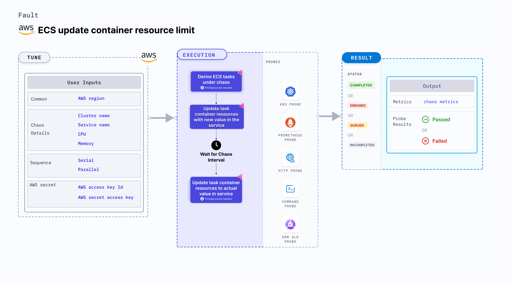

ECS update container resource limits allows you to modify the CPU and memory resources of containers in an Amazon ECS (Elastic Container Service) task.
This experiment primarily involves ECS Fargate and doesn't depend on EC2 instances. [They](/docs/chaos-engineering/chaos-faults/aws/ec2-and-serverless-faults#serverless-faults) focus on altering the state or resources of ECS containers without direct container interaction.



## Use cases
ECS update container resource limit:
- Determines the behavior of your ECS tasks when their resource limits are changed.
- Verifies the scalability and resilience of your ECS tasks under different resource configurations.
- Modifies the resource limits of a container by updating the task definition associated with the ECS service or task.
- Simulates scenarios where containers experience changes in their allocated resources, which may affect their performance or availability. For example, you can increase or decrease the CPU or memory limits of a container to test how your application adapts to changes in resource availability.
- Validates the behavior of your application and infrastructure during simulated resource limit changes, such as:
  - Testing how your application scales up or down in response to changes in CPU or memory limits.
  - Verifying the resilience of your system when containers are running with lower resource limits.
  - Evaluating the impact of changes in resource limits on the performance and availability of your application.

:::warning
Modifying the container resource limits using the ECS update container resource limit is an intentional disruption and should be used carefully in controlled environments, such as during testing or staging, to avoid any negative impact on the production workloads.
:::

### Prerequisites
- Kubernetes >= 1.17
- ECS cluster running with the desired tasks and containers and familiarity with ECS service update and deployment concepts.
- Create a Kubernetes secret that has the AWS access configuration(key) in the `CHAOS_NAMESPACE`. Below is a sample secret file:

```yaml
apiVersion: v1
kind: Secret
metadata:
  name: cloud-secret
type: Opaque
stringData:
  cloud_config.yml: |-
    # Add the cloud AWS credentials respectively
    [default]
    aws_access_key_id = XXXXXXXXXXXXXXXXXXX
    aws_secret_access_key = XXXXXXXXXXXXXXX
```

:::tip
HCE recommends that you use the same secret name, that is, `cloud-secret`. Otherwise, you will need to update the `AWS_SHARED_CREDENTIALS_FILE` environment variable in the fault template with the new secret name and you won't be able to use the default health check probes.
:::

Below is an example AWS policy to execute the fault.

```json
{
    "Version": "2012-10-17",
    "Statement": [
        {
            "Effect": "Allow",
            "Action": [
                "ecs:DescribeTasks",
                "ecs:DescribeServices",
                "ecs:DescribeTaskDefinition",
                "ecs:RegisterTaskDefinition",
                "ecs:UpdateService",
                "ecs:ListTasks",
                "ecs:DeregisterTaskDefinition"
            ],
            "Resource": "*"
        },
        {
            "Effect": "Allow",
            "Action": [
                "iam:PassRole"
            ],
            "Resource": "*"
        }
    ]
}
```

:::info note
- Refer to [AWS named profile for chaos](./security-configurations/aws-switch-profile.md) to use a different profile for AWS faults.
- The ECS containers should be in a healthy state before and after introducing chaos.
- Refer to the [common attributes](/docs/chaos-engineering/chaos-faults/common-tunables-for-all-faults.md) and [AWS-specific tunables](./aws-fault-tunables.md) to tune the common tunables for all faults and aws specific tunables.
- Refer to the [superset permission/policy](./security-configurations/policy-for-all-aws-faults.md) to execute all AWS faults.
:::

### Mandatory tunables
   <table>
        <tr>
          <th> Tunable </th>
          <th> Description </th>
          <th> Notes </th>
        </tr>
        <tr>
          <td> CLUSTER_NAME </td>
          <td> Name of the target ECS cluster. </td>
          <td> For example, <code>cluster-1</code>. </td>
        </tr>
        <tr>
          <td> SERVICE_NAME </td>
          <td> Name of the ECS service under chaos. </td>
          <td> For example, <code>nginx-svc</code>. </td>
        </tr>
        <tr>
          <td> REGION </td>
          <td> Region name of the target ECS cluster</td>
          <td> For example, <code>us-east-1</code>. </td>
        </tr>
    </table>

### Optional tunables
  <table>
      <tr>
        <th> Tunable </th>
        <th> Description </th>
        <th> Notes </th>
      </tr>
      <tr>
        <td> TOTAL_CHAOS_DURATION </td>
        <td> Duration that you specify, through which chaos is injected into the target resource (in seconds). </td>
        <td> Default: 30s. For more information, go to <a href="/docs/chaos-engineering/chaos-faults/common-tunables-for-all-faults#duration-of-the-chaos"> duration of the chaos. </a></td>
      </tr>
      <tr>
        <td> CHAOS_INTERVAL </td>
        <td> Interval between successive instance terminations (in seconds).</td>
        <td> Default: 30s. For more information, go to <a href="/docs/chaos-engineering/chaos-faults/common-tunables-for-all-faults#chaos-interval"> chaos interval.</a></td>
      </tr>
      <tr>
        <td> AWS_SHARED_CREDENTIALS_FILE </td>
        <td> Path to the AWS secret credentials.</td>
        <td> Defaults to <code>/tmp/cloud_config.yml</code>. </td>
      </tr>
      <tr>
        <td> CPU </td>
        <td> CPU resouce set of the target ECS container. </td>
        <td> Default: 256. For more information, go to <a href="#cpu-and-memory-resource-limit"> CPU limit.</a> </td>
      </tr>
      <tr>
        <td> Memory </td>
        <td> Memory resouce set of the target ECS container</td>
        <td> Default: 256. For more information, go to <a href="#cpu-and-memory-resource-limit"> memory limit.</a> </td>
      </tr>
      <tr>
        <td> RAMP_TIME </td>
        <td> Period to wait before and after injecting chaos (in seconds).  </td>
        <td> For example, 30 s. For more information, go to <a href="/docs/chaos-engineering/chaos-faults/common-tunables-for-all-faults#ramp-time"> ramp time. </a></td>
      </tr>
    </table>


### CPU and memory resource limit

CPU and memory limit for the task containers. Tune it by using the `CPU` and `MEMORY` environment variables.

The following YAML snippet illustrates the use of this environment variable:

[embedmd]:# (./static/manifests/ecs-update-container-resource-limit/container-resource-limit.yaml yaml)
```yaml
# Set CPU and Memory container resouce for the target container
apiVersion: litmuschaos.io/v1alpha1
kind: ChaosEngine
metadata:
  name: aws-nginx
spec:
  engineState: "active"
  annotationCheck: "false"
  chaosServiceAccount: litmus-admin
  experiments:
  - name: ecs-update-container-resource-limit
    spec:
      components:
        env:
        - name: CPU
          value: '256'
        - name: MEMORY
          value: '256'
        - name: REGION
          value: 'us-east-2'
        - name: TOTAL_CHAOS_DURATION
          VALUE: '60'
```
