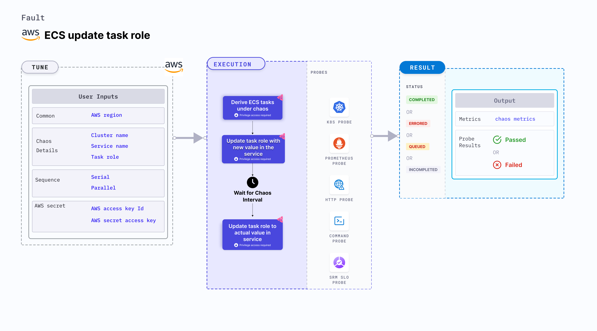

ECS update task role allows you to modify the IAM task role associated with an Amazon ECS (Elastic Container Service) task.
This experiment primarily involves ECS Fargate and doesn't depend on EC2 instances. [They](/docs/chaos-engineering/chaos-faults/aws/ec2-and-serverless-faults#serverless-faults) focus on altering the state or resources of ECS containers without direct container interaction.




## Use cases
ECS update task role:
- Determines the behavior of your ECS tasks when their IAM role is changed.
- Verifies the authorization and access permissions of your ECS tasks under different IAM configurations.
- Modifies the IAM task role associated with a container task by updating the task definition associated with the ECS service or task.
- Simulate scenarios where the IAM role associated with a task is changed, which may impact the authorization and access permissions of the containers running in the task.
- Validates the behavior of your application and infrastructure during simulated IAM role changes, such as:
  - Testing how your application handles changes in IAM role permissions and access.
  - Verifying the authorization settings of your system when the IAM role is updated.
  - Evaluating the impact of changes in IAM roles on the security and compliance of your application.

:::warning
Modifying the IAM task role using the ECS update task role is an intentional disruption and should be used carefully in controlled environments.
:::

### Prerequisites
- Kubernetes >= 1.17
- ECS cluster running with the desired tasks and containers and familiarity with ECS service update and deployment concepts.
- Create a Kubernetes secret that has the AWS access configuration(key) in the `CHAOS_NAMESPACE`. Below is a sample secret file:

```yaml
apiVersion: v1
kind: Secret
metadata:
  name: cloud-secret
type: Opaque
stringData:
  cloud_config.yml: |-
    # Add the cloud AWS credentials respectively
    [default]
    aws_access_key_id = XXXXXXXXXXXXXXXXXXX
    aws_secret_access_key = XXXXXXXXXXXXXXX
```

:::tip
HCE recommends that you use the same secret name, that is, `cloud-secret`. Otherwise, you will need to update the `AWS_SHARED_CREDENTIALS_FILE` environment variable in the fault template with the new secret name and you won't be able to use the default health check probes.
:::

Below is an example AWS policy to execute the fault.

```json
{
    "Version": "2012-10-17",
    "Statement": [
        {
            "Effect": "Allow",
            "Action": [
                "ecs:DescribeTasks",
                "ecs:DescribeServices",
                "ecs:DescribeTaskDefinition",
                "ecs:RegisterTaskDefinition",
                "ecs:UpdateService",
                "ecs:ListTasks",
                "ecs:DeregisterTaskDefinition"
            ],
            "Resource": "*"
        },
        {
            "Effect": "Allow",
            "Action": [
                "iam:PassRole"
            ],
            "Resource": "*"
        }
    ]
}
```

:::info note
- Refer to [AWS named profile for chaos](./security-configurations/aws-switch-profile.md) to use a different profile for AWS faults.
- The ECS containers should be in a healthy state before and after introducing chaos.
- Refer to the [common attributes](/docs/chaos-engineering/chaos-faults/common-tunables-for-all-faults.md) and [AWS-specific tunables](./aws-fault-tunables.md) to tune the common tunables for all faults and AWS-specific tunables.
- Refer to the [superset permission/policy](./security-configurations/policy-for-all-aws-faults.md) to execute all AWS faults.
:::

### Mandatory tunables
  <table>
        <tr>
          <th> Tunable </th>
          <th> Description </th>
          <th> Notes </th>
        </tr>
        <tr>
          <td> CLUSTER_NAME </td>
          <td> Name of the target ECS cluster. </td>
          <td> For example, <code>cluster-1</code>. </td>
        </tr>
        <tr>
          <td> SERVICE_NAME </td>
          <td> Name of the ECS service under chaos. </td>
          <td> For example, <code>nginx-svc</code>. </td>
        </tr>
        <tr>
          <td> REGION </td>
          <td> Region name of the target ECS cluster</td>
          <td> For example, <code>us-east-1</code>. </td>
        </tr>
    </table>

### Optional tunables
  <table>
      <tr>
        <th> Tunable </th>
        <th> Description </th>
        <th> Notes </th>
      </tr>
      <tr>
        <td> TOTAL_CHAOS_DURATION </td>
        <td> Duration that you specify, through which chaos is injected into the target resource (in seconds). </td>
        <td> Default: 30 s. For more information, go to <a href="/docs/chaos-engineering/chaos-faults/common-tunables-for-all-faults#duration-of-the-chaos"> duration of the chaos. </a></td>
      </tr>
      <tr>
        <td> CHAOS_INTERVAL </td>
        <td> Interval between successive instance terminations (in seconds).</td>
        <td> Default: 30 s. For more information, go to <a href="/docs/chaos-engineering/chaos-faults/common-tunables-for-all-faults#chaos-interval"> chaos interval.</a></td>
      </tr>
      <tr>
        <td> AWS_SHARED_CREDENTIALS_FILE </td>
        <td> Path to the AWS secret credentials.</td>
        <td> Default: <code>/tmp/cloud_config.yml</code>. </td>
      </tr>
      <tr>
        <td> TASK_ROLE </td>
        <td> Provide a custom chaos role for the ECS Task containers. </td>
        <td> Default: no role. For more information, go to <a href="#task-role-specification"> task role specification.</a> </td>
      </tr>
      <tr>
        <td> RAMP_TIME </td>
        <td> Period to wait before and after injecting chaos (in seconds).  </td>
        <td> For example, 30 s. For more information, go to <a href="/docs/chaos-engineering/chaos-faults/common-tunables-for-all-faults#ramp-time"> ramp time. </a></td>
      </tr>
    </table>

### Task role specification

Task role for the ECS task containers. Tune it by using the `TASK_ROLE` environment variable.

The following YAML snippet illustrates the use of this environment variable:

[embedmd]:# (./static/manifests/ecs-update-task-role/task-role.yaml yaml)
```yaml
# Set task role resource for the target task
apiVersion: litmuschaos.io/v1alpha1
kind: ChaosEngine
metadata:
  name: aws-nginx
spec:
  engineState: "active"
  annotationCheck: "false"
  chaosServiceAccount: litmus-admin
  experiments:
  - name: ecs-update-task-role
    spec:
      components:
        env:
        - name: TASK_ROLE
          value: 'arn:aws:iam::149554801296:role/ecsTaskExecutionRole'
        - name: REGION
          value: 'us-east-2'
        - name: TOTAL_CHAOS_DURATION
          VALUE: '60'
```
