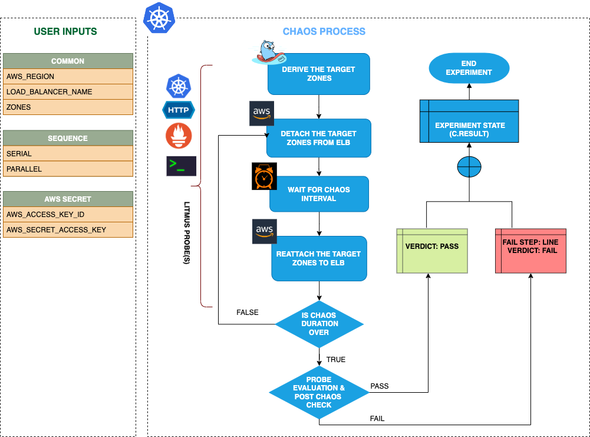

## Introduction
- It takes AZ down chaos on a target ELB for a specified duration. It causes access restrictions for certain availability zones.
- It tests application sanity, availability, and recovery workflows of the application pod attached to the load balancer.

:::tip Fault execution flow chart

:::

## Uses

<details>
<summary>View the uses of the fault</summary>
<div>
AZ down is another very common and frequent scenario we find with ELB that can break the connectivity with the given zones and impacts their delivery. Such scenarios can still occur despite whatever availability aids AWS provides.

Detaching the AZ from the load balancer will disrupt an application's performance and impact its smooth working. So this category of chaos fault helps build immunity in the application undergoing such scenarios.

</div>
</details>

## Prerequisites

:::info
- Kubernetes > 1.17
- AWS access to attach or detach an AZ from ELB.
- Minimum number of AZ is attached to the ELB, else the fault fails to detach the given AZ.
- Kubernetes secret that has the AWS access configuration(key) in the `CHAOS_NAMESPACE`. A sample secret file looks like:
```yaml
apiVersion: v1
kind: Secret
metadata:
  name: cloud-secret
type: Opaque
stringData:
  cloud_config.yml: |-
    # Add the cloud AWS credentials respectively
    [default]
    aws_access_key_id = XXXXXXXXXXXXXXXXXXX
    aws_secret_access_key = XXXXXXXXXXXXXXX
```
- If you change the secret key name (from `cloud_config.yml`), update the `AWS_SHARED_CREDENTIALS_FILE` environment variable value on `fault.yaml`with the same name.
:::

## Default Validations

:::info
- The ELB is attached to the given availability zones.
:::

## Fault tunables

<details>
    <summary>Check the Fault Tunables</summary>
    <h2>Mandatory Fields</h2>
    <table>
      <tr>
        <th> Variables </th>
        <th> Description </th>
        <th> Notes </th>
      </tr>
      <tr>
        <td> LOAD_BALANCER_NAME </td>
        <td> Provide the name of load balancer whose AZ has to be detached</td>
        <td> Eg. <code>elb-name</code> </td>
      </tr>
      <tr>
        <td> ZONES </td>
        <td> Provide the target zones that have to be detached from ELB</td>
        <td> Eg. <code>us-east-1a</code> </td>
      </tr>
      <tr>
        <td> REGION </td>
        <td> The region name for the target volumes</td>
        <td> Eg. <code>us-east-1</code> </td>
      </tr>
    </table>
    <h2>Optional Fields</h2>
    <table>
      <tr>
        <th> Variables </th>
        <th> Description </th>
        <th> Notes </th>
      </tr>
      <tr>
        <td> TOTAL_CHAOS_DURATION </td>
        <td> The time duration for chaos insertion (in seconds) </td>
        <td> Defaults to 30s </td>
      </tr>
      <tr>
        <td> CHAOS_INTERVAL </td>
        <td> The time duration between the attachment and detachment of the volumes (sec) </td>
        <td> Defaults to 30s </td>
      </tr>
      <tr>
        <td> SEQUENCE </td>
        <td> It defines sequence of chaos execution for multiple volumes</td>
        <td> Default value: parallel. Supported: serial, parallel </td>
      </tr>
      <tr>
        <td> RAMP_TIME </td>
        <td> Period to wait before and after injection of chaos in sec </td>
        <td> Eg: 30 </td>
      </tr>
    </table>
</details>

## Fault Examples

### Common and AWS specific tunables

Refer to the [common attributes](../common-tunables-for-all-faults) and [AWS specific tunable](./aws-fault-tunables) to tune the common tunables for all faults and aws specific tunables.

### Target Zones

It contains comma separated list of target zones. It can be tuned via `ZONES` environment variable.

Use the following example to tune it:

[embedmd]:# (./static/manifests/elb-az-down/target-zones.yaml yaml)
```yaml
# contains elb az down for given zones
apiVersion: litmuschaos.io/v1alpha1
kind: ChaosEngine
metadata:
  name: engine-nginx
spec:
  engineState: "active"
  chaosServiceAccount: litmus-admin
  experiments:
  - name: elb-az-down
    spec:
      components:
        env:
        # load balancer name for chaos
        - name: LOAD_BALANCER_NAME
          value: 'tes-elb'
        # target zones for the chaos
        - name: ZONES
          value: 'us-east-1a,us-east-1b'
        # region for chaos
        - name: REGION
          value: 'us-east-1'
```
