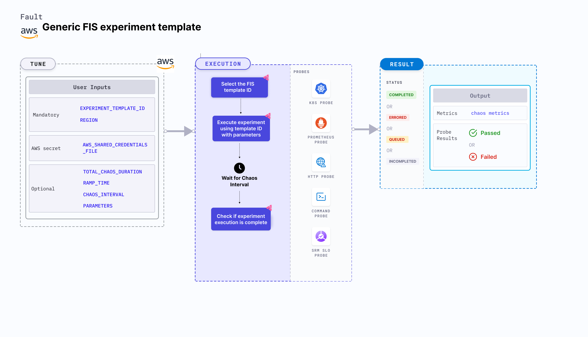

Generic experiment template provides a template to natively inject faults using FIS for different services, such as EC2, EBS, DynamoDB, and so on.
- You need to create an FIS template and store it.
- Provide parameters to the pre-created FIS templates and execute experiments.
- You can specify the template ID and region on Harness to execute the experiments using these FIS templates.
- You can monitor and report the results of executing the experiment from these FIS templates.



## Use cases
- Inject faults natively using FIS services.
- Monitor and report the results of executing the experiment from the FIS templates.
- Build chaos experiments with pre-defined templates or build experiments from scratch using FIS service.

### Prerequisites
- Kubernetes >= 1.17
- The Kubernetes secret should have AWS access configuration (key) in the `CHAOS_NAMESPACE`. A sample secret file looks like:
  ```yaml
  apiVersion: v1
  kind: Secret
  metadata:
    name: cloud-secret
  type: Opaque
  stringData:
    cloud_config.yml: |-
      # Add the cloud AWS credentials respectively
      [default]
      aws_access_key_id = XXXXXXXXXXXXXXXXXXX
      aws_secret_access_key = XXXXXXXXXXXXXXX
  ```

:::tip
HCE recommends that you use the same secret name, that is, `cloud-secret`. Otherwise, you will need to update the `AWS_SHARED_CREDENTIALS_FILE` environment variable in the fault template and you won't be able to use the default health check probes.
:::

Below is an example AWS policy to execute the fault.

```json
{
    "Version": "2012-10-17",
    "Statement": [
        {
            "Effect": "Allow",
            "Action": [
                "fis:CreateExperimentTemplate",
                "fis:StartExperiment",
                "fis:StopExperiment",
                "fis:GetExperiment",
                "fis:ListExperiments"
            ],
            "Resource": "*"
        },
        {
            "Effect": "Allow",
            "Action": [
                "cloudwatch:DescribeAlarms"
            ],
            "Resource": "*"
        }
    ]
}
```

:::info note
- Go to [AWS named profile for chaos](./security-configurations/aws-switch-profile.md) to use a different profile for AWS faults and [superset permission or policy](./security-configurations/policy-for-all-aws-faults.md) to execute all AWS faults.
- Go to the [common tunables](/docs/chaos-engineering/chaos-faults/common-tunables-for-all-faults.md) and [AWS-specific tunables](./aws-fault-tunables.md) to tune the common tunables for all faults and AWS-specific tunables.
:::

### Mandatory tunables

   <table>
      <tr>
        <th> Tunable </th>
        <th> Description </th>
        <th> Notes </th>
      </tr>
      <tr>
        <td> EXPERIMENT_TEMPLATE_ID </td>
        <td> Template ID that is used to inject chaos natively. </td>
        <td> </td>
      </tr>
      <tr>
        <td> REGION </td>
        <td> Region name for the target volumes</td>
        <td> For example, <code>us-east-1</code>. </td>
      </tr>
    </table>

### Optional tunables
  <table>
    <tr>
      <th> Tunable </th>
      <th> Description </th>
      <th> Notes </th>
    </tr>
    <tr>
      <td> TOTAL_CHAOS_DURATION </td>
      <td> Time duration for chaos insertion (sec) </td>
      <td> Default: 30 s. For more information, go to <a href="/docs/chaos-engineering/chaos-faults/common-tunables-for-all-faults#duration-of-the-chaos"> duration of the chaos. </a></td>
    </tr>
    <tr>
      <td> CHAOS_INTERVAL </td>
      <td> The time duration between the attachment and detachment of the volumes (sec) </td>
      <td> Default: 30 s. For more information, go to <a href="/docs/chaos-engineering/chaos-faults/common-tunables-for-all-faults#chaos-interval"> chaos interval.</a></td>
    </tr>
    <tr>
      <td> RAMP_TIME </td>
      <td> Period to wait before and after injection of chaos in sec </td>
      <td> For example, 30 s. For more information, go to <a href="/docs/chaos-engineering/chaos-faults/common-tunables-for-all-faults#ramp-time"> ramp time. </a></td>
    </tr>
    <tr>
      <td> AWS_SHARED_CREDENTIALS_FILE </td>
      <td> Path to the AWS secret credentials. </td>
      <td> Default: <code>/tmp/cloud_config.yml</code>. </td>
      </tr>
  </table>

### Experiment template ID

The template ID that is used to inject chaos. Select the template, fill in the values and reference its ID in the tunables. Tune it using the `EXPERIMENT_TEMPLATE_ID` environment variable.

The following YAML snippet illustrates the use of this environment variable:

[embedmd]:# (./static/manifests/generic-experiment-template/experiment-template-id.yaml yaml)
```yaml
kind: Workflow
apiVersion: argoproj.io/v1alpha1
metadata:
  name: fis-chaos
  namespace: litmus
spec:
  templates:
    - name: fis-chaos
      spec:
        components:
          env:
            - name: TOTAL_CHAOS_DURATION
              value: "60"
            - name: CHAOS_INTERVAL
              value: "60"
            - name: REGION
              value: ""
            - name: EXPERIMENT_TEMPLATE_ID
              value: ''
            - name: RAMP_TIME
              value: ""
            - name: AWS_SHARED_CREDENTIALS_FILE
              value: /tmp/cloud_config.yml
          secrets:
            - name: cloud-secret
              mountPath: /tmp/
```