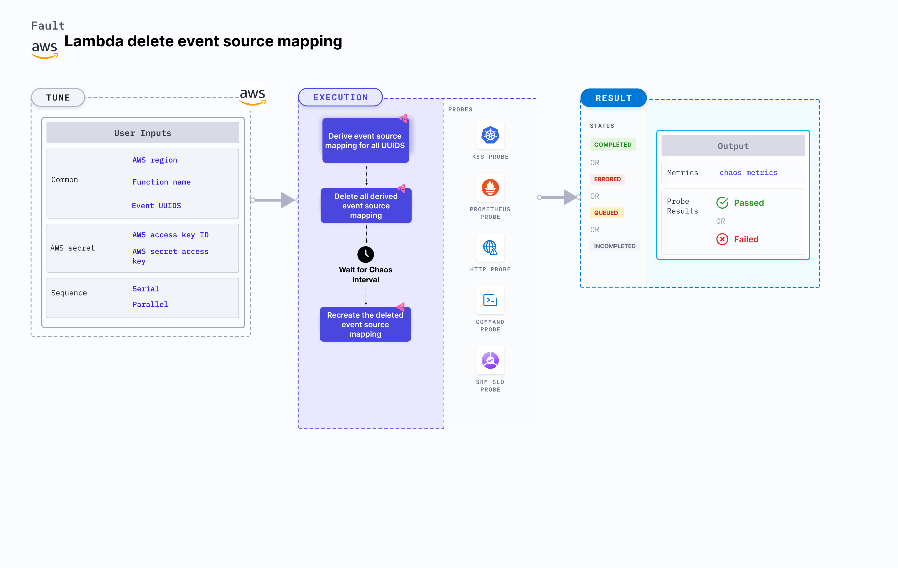

## Introduction

- It causes the removal of event source mapping from lambda function for a certain chaos duration.
- It checks the performance of the application/service running without the event-source-mapping which can cause missing entries on DB for example.

:::tip Fault execution flow chart

:::

## Uses

<details>
<summary>View the uses of the fault</summary>
<div>
 Deletion of event source mapping from a lambda function can be very critical, it can lead to scenarios like failing to update DB when an event trigger this can break the service and impacts their delivery. Such scenarios can still occur despite whatever availability aids AWS provides or we determine.

It will help us know if we have proper error handling or auto recovery configured for such scenarios. So this category of chaos fault helps you build the immunity of the application undergoing such scenarios.
</div>
</details>

## Prerequisites

:::info

- Kubernetes >= 1.17
- AWS Lambda event source mapping is attached to the lambda function.
- Kubernetes secret that has AWS access configuration(key) in the `CHAOS_NAMESPACE`. A secret file looks like this:

```yaml
apiVersion: v1
kind: Secret
metadata:
  name: cloud-secret
type: Opaque
stringData:
  cloud_config.yml: |-
    # Add the cloud AWS credentials respectively
    [default]
    aws_access_key_id = XXXXXXXXXXXXXXXXXXX
    aws_secret_access_key = XXXXXXXXXXXXXXX
```

- If you change the secret key name (from `cloud_config.yml`), update the `AWS_SHARED_CREDENTIALS_FILE` environment variable value on `experiment.yaml` with the same name.

## Default Validations

:::info

- AWS Lambda event source mapping is healthy and attached to the lambda function.

:::

## Experiment Tunables

<details>
    <summary>Check the Fault Tunables</summary>
    <h2>Mandatory Fields</h2>
    <table>
      <tr>
        <th> Variables </th>
        <th> Description </th>
        <th> Notes </th>
      </tr>
      <tr>
        <td> FUNCTION_NAME </td>
        <td> Function name of the target lambda function. It supports single function name.</td>
        <td> Eg: <code>test-function</code> </td>
      </tr>
      <tr>
        <td> EVENT_UUIDS </td>
        <td> Provide the UUID for the target event source mapping.</td>
        <td> You can provide multiple values as (,) comma separated values. Eg: <code>id1,id2</code> </td>
      </tr>
      <tr>
        <td> REGION </td>
        <td> The region name of the target lambda function</td>
        <td> Eg: <code>us-east-2</code></td>
      </tr>
    </table>
    <h2>Optional Fields</h2>
    <table>
      <tr>
        <th> Variables </th>
        <th> Description </th>
        <th> Notes </th>
      </tr>
      <tr>
        <td> TOTAL_CHAOS_DURATION </td>
        <td> The total time duration for chaos insertion in seconds </td>
        <td> Defaults to 30s </td>
      </tr>
      <tr>
        <td> SEQUENCE </td>
        <td> It defines sequence of chaos execution for multiple instance</td>
        <td> Default value: parallel. Supported: serial, parallel </td>
      </tr>
      <tr>
        <td> RAMP_TIME </td>
        <td> Period to wait before and after injection of chaos in sec </td>
        <td> Eg. 30 </td>
      </tr>
    </table>
</details>

## Fault Examples

### Common and AWS specific tunables

Refer the [common attributes](../common-tunables-for-all-experiments) and [AWS specific tunable](./aws-experiments-tunables) to tune the common tunables for all faults and aws specific tunables.

### Multiple Event Source Mapping

It can delete multiple event source mapping for a certain chaos duration using `EVENT_UUIDS` ENV that takes the UUID of the events as a comma separated value.

Use the following example to tune this:

[embedmd]:# (./static/manifests/lambda-delete-event-source-mapping/multiple-events.yaml yaml)
```yaml
# contains the removal of multiple event source mapping
apiVersion: litmuschaos.io/v1alpha1
kind: ChaosEngine
metadata:
  name: engine-nginx
spec:
  engineState: "active"
  chaosServiceAccount: litmus-admin
  experiments:
  - name: lambda-delete-event-source-mapping
    spec:
      components:
        env:
        # provide UUIDS of event source mapping
        - name: EVENT_UUIDS
          value: 'id1,id2'
        # provide the function name for the chaos
        - name: FUNCTION_NAME
          value: 'chaos-function'
```
