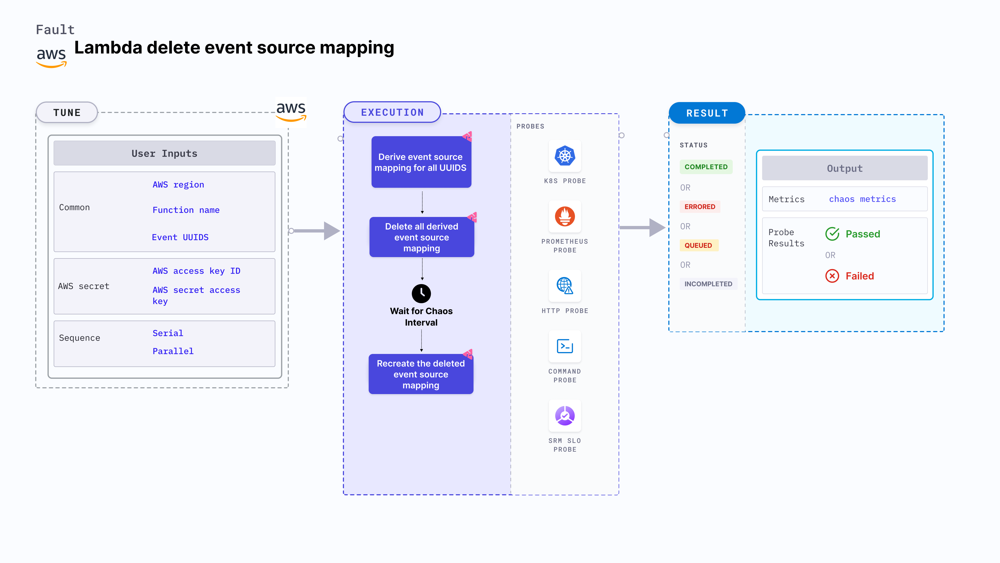

Lambda delete event source mapping removes the event source mapping from an AWS Lambda function for a specific duration.
- It checks the performance of the application (or service) without the event source mapping which may cause missing entries in a database.





## Usage

<details>
<summary>View fault usage</summary>
<div>
Deleting an event source mapping from a Lambda function is critical. It can lead to scenarios such as failure to update the database on an event trigger, which can break the service. 
Such faults determine if proper error handling or auto recovery options have been configured for the application.
</div>
</details>

## Prerequisites
- Kubernetes >= 1.17
- AWS Lambda event source mapping attached to the lambda function.
- Kubernetes secret that has AWS access configuration(key) in the `CHAOS_NAMESPACE`. A secret file looks like this:

```yaml
apiVersion: v1
kind: Secret
metadata:
  name: cloud-secret
type: Opaque
stringData:
  cloud_config.yml: |-
    # Add the cloud AWS credentials respectively
    [default]
    aws_access_key_id = XXXXXXXXXXXXXXXXXXX
    aws_secret_access_key = XXXXXXXXXXXXXXX
```

- It is recommended to use the same secret name that is `cloud-secret` or else you need to update the `AWS_SHARED_CREDENTIALS_FILE` env in the fault template and you may not be able to use the default healthcheck probes. 

- Refer to [AWS Named Profile For Chaos](./security/aws-switch-profile.md) to know how to use a different profile for AWS faults.

## Permissions required

Here is an example AWS policy to execute the fault.

<details>
<summary>View policy for the fault</summary>

```json
{
    "Version": "2012-10-17",
    "Statement": [
        {
            "Effect": "Allow",
            "Action": [
                "lambda:ListEventSourceMappings",
                "lambda:DeleteEventSourceMapping",
                "lambda:UpdateEventSourceMapping",
                "lambda:CreateEventSourceMapping",
                "lambda:UpdateFunctionConfiguration",
                "lambda:GetFunctionConcurrency",
                "lambda:GetFunction",
                "lambda:DeleteFunctionConcurrency",
                "lambda:PutFunctionConcurrency"
            ],
            "Resource": "*"
        }
    ]
}
```
</details>

Refer to the [superset permission/policy](./security/policy-for-all-aws-faults.md) to execute all AWS faults.

## Default validations
The AWS Lambda event source mapping is healthy and attached to the lambda function.


## Fault tunables

<details>
    <summary>Fault tunables</summary>
    <h2>Mandatory fields</h2>
    <table>
      <tr>
        <th> Variables </th>
        <th> Description </th>
        <th> Notes </th>
      </tr>
      <tr>
        <td> FUNCTION_NAME </td>
        <td> Function name of the target lambda function. It supports single function name.</td>
        <td> For example, <code>test-function</code> </td>
      </tr>
      <tr>
        <td> EVENT_UUIDS </td>
        <td> Provide the UUID for the target event source mapping.</td>
        <td> You can provide multiple values as (,) comma-separated values. For example, <code>id1,id2</code> </td>
      </tr>
      <tr>
        <td> REGION </td>
        <td> The region name of the target lambda function</td>
        <td> For example, <code>us-east-2</code></td>
      </tr>
    </table>
    <h2>Optional fields</h2>
    <table>
      <tr>
        <th> Variables </th>
        <th> Description </th>
        <th> Notes </th>
      </tr>
      <tr>
        <td> TOTAL_CHAOS_DURATION </td>
        <td> The total time duration for chaos insertion in seconds </td>
        <td> Defaults to 30s </td>
      </tr>
      <tr>
        <td> SEQUENCE </td>
        <td> It defines sequence of chaos execution for multiple instance</td>
        <td> Default value: parallel. Supported: serial, parallel </td>
      </tr>
      <tr>
        <td> RAMP_TIME </td>
        <td> Period to wait before and after injection of chaos in sec </td>
        <td> For example, 30 </td>
      </tr>
    </table>
</details>

## Fault Examples

### Common and AWS-specific tunables

Refer to the [common attributes](../common-tunables-for-all-faults) and [AWS-specific tunables](./aws-fault-tunables) to tune the common tunables for all faults and aws specific tunables.

### Multiple Event Source Mapping

It can delete multiple event source mappings for a certain chaos duration using `EVENT_UUIDS` environment variable that takes the UUID of the events as a comma-separated value (CSV file).

Use the following example to tune it:

[embedmd]:# (./static/manifests/lambda-delete-event-source-mapping/multiple-events.yaml yaml)
```yaml
# contains the removal of multiple event source mapping
apiVersion: litmuschaos.io/v1alpha1
kind: ChaosEngine
metadata:
  name: engine-nginx
spec:
  engineState: "active"
  chaosServiceAccount: litmus-admin
  experiments:
  - name: lambda-delete-event-source-mapping
    spec:
      components:
        env:
        # provide UUIDS of event source mapping
        - name: EVENT_UUIDS
          value: 'id1,id2'
        # provide the function name for the chaos
        - name: FUNCTION_NAME
          value: 'chaos-function'
```
