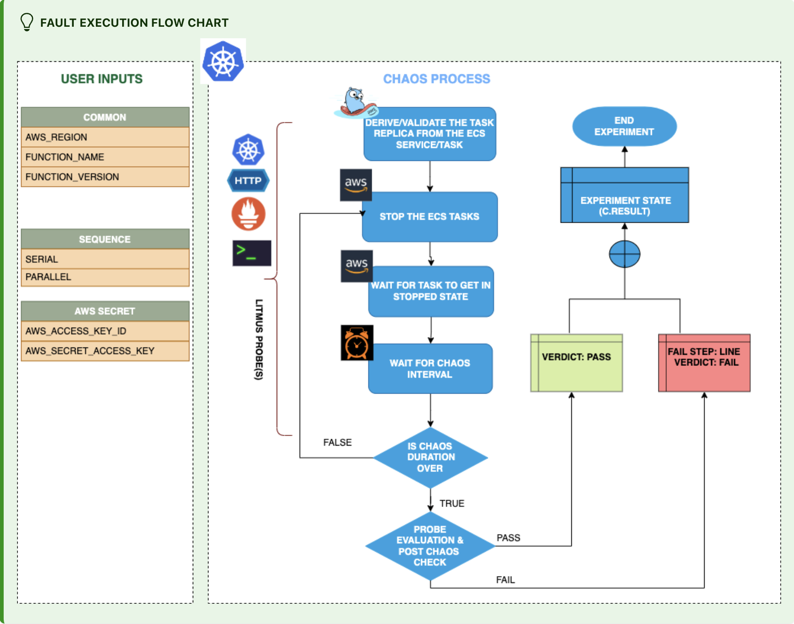

Lambda delete function concurrency is an AWS fault that:
- Deletes the Lambda function's reserved concurrency, thereby ensuring that the function has adequate unreserved concurrency to run.
- Examines the performance of the running Lambda application, if the Lambda function lacks sufficient concurrency.

:::tip Fault execution flow chart

:::

## Usage

<details>
<summary>View fault usage</summary>
<div>
When there is no unreserved concurrency left to run the Lambda function, this chaos fault can be used to check how your application behaves.

</div>
</details>

## Prerequisites

:::info

- Kubernetes >= 1.17
- Reserved concurrency set on the target Lambda function.
- Kubernetes secret that has AWS access configuration (key) in the `CHAOS_NAMESPACE`. Below is a sample secret file:

```yaml
apiVersion: v1
kind: Secret
metadata:
  name: cloud-secret
type: Opaque
stringData:
  cloud_config.yml: |-
    # Add the cloud AWS credentials respectively
    [default]
    aws_access_key_id = XXXXXXXXXXXXXXXXXXX
    aws_secret_access_key = XXXXXXXXXXXXXXX
```

- If you change the secret key name (from `cloud_config.yml`), ensure that you update the `AWS_SHARED_CREDENTIALS_FILE` environment variable in the `experiment.yaml` with the same name.
:::

## Permissions required

- Here is an example AWS policy to execute the Lambda delete function concurrency fault.

<details>
<summary>View policy for this fault</summary>

```json
{
    "Version": "2012-10-17",
    "Statement": [
        {
            "Effect": "Allow",
            "Action": [
                "lambda:UpdateFunctionConfiguration",
                "lambda:GetFunctionConcurrency",
                "lambda:GetFunction",
                "lambda:DeleteFunctionConcurrency",
                "lambda:PutFunctionConcurrency"
            ],
            "Resource": "*"
        }
    ]
}
```
</details>

- Refer to the [superset permission/policy](../policy-for-all-aws-faults) to execute all AWS faults.

## Default validation

:::info

- The Lambda function should be up and running.

:::

## Experiment tunables

<details>
    <summary>Fault tunables</summary>
    <h2>Mandatory fields</h2>
    <table>
      <tr>
        <th> Variables </th>
        <th> Description </th>
        <th> Notes </th>
      </tr>
      <tr>
        <td> FUNCTION_NAME </td>
        <td> Name of the target Lambda function. It supports a single function name.</td>
        <td> For example, <code>test-function</code>. </td>
      </tr>
      <tr>
        <td> FUNCTION_VERSION </td>
        <td> Specifies the version of the function. </td>
        <td> Defaults to <code>$LATEST</code>. </td>
      </tr>
      <tr>
        <td> REGION </td>
        <td> Region name of the target Lambda function. </td>
        <td> For example, <code>us-east-2</code>. </td>
      </tr>
    </table>
    <h2>Optional Fields</h2>
    <table>
      <tr>
        <th> Variables </th>
        <th> Description </th>
        <th> Notes </th>
      </tr>
      <tr>
        <td> TOTAL_CHAOS_DURATION </td>
        <td> Duration to insert chaos (in seconds).</td>
        <td> Defaults to 30s. </td>
      </tr>
      <tr>
        <td> CHAOS_INTERVAL </td>
        <td> Time interval between two successive deletions of reserved concurrency (in seconds).</td>
        <td> Defaults to 30s. </td>
      </tr>
      <tr>
        <td> RAMP_TIME </td>
        <td> Period to wait before and after injecting chaos (in seconds). </td>
        <td> For example, 30s. </td>
      </tr>
    </table>
</details>

## Fault examples

### Common and AWS specific tunables

Refer to the [common attributes](../common-tunables-for-all-faults) and [AWS specific tunables](./aws-fault-tunables) to tune the common tunables for all faults and aws specific tunables.
