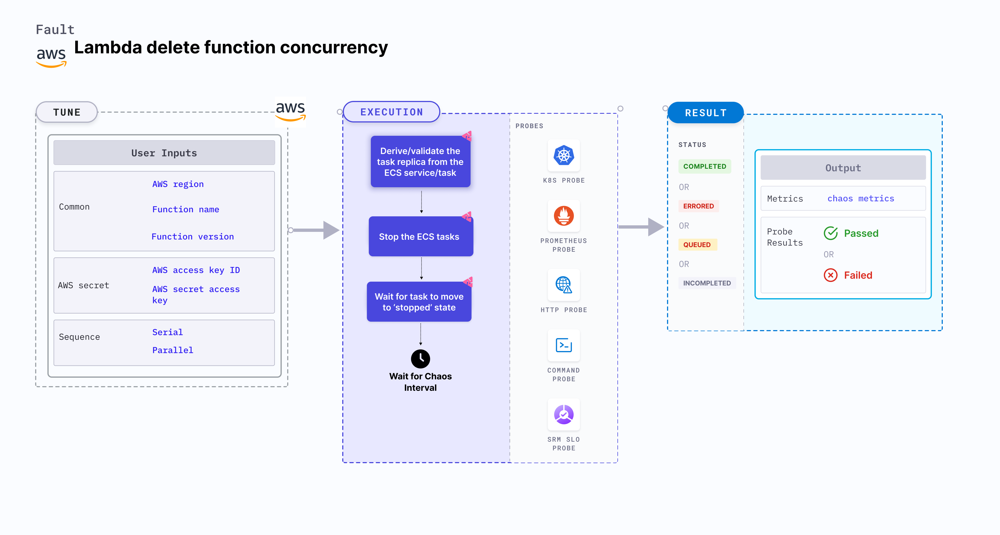

## Introduction

- It deletes the reserved concurrency of lambda function. This helps in verifying the function has adequate unreserved concurrency to run.

- It helps to checks the performance of the running lambda application, if the lambda function has not enough concurrency.

:::tip Fault execution flow chart

:::

## Uses

<details>
<summary>View the uses of the fault</summary>
<div>
In some of the cases, It may be possible that there is no unreserved concurrency left to run the lambda function. So this chaos faults helps you to check how your application is behaving when lambda function has no concurrency left to run.

</div>
</details>

## Prerequisites

:::info

- Ensure that Kubernetes Version >= 1.17
- Reserved Concurrency should be set on the target lambda function
- Kubernetes secret that has AWS access configuration(key) in the `CHAOS_NAMESPACE`. A secret file looks like this:

```yaml
apiVersion: v1
kind: Secret
metadata:
  name: cloud-secret
type: Opaque
stringData:
  cloud_config.yml: |-
    # Add the cloud AWS credentials respectively
    [default]
    aws_access_key_id = XXXXXXXXXXXXXXXXXXX
    aws_secret_access_key = XXXXXXXXXXXXXXX
```

- If you change the secret key name (from `cloud_config.yml`), update the `AWS_SHARED_CREDENTIALS_FILE` environment variable value on `experiment.yaml` with the same name.
:::

## Permission Requirement

- Here is an example AWS policy to execute this fault.

<details>
<summary>View policy for this fault</summary>

```json
{
    "Version": "2012-10-17",
    "Statement": [
        {
            "Effect": "Allow",
            "Action": [
                "lambda:UpdateFunctionConfiguration",
                "lambda:GetFunctionConcurrency",
                "lambda:GetFunction",
                "lambda:DeleteFunctionConcurrency",
                "lambda:PutFunctionConcurrency"
            ],
            "Resource": "*"
        }
    ]
}
```
</details>

- Refer a [superset permission/policy](../policy-for-all-aws-faults) to execute all AWS faults.

## Default Validations

:::info

- The Lambda function should be up and running.

:::

## Experiment Tunables

<details>
    <summary>Check the Fault Tunables</summary>
    <h2>Mandatory Fields</h2>
    <table>
      <tr>
        <th> Variables </th>
        <th> Description </th>
        <th> Notes </th>
      </tr>
      <tr>
        <td> FUNCTION_NAME </td>
        <td> Function name of the target lambda function. It support single function name.</td>
        <td> Eg: <code>test-function</code> </td>
      </tr>
      <tr>
        <td> FUNCTION_VERSION </td>
        <td> Provide the version of the function </td>
        <td> Defaults to <code>$LATEST</code> </td>
      </tr>
      <tr>
        <td> REGION </td>
        <td> The region name of the target lambda function</td>
        <td> Eg: <code>us-east-2</code> </td>
      </tr>
    </table>
    <h2>Optional Fields</h2>
    <table>
      <tr>
        <th> Variables </th>
        <th> Description </th>
        <th> Notes </th>
      </tr>
      <tr>
        <td> TOTAL_CHAOS_DURATION </td>
        <td> The total time duration for chaos insertion in seconds </td>
        <td> Defaults to 30s </td>
      </tr>
      <tr>
        <td> CHAOS_INTERVAL </td>
        <td> The interval (in seconds) between successive deletion of reserved concurrency.</td>
        <td> Defaults to 30s </td>
      </tr>
      <tr>
        <td> RAMP_TIME </td>
        <td> Period to wait before and after injection of chaos in seconds </td>
        <td> Eg. 30 </td>
      </tr>
    </table>
</details>

## Fault Examples

### Common and AWS specific tunables

Refer the [common attributes](../common-tunables-for-all-faults) and [AWS specific tunable](./aws-fault-tunables) to tune the common tunables for all faults and aws specific tunables.
