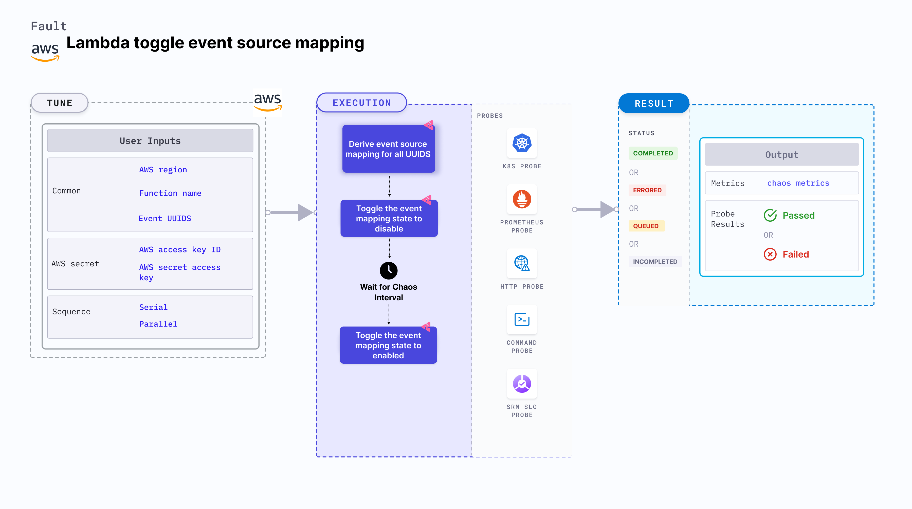

## Introduction

- It toggles the event source mapping state to <code>disable</code> for a lambda function during a certain chaos duration.
- It checks the performance of the running application/service when the event source mapping is not enabled which can cause, for example, missing entries on a database.

:::tip Fault execution flow chart

:::

## Uses

<details>
<summary>View the uses of the fault</summary>
<div>
 Toggling between different states of event source mapping from a lambda function is critical. It can lead to scenarios such as failure to update the database on an event trigger which can break the service and impact their delivery. Such scenarios can occur despite  availability aids provided by AWS or determined by you.

It helps understand if you have proper error handling or auto recovery configured for such cases. Hence, this category of chaos fault helps build the immunity of the application.
</div>
</details>

## Prerequisites

:::info

- Kubernetes >= 1.17
- AWS Lambda event source mapping attached to the lambda function.
- Kubernetes secret that has AWS access configuration(key) in the `CHAOS_NAMESPACE`. A secret file looks like this:

```yaml
apiVersion: v1
kind: Secret
metadata:
  name: cloud-secret
type: Opaque
stringData:
  cloud_config.yml: |-
    # Add the cloud AWS credentials respectively
    [default]
    aws_access_key_id = XXXXXXXXXXXXXXXXXXX
    aws_secret_access_key = XXXXXXXXXXXXXXX
```

- If you change the secret key name (from `cloud_config.yml`), update the `AWS_SHARED_CREDENTIALS_FILE` environment variable value on `experiment.yaml` with the same name.

## Default Validations

:::info

- The AWS Lambda event source mapping is healthy and attached to the lambda function.

:::

## Experiment Tunables

<details>
    <summary>Check the Fault Tunables</summary>
    <h2>Mandatory Fields</h2>
    <table>
      <tr>
        <th> Variables </th>
        <th> Description </th>
        <th> Notes </th>
      </tr>
      <tr>
        <td> FUNCTION_NAME </td>
        <td> Function name of the target lambda function. It supports single function name.</td>
        <td> Eg: <code>test-function</code> </td>
      </tr>
      <tr>
        <td> EVENT_UUIDS </td>
        <td> Provide the UUID for the target event source mapping.</td>
        <td> You can provide multiple values as (,) comma separated values. Eg: <code>id1,id2</code> </td>
      </tr>
      <tr>
        <td> REGION </td>
        <td> The region name of the target lambda function</td>
        <td> Eg: <code>us-east-2</code></td>
      </tr>
    </table>
    <h2>Optional Fields</h2>
    <table>
      <tr>
        <th> Variables </th>
        <th> Description </th>
        <th> Notes </th>
      </tr>
      <tr>
        <td> TOTAL_CHAOS_DURATION </td>
        <td> The total time duration for chaos insertion in seconds </td>
        <td> Defaults to 30s </td>
      </tr>
      <tr>
        <td> SEQUENCE </td>
        <td> It defines sequence of chaos execution for multiple instance</td>
        <td> Default value: parallel. Supported: serial, parallel </td>
      </tr>
      <tr>
        <td> RAMP_TIME </td>
        <td> Period to wait before and after injection of chaos in sec </td>
        <td> Eg. 30 </td>
      </tr>
    </table>
</details>

## Fault Examples

### Common and AWS specific tunables

Refer to the [common attributes](../common-tunables-for-all-faults) and [AWS specific tunable](./aws-fault-tunables) to tune the common tunables for all faults and aws specific tunables.

### Multiple Event Source Mapping

It toggles between multiple event source mapping for a certain chaos duration using `EVENT_UUIDS` environment variable that takes the UUID of the events as a comma separated value (CSV file).

Use the following example to tune it:

[embedmd]:# (./static/manifests/lambda-toggle-event-mapping-state/multiple-events.yaml yaml)
```yaml
# contains the removal of multiple event source mapping
apiVersion: litmuschaos.io/v1alpha1
kind: ChaosEngine
metadata:
  name: engine-nginx
spec:
  engineState: "active"
  chaosServiceAccount: litmus-admin
  experiments:
  - name: lambda-toggle-event-mapping-state
    spec:
      components:
        env:
        # provide UUIDS of event source mapping
        - name: EVENT_UUIDS
          value: 'id1,id2'
        # provide the function name for the chaos
        - name: FUNCTION_NAME
          value: 'chaos-function'
```
