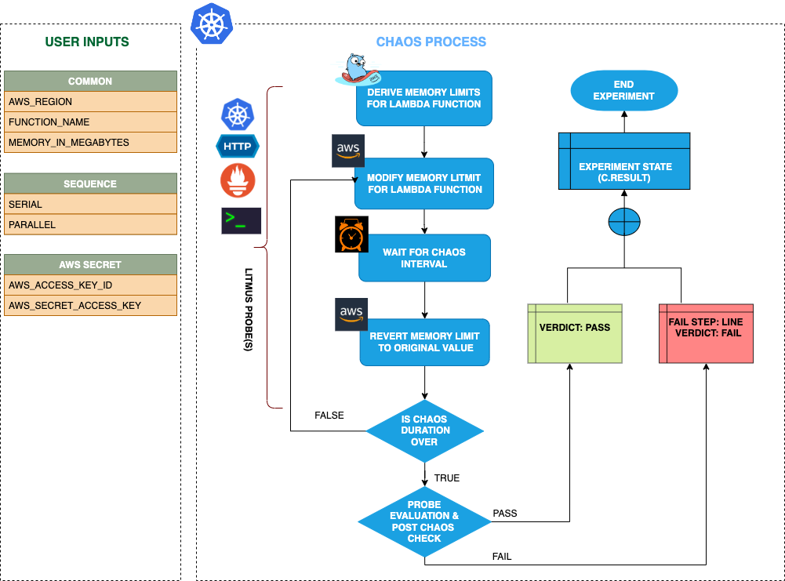

## Introduction

- It causes the memory of a lambda function to be updated to a specified value for a certain chaos duration.
- It checks the performance of the application/service running with a new memory limit and also helps to determine a safe overall memory limit value for the function.
- Smaller the memory limit higher will be the time taken by the lambda function under load.

:::tip Fault execution flow chart

:::

## Uses

<details>
<summary>View the uses of the fault</summary>
<div>
Hitting a memory limit is a very common and frequent scenario we find with lambda functions that can slow down the service and impacts their delivery. Such scenarios can still occur despite whatever availability aids AWS provides or we determine.

Running out of memory due to a smaller limit interrupts the flow of the given function. So this category of chaos fault helps you to build immunity on the application undergoing any such scenarios.
</div>
</details>

## Prerequisites

:::info

- Kubernetes >= 1.17
- Access for operating AWS Lambda functions.
- Kubernetes secret that has AWS access configuration(key) in the `CHAOS_NAMESPACE`. A secret file looks like this:

```yaml
apiVersion: v1
kind: Secret
metadata:
  name: cloud-secret
type: Opaque
stringData:
  cloud_config.yml: |-
    # Add the cloud AWS credentials respectively
    [default]
    aws_access_key_id = XXXXXXXXXXXXXXXXXXX
    aws_secret_access_key = XXXXXXXXXXXXXXX
```

- If you change the secret key name (from `cloud_config.yml`), update the `AWS_SHARED_CREDENTIALS_FILE` environment variable value on `experiment.yaml` with the same name.

## Default Validations

:::info

- The Lambda function should be up and running.

:::

## Experiment Tunables

<details>
    <summary>Check the Fault Tunables</summary>
    <h2>Mandatory Fields</h2>
    <table>
      <tr>
        <th> Variables </th>
        <th> Description </th>
        <th> Notes </th>
      </tr>
      <tr>
        <td> FUNCTION_NAME </td>
        <td> Function name of the target lambda function. It supports single function name.</td>
        <td> Eg: <code>test-function</code> </td>
      </tr>
      <tr>
        <td> MEMORY_IN_MEGABYTES </td>
        <td> Provide the value of the memory limit of a function in megabytes.</td>
        <td> The minimum value of the memory limit on a lambda function is 128Mb and the maximum upto 10240Mb </td>
      </tr>
      <tr>
        <td> REGION </td>
        <td> The region name of the target lambda function</td>
        <td> Eg: <code>us-east-2</code> </td>
      </tr>
    </table>
    <h2>Optional Fields</h2>
    <table>
      <tr>
        <th> Variables </th>
        <th> Description </th>
        <th> Notes </th>
      </tr>
      <tr>
        <td> TOTAL_CHAOS_DURATION </td>
        <td> The total time duration for chaos insertion in seconds </td>
        <td> Defaults to 30s </td>
      </tr>
      <tr>
        <td> CHAOS_INTERVAL </td>
        <td> The interval (in seconds) between successive instance termination.</td>
        <td> Defaults to 30s </td>
      </tr>
      <tr>
        <td> SEQUENCE </td>
        <td> It defines sequence of chaos execution for multiple instance</td>
        <td> Default value: parallel. Supported: serial, parallel </td>
      </tr>
      <tr>
        <td> RAMP_TIME </td>
        <td> Period to wait before and after injection of chaos in seconds </td>
        <td> Eg. 30 </td>
      </tr>
    </table>
</details>

## Fault Examples

### Common and AWS specific tunables

Refer the [common attributes](../common-tunables-for-all-faults) and [AWS specific tunable](./aws-fault-tunables) to tune the common tunables for all faults and aws specific tunables.

### Memory Limit

It can update the lambda function memory limit to a newer value by using `MEMORY_IN_MEGABYTES` ENV as shown below.

Use the following example to tune this:

[embedmd]:# (./static/manifests/lambda-update-function-memory/function-memory.yaml yaml)
```yaml
# contains the memory limit value for the lambda function
apiVersion: litmuschaos.io/v1alpha1
kind: ChaosEngine
metadata:
  name: engine-nginx
spec:
  engineState: "active"
  chaosServiceAccount: litmus-admin
  experiments:
  - name: lambda-update-function-memory
    spec:
      components:
        env:
        # provide the function memory limit
        - name: MEMORY_IN_MEGABYTES
          value: '10'
        # provide the function name for memory limit chaos
        - name: FUNCTION_NAME
          value: 'chaos-function'
```
