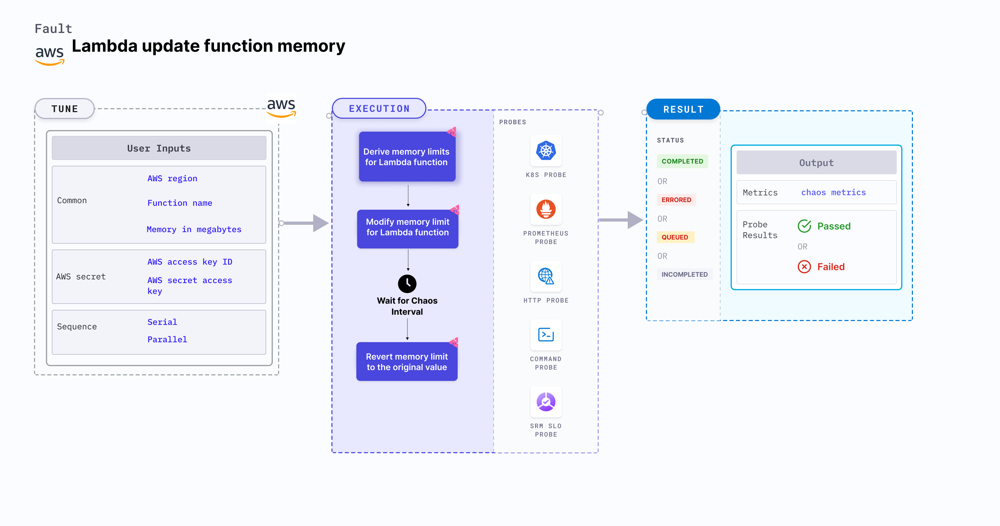

Lambda update function memory is an AWS fault that:
- Updates the memory of a Lambda function to a specific value during a chaos duration.
- Checks the performance of the application (or service) running with a new memory limit thereby determining a safe overall memory limit value for the function. The Lambda function takes longer to execute if the memory limit is reduced.

:::tip Fault execution flow chart

:::

## Usage

<details>
<summary>View fault usage</summary>
<div>
Hitting a memory limit is a common scenario with Lambda functions that slows down the service and impacts their delivery. Such scenarios occur despite the availability aids provided by AWS or determined by users.

Running out of memory due to a small limit interrupts the flow of the given function. This chaos fault helps the application build immunity against such scenarios.
</div>
</details>

## Prerequisites

:::info

- Kubernetes >= 1.17
- Kubernetes secret that has AWS access configuration (key) in the `CHAOS_NAMESPACE`. Below is a sample secret file:

```yaml
apiVersion: v1
kind: Secret
metadata:
  name: cloud-secret
type: Opaque
stringData:
  cloud_config.yml: |-
    # Add the cloud AWS credentials respectively
    [default]
    aws_access_key_id = XXXXXXXXXXXXXXXXXXX
    aws_secret_access_key = XXXXXXXXXXXXXXX
```

- If you change the secret key name (from `cloud_config.yml`), ensure that you update the `AWS_SHARED_CREDENTIALS_FILE` environment variable value on `experiment.yaml` with the same name.
:::

## Permissions required

- Here is an example AWS policy to execute the Lambda update function memory fault.

<details>
<summary>View policy for this fault</summary>

```json
{
    "Version": "2012-10-17",
    "Statement": [
        {
            "Effect": "Allow",
            "Action": [
                "lambda:UpdateFunctionConfiguration",
                "lambda:GetFunctionConcurrency",
                "lambda:GetFunction",
                "lambda:DeleteFunctionConcurrency",
                "lambda:PutFunctionConcurrency"
            ],
            "Resource": "*"
        }
    ]
}
```
</details>

- Refer to the [superset permission (or policy)](../policy-for-all-aws-faults) to execute all AWS faults.

## Default validation

:::info

- The Lambda function should be up and running.

:::

## Chaos injection validation

:::info
- You can validate the Lambda update function memory fault from the general configuration section of the target Lambda function in the AWS console. While inecting chaos, the function memory is updated with the value you provide.
:::

## Experiment tunables

<details>
    <summary>Fault tunables</summary>
    <h2>Mandatory Fields</h2>
    <table>
      <tr>
        <th> Variables </th>
        <th> Description </th>
        <th> Notes </th>
      </tr>
      <tr>
        <td> FUNCTION_NAME </td>
        <td> Name of the target Lambda function. It supports a single function name.</td>
        <td> For example, <code>test-function</code>. </td>
      </tr>
      <tr>
        <td> MEMORY_IN_MEGABYTES </td>
        <td> Memory limit of a function (in MB).</td>
        <td> Memory range of the Lambda function is 128 MB to 10240 MB. </td>
      </tr>
      <tr>
        <td> REGION </td>
        <td> Region name of the target Lambda function. </td>
        <td> For example, <code>us-east-2</code>. </td>
      </tr>
    </table>
    <h2>Optional Fields</h2>
    <table>
      <tr>
        <th> Variables </th>
        <th> Description </th>
        <th> Notes </th>
      </tr>
      <tr>
        <td> TOTAL_CHAOS_DURATION </td>
        <td> Duration to insert chaos (in seconds). </td>
        <td> Defaults to 30s. </td>
      </tr>
      <tr>
        <td> CHAOS_INTERVAL </td>
        <td> Time interval between two successive instance terminations (in seconds).</td>
        <td> Defaults to 30s. </td>
      </tr>
      <tr>
        <td> SEQUENCE </td>
        <td> Sequence of chaos execution for multiple instances.</td>
        <td> Defaults to parallel. Supports serial sequence as well. </td>
      </tr>
      <tr>
        <td> RAMP_TIME </td>
        <td> Period to wait before and after injecting chaos (in seconds). </td>
        <td> For example, 30s. </td>
      </tr>
    </table>
</details>

## Fault examples

### Common and AWS specific tunables

Refer to the [common attributes](../common-tunables-for-all-faults) and [AWS specific tunables](./aws-fault-tunables) to tune the common tunables for all faults and AWS specific tunables.

### Memory limit

You can update the value of the Lambda function memory limit using the `MEMORY_IN_MEGABYTES` environment variable.

Use the following example to tune it:

[embedmd]:# (./static/manifests/lambda-update-function-memory/function-memory.yaml yaml)
```yaml
# contains the memory limit value for the lambda function
apiVersion: litmuschaos.io/v1alpha1
kind: ChaosEngine
metadata:
  name: engine-nginx
spec:
  engineState: "active"
  chaosServiceAccount: litmus-admin
  experiments:
  - name: lambda-update-function-memory
    spec:
      components:
        env:
        # provide the function memory limit
        - name: MEMORY_IN_MEGABYTES
          value: '10'
        # provide the function name for memory limit chaos
        - name: FUNCTION_NAME
          value: 'chaos-function'
```
