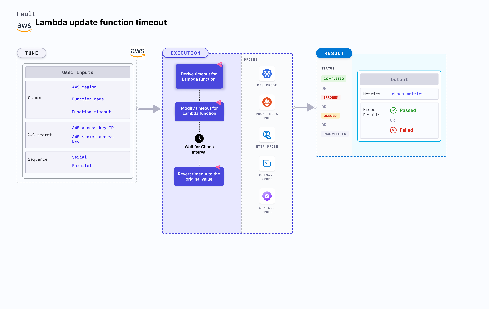

## Introduction

- It causes the timeout of a lambda function to be updated to a specified value for a certain chaos duration.
- It checks the performance of the application/service running with a new timeout and also helps to determine a safe overall timeout value for the function.

:::tip Fault execution flow chart

:::

## Uses

<details>
<summary>View the uses of the fault</summary>
<div>
Hitting a timeout is a very common and frequent scenario we find with lambda functions that can break the service and impacts their delivery. Such scenarios can still occur despite whatever availability aids AWS provides or we determine.

Getting timeout errors interrupts the flow of the given function. So this category of chaos fault helps you to build the immunity of the application undergoing any such scenarios.
</div>
</details>

## Prerequisites

:::info

- Kubernetes >= 1.17
- Access to operate AWS Lambda service.
- Kubernetes secret that has AWS access configuration(key) in the `CHAOS_NAMESPACE`. A secret file looks like this:

```yaml
apiVersion: v1
kind: Secret
metadata:
  name: cloud-secret
type: Opaque
stringData:
  cloud_config.yml: |-
    # Add the cloud AWS credentials respectively
    [default]
    aws_access_key_id = XXXXXXXXXXXXXXXXXXX
    aws_secret_access_key = XXXXXXXXXXXXXXX
```

- If you change the secret key name (from `cloud_config.yml`), update the `AWS_SHARED_CREDENTIALS_FILE` environment variable value on `experiment.yaml` with the same name.

## Default Validations

:::info

- The Lambda function should be up and running.

:::

## Experiment Tunables

<details>
    <summary>Check the Fault Tunables</summary>
    <h2>Mandatory Fields</h2>
    <table>
      <tr>
        <th> Variables </th>
        <th> Description </th>
        <th> Notes </th>
      </tr>
      <tr>
        <td> FUNCTION_NAME </td>
        <td> Function name of the target lambda function. It support single function name.</td>
        <td> Eg: <code>test-function</code> </td>
      </tr>
      <tr>
        <td> FUNCTION_TIMEOUT </td>
        <td> Provide the value of function timeout in seconds.</td>
        <td> The minimum value is 1s and maximum upto 15mins that is 900s </td>
      </tr>
      <tr>
        <td> REGION </td>
        <td> The region name of the target lambda function</td>
        <td> Eg: <code>us-east-2</code> </td>
      </tr>
    </table>
    <h2>Optional Fields</h2>
    <table>
      <tr>
        <th> Variables </th>
        <th> Description </th>
        <th> Notes </th>
      </tr>
      <tr>
        <td> TOTAL_CHAOS_DURATION </td>
        <td> The total time duration for chaos insertion in seconds </td>
        <td> Defaults to 30s </td>
      </tr>
      <tr>
        <td> CHAOS_INTERVAL </td>
        <td> The interval (in seconds) between successive instance termination.</td>
        <td> Defaults to 30s </td>
      </tr>
      <tr>
        <td> SEQUENCE </td>
        <td> It defines sequence of chaos execution for multiple instance</td>
        <td> Default value: parallel. Supported: serial, parallel </td>
      </tr>
      <tr>
        <td> RAMP_TIME </td>
        <td> Period to wait before and after injection of chaos in seconds </td>
        <td> Eg. 30 </td>
      </tr>
    </table>
</details>

## Fault Examples

### Common and AWS specific tunables

Refer the [common attributes](../common-tunables-for-all-faults) and [AWS specific tunable](./aws-fault-tunables) to tune the common tunables for all faults and aws specific tunables.

### Timeout Value

It can update the lambda function timeout value to a newer value by using `FUNCTION_TIMEOUT` ENV as shown below.

Use the following example to tune this:

[embedmd]:# (./static/manifests/lambda-update-function-timeout/function-timeout.yaml yaml)
```yaml
# contains the timeout value for the lambda function
apiVersion: litmuschaos.io/v1alpha1
kind: ChaosEngine
metadata:
  name: engine-nginx
spec:
  engineState: "active"
  chaosServiceAccount: litmus-admin
  experiments:
  - name: lambda-update-function-timeout
    spec:
      components:
        env:
        # provide the function timeout for 10seconds
        - name: FUNCTION_TIMEOUT
          value: '10'
        # provide the function name for timeout chaos
        - name: FUNCTION_NAME
          value: 'chaos-function'
```
