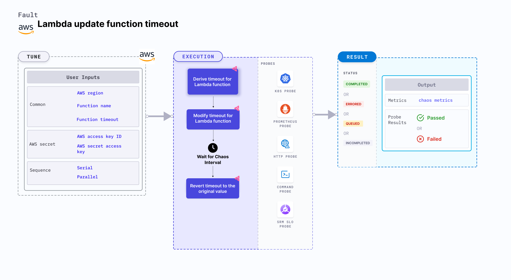

Lambda update function timeout is an AWS fault that:
- Modifies the timeout value for a function, which may cause the function to fail quickly. 
- Verifies the handling mechanism for function failures and helps determine the correct (or minimum) timeout value for that function.
- Checks the performance of the Lambda application running at different timeout values.

:::tip Fault execution flow chart

:::

## Usage

<details>
<summary>View fault usage</summary>
<div>
Hitting a memory limit is a common scenario with Lambda functions that slows down the service and impacts their delivery. Such scenarios occur despite the availability aids provided by AWS or determined by users.

Timeout errors interrupt the flow of the given function. This chaos fault helps the application build immunity against such scenarios.
</div>
</details>

## Prerequisites

:::info

- Kubernetes >= 1.17
- Kubernetes secret that has AWS access configuration (key) in the `CHAOS_NAMESPACE`. Below is a sample secret file:

```yaml
apiVersion: v1
kind: Secret
metadata:
  name: cloud-secret
type: Opaque
stringData:
  cloud_config.yml: |-
    # Add the cloud AWS credentials respectively
    [default]
    aws_access_key_id = XXXXXXXXXXXXXXXXXXX
    aws_secret_access_key = XXXXXXXXXXXXXXX
```

- If you change the secret key name (from `cloud_config.yml`), ensure that you update the `AWS_SHARED_CREDENTIALS_FILE` environment variable on `experiment.yaml` with the same name.
:::

## Permissions required

- Here is an example AWS policy to execute the Lambda update function timeout fault.

<details>
<summary>View policy for this fault</summary>

```json
{
    "Version": "2012-10-17",
    "Statement": [
        {
            "Effect": "Allow",
            "Action": [
                "lambda:UpdateFunctionConfiguration",
                "lambda:GetFunctionConcurrency",
                "lambda:GetFunction",
                "lambda:DeleteFunctionConcurrency",
                "lambda:PutFunctionConcurrency"
            ],
            "Resource": "*"
        }
    ]
}
```
</details>

- Refer to the [superset permission (or policy)](../policy-for-all-aws-faults) to execute all AWS faults.

## Default validation

:::info

- The Lambda function should be up and running.

:::

## Chaos injection validation
:::info
- You can validate the Lambda function timeout fault from the general configuration section of the target Lambda function in the AWS console. While injecting chaos, the function timeout is updated with the value you provide.
:::
## Experiment tunables

<details>
    <summary>Check the Fault Tunables</summary>
    <h2>Mandatory Fields</h2>
    <table>
      <tr>
        <th> Variables </th>
        <th> Description </th>
        <th> Notes </th>
      </tr>
      <tr>
        <td> FUNCTION_NAME </td>
        <td> Name of the target Lambda function. It support a single function name.</td>
        <td> For example, <code>test-function</code>. </td>
      </tr>
      <tr>
        <td> FUNCTION_TIMEOUT </td>
        <td> Value of the function timeout (in seconds).</td>
        <td> Range of the timeout is 1s to 900s (that is, 15 minutes). </td>
      </tr>
      <tr>
        <td> REGION </td>
        <td> Region name of the target Lambda function. </td>
        <td> For example, <code>us-east-2</code>. </td>
      </tr>
    </table>
    <h2>Optional Fields</h2>
    <table>
      <tr>
        <th> Variables </th>
        <th> Description </th>
        <th> Notes </th>
      </tr>
      <tr>
        <td> TOTAL_CHAOS_DURATION </td>
        <td> Duration to insert chaos (in seconds). </td>
        <td> Defaults to 30s. </td>
      </tr>
      <tr>
        <td> CHAOS_INTERVAL </td>
        <td> Time interval between two successive instance terminations (in seconds).</td>
        <td> Defaults to 30s. </td>
      </tr>
      <tr>
        <td> SEQUENCE </td>
        <td> Sequence of chaos execution for multiple instances. </td>
        <td> Defaults to parallel. Supports serial sequence as well. </td>
      </tr>
      <tr>
        <td> RAMP_TIME </td>
        <td> Period to wait before and after injecting chaos (in seconds). </td>
        <td> For example, 30s. </td>
      </tr>
    </table>
</details>

## Fault examples

### Common and AWS specific tunables

Refer to the [common attributes](../common-tunables-for-all-faults) and [AWS specific tunables](./aws-fault-tunables) to tune the common tunables for all faults and aws specific tunables.

### Timeout value

You can update the value of the Lambda function timeout value using the `FUNCTION_TIMEOUT` environment variable.

Use the following example to tune it:

[embedmd]:# (./static/manifests/lambda-update-function-timeout/function-timeout.yaml yaml)
```yaml
# contains the timeout value for the lambda function
apiVersion: litmuschaos.io/v1alpha1
kind: ChaosEngine
metadata:
  name: engine-nginx
spec:
  engineState: "active"
  chaosServiceAccount: litmus-admin
  experiments:
  - name: lambda-update-function-timeout
    spec:
      components:
        env:
        # provide the function timeout for 10seconds
        - name: FUNCTION_TIMEOUT
          value: '10'
        # provide the function name for timeout chaos
        - name: FUNCTION_NAME
          value: 'chaos-function'
```