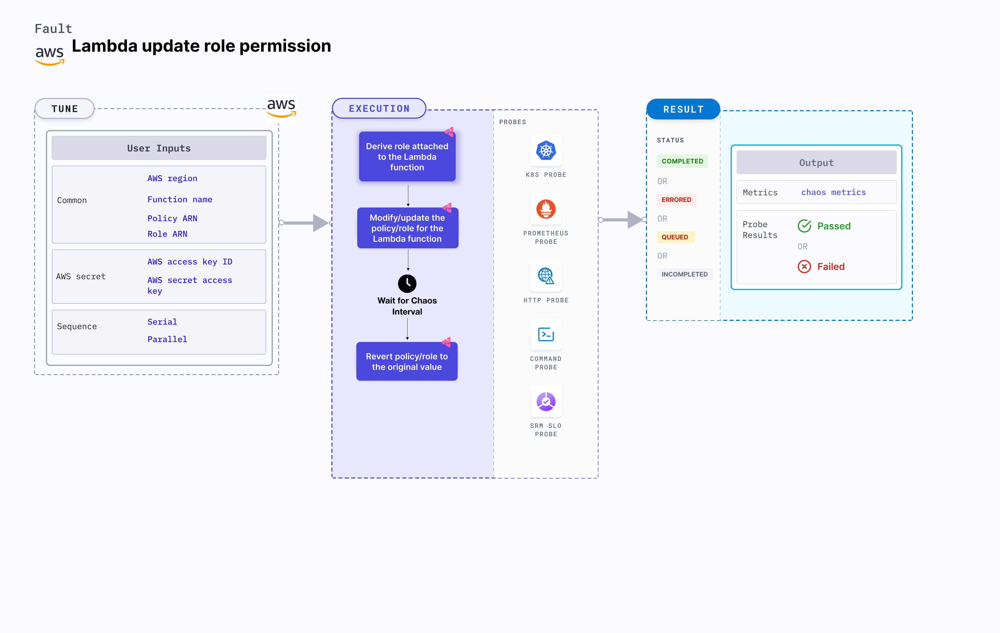

Lambda update role permission is an AWS fault that:
- Modifies the role policies associated with a Lambda function.
- Verifies the handling mechanism for function failures.
- Can also be used to update the role attached to a Lambda function.
- Checks the performance of the running lambda application in case it does not have enough permissions.

:::tip Fault execution flow chart

:::

## Usage

<details>
<summary>View fault usage</summary>
<div>
Lambda functions sometimes depend on services such as RDS, DynamoDB, S3, etc. In such cases, certain permissions are required to access these services. This chaos fault helps understand how your application would behave when a Lambda function does not have enough permissions to access the services.

</div>
</details>

## Prerequisites

:::info

- Kubernetes >= 1.17
- Kubernetes secret that has AWS access configuration (key) in the `CHAOS_NAMESPACE`. Below is a sample secret file:

```yaml
apiVersion: v1
kind: Secret
metadata:
  name: cloud-secret
type: Opaque
stringData:
  cloud_config.yml: |-
    # Add the cloud AWS credentials respectively
    [default]
    aws_access_key_id = XXXXXXXXXXXXXXXXXXX
    aws_secret_access_key = XXXXXXXXXXXXXXX
```

- If you change the secret key name (from `cloud_config.yml`), ensure that you update the `AWS_SHARED_CREDENTIALS_FILE` environment variable on `experiment.yaml` with the same name.
:::
## Permissions required

- Here is an example AWS policy to execute the Lambda update role permission fault.

<details>
<summary>View policy for this fault if `ROLE_ARN` environment variable is set.</summary>

```json
{
    "Version": "2012-10-17",
    "Statement": [
        {
            "Sid": "VisualEditor0",
            "Effect": "Allow",
            "Action": [
                "iam:PassRole",
                "lambda:GetFunction",
                "lambda:UpdateFunctionConfiguration",
                "iam:AttachRolePolicy"
            ],
            "Resource": "*"
        }
    ]
}
```
</details>
<details>
<summary>View policy for this fault if `POLICY_ARN` environment variable is set.</summary>

```json
{
    "Version": "2012-10-17",
    "Statement": [
        {
            "Sid": "VisualEditor0",
            "Effect": "Allow",
            "Action": [
                "iam:DetachRolePolicy",
                "lambda:GetFunction",
                "iam:ListAttachedRolePolicies",
                "iam:AttachRolePolicy",
                "iam:GetRolePolicy"
            ],
            "Resource": "*"
        }
    ]
}
```
</details>

- Refer to the [superset permission (or policy)](../policy-for-all-aws-faults) to execute all AWS faults.

## Default validation

:::info

- The Lambda function should be up and running.

:::

## Experiment tunables

<details>
    <summary>Fault tunables</summary>
    <h2>Mandatory Fields</h2>
    <table>
      <tr>
        <th> Variables </th>
        <th> Description </th>
        <th> Notes </th>
      </tr>
      <tr>
        <td> FUNCTION_NAME </td>
        <td> Name of the target Lambda function. It supports a single function name.</td>
        <td> For example, <code>test-function</code>. </td>
      </tr>
      <tr>
        <td> POLICY_ARN </td>
        <td> Provide the policy arn that you want to detach from the role attached</td>
        <td> </td>
      </tr>
      <tr>
        <td> ROLE_ARN </td>
        <td> Provide the role arn that you want to update in the lambda function</td>
        <td> ROLE_ARN and POLICY_ARN are mutually exclusive. If both are provided, ROLE_ARN is prioritized</td>
      </tr>
      <tr>
        <td> REGION </td>
        <td> The region name of the target lambda function</td>
        <td> For example, <code>us-east-2</code> </td>
      </tr>
    </table>
    <h2>Optional Fields</h2>
    <table>
      <tr>
        <th> Variables </th>
        <th> Description </th>
        <th> Notes </th>
      </tr>
      <tr>
        <td> TOTAL_CHAOS_DURATION </td>
        <td> The total time duration for chaos insertion in seconds </td>
        <td> Defaults to 30s. </td>
      </tr>
      <tr>
        <td> CHAOS_INTERVAL </td>
        <td> The interval (in seconds) between successive policy/role detach/update.</td>
        <td> Defaults to 30s </td>
      </tr>
      <tr>
        <td> SEQUENCE </td>
        <td> It defines sequence of chaos execution for multiple instance</td>
        <td> Default value: parallel. Supported: serial, parallel </td>
      </tr>
      <tr>
        <td> RAMP_TIME </td>
        <td> Period to wait before and after injection of chaos in seconds </td>
        <td> For example, 30s. </td>
      </tr>
    </table>
</details>

## Fault examples

### Common and AWS specific tunables

Refer to the [common attributes](../common-tunables-for-all-faults) and [AWS specific tunables](./aws-fault-tunables) to tune the common tunables for all faults and aws specific tunables.

### Role ARN

You can update the role attached to a Lambda function using the `ROLE_ARN` environment variable.

Use the following example to tune it:

[embedmd]:# (./static/manifests/lambda-update-role-permission/function-role.yaml yaml)
```yaml
# contains the role arn for the lambda function
apiVersion: litmuschaos.io/v1alpha1
kind: ChaosEngine
metadata:
  name: engine-nginx
spec:
  engineState: "active"
  chaosServiceAccount: litmus-admin
  experiments:
  - name: lambda-update-role-permission
    spec:
      components:
        env:
        # provide the role arn 
        - name: ROLE_ARN
          value: 'arn:aws:iam::ACCOUNT_ID:role/service-role/chaos-role'
        # provide the function name 
        - name: FUNCTION_NAME
          value: 'chaos-function' 
```
### Policy ARN

You can detach the policies attached to the role of Lambda function using the `POLICY_ARN` environment variable. 
Setting the `ROLE_ARN` environment variable helps update the role attached to the Lambda function. Otherwise, the policy is detached using the `POLICY_ARN` environment variable.

Use the following example to tune it:

[embedmd]:# (./static/manifests/lambda-update-role-permission/function-policy.yaml yaml)
```yaml
# contains the policy arn for the lambda function
apiVersion: litmuschaos.io/v1alpha1
kind: ChaosEngine
metadata:
  name: engine-nginx
spec:
  engineState: "active"
  chaosServiceAccount: litmus-admin
  experiments:
  - name: lambda-update-role-permission
    spec:
      components:
        env:
        # provide the policy arn 
        - name: POLICY_ARN
          value: 'arn:aws:iam::ACCOUNT_ID:policy/service-role/chaos-policy'
        # provide the function name 
        - name: FUNCTION_NAME
          value: 'chaos-function'
```
