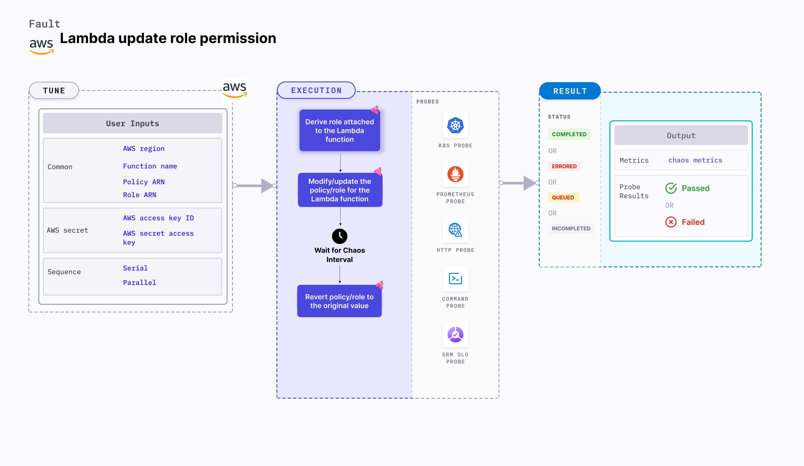

Lambda update role permission is an AWS fault that modifies the role policies associated with a Lambda function. Sometimes, Lambda functions depend on services like RDS, DynamoDB, and S3. In such cases, certain permissions are required to access these services. This fault helps understand how your application would behave when a Lambda function does not have enough permissions to access the services.



## Use cases
Lambda updated role permission:
- Verifies the handling mechanism for function failures.
- Updates the role attached to a Lambda function.
- Determines the performance of the running Lambda application when it does not have enough permissions.

### Prerequisites
- Kubernetes >= 1.17
- The Lambda function must be up and running.
- Kubernetes secret must have the AWS access configuration (key) in the `CHAOS_NAMESPACE`. Below is a sample secret file:
  ```yaml
  apiVersion: v1
  kind: Secret
  metadata:
    name: cloud-secret
  type: Opaque
  stringData:
    cloud_config.yml: |-
      # Add the cloud AWS credentials respectively
      [default]
      aws_access_key_id = XXXXXXXXXXXXXXXXXXX
      aws_secret_access_key = XXXXXXXXXXXXXXX
  ```

:::tip
HCE recommends that you use the same secret name, that is, `cloud-secret`. Otherwise, you will need to update the `AWS_SHARED_CREDENTIALS_FILE` environment variable in the fault template with the new secret name and you won't be able to use the default health check probes.
:::

Below is an example AWS policy to execute the fault when `ROLE_ARN` environment variable is set.

```json
{
    "Version": "2012-10-17",
    "Statement": [
        {
            "Sid": "VisualEditor0",
            "Effect": "Allow",
            "Action": [
                "iam:PassRole",
                "lambda:GetFunction",
                "lambda:UpdateFunctionConfiguration",
                "iam:AttachRolePolicy"
            ],
            "Resource": "*"
        }
    ]
}
```

Below is an example AWS policy to execute the fault when `POLICY_ARN` environment variable is set.

```json
{
    "Version": "2012-10-17",
    "Statement": [
        {
            "Sid": "VisualEditor0",
            "Effect": "Allow",
            "Action": [
                "iam:DetachRolePolicy",
                "lambda:GetFunction",
                "iam:ListAttachedRolePolicies",
                "iam:AttachRolePolicy",
                "iam:GetRolePolicy"
            ],
            "Resource": "*"
        }
    ]
}
```

:::info note
- Go to [AWS named profile for chaos](./security-configurations/aws-switch-profile.md) to use a different profile for AWS faults.
- Go to [superset permission/policy](./security-configurations/policy-for-all-aws-faults.md) to execute all AWS faults.
- Go to the [common tunables](/docs/chaos-engineering/chaos-faults/common-tunables-for-all-faults.md) and [AWS-specific tunables](./aws-fault-tunables.md) to tune the common tunables for all faults and AWS-specific tunables.
:::

### Mandatory tunables
   <table>
      <tr>
        <th> Tunable </th>
        <th> Description </th>
        <th> Notes </th>
      </tr>
      <tr>
        <td> FUNCTION_NAME </td>
        <td> Name of the target Lambda function. It supports a single function name.</td>
        <td> For example, <code>test-function</code>. </td>
      </tr>
      <tr>
        <td> POLICY_ARN </td>
        <td> Provide the policy ARN that you want to detach from the role attached</td>
        <td> For more information, go to <a href="#policy-arn"> policy ARN.</a></td>
      </tr>
      <tr>
        <td> ROLE_ARN </td>
        <td> Provide the role arn that you want to update in the lambda function</td>
        <td> ROLE_ARN and POLICY_ARN are mutually exclusive. If both are provided, ROLE_ARN takes precedence. For more information, go to <a href="#role-arn"> role ARN.</a></td>
      </tr>
      <tr>
        <td> REGION </td>
        <td> The region name of the target lambda function</td>
        <td> For example, <code>us-east-2</code> </td>
      </tr>
    </table>

### Optional tunables
  <table>
      <tr>
        <th> Tunable </th>
        <th> Description </th>
        <th> Notes </th>
      </tr>
      <tr>
        <td> TOTAL_CHAOS_DURATION </td>
        <td> Duration that you specify, through which chaos is injected into the target resource (in seconds). </td>
        <td> Default: 30 s. For more information, go to <a href="/docs/chaos-engineering/chaos-faults/common-tunables-for-all-faults#duration-of-the-chaos"> duration of the chaos. </a></td>
      </tr>
      <tr>
        <td> CHAOS_INTERVAL </td>
        <td> The interval (in seconds) between successive policy/role detach/update.</td>
        <td> Default: 30 s. For more information, go to <a href="/docs/chaos-engineering/chaos-faults/common-tunables-for-all-faults#chaos-interval"> chaos interval.</a></td>
      </tr>
      <tr>
            <td> AWS_SHARED_CREDENTIALS_FILE </td>
            <td> Path to the AWS secret credentials. </td>
            <td> Default: <code>/tmp/cloud_config.yml</code>. </td>
        </tr>
      <tr>
        <td> SEQUENCE </td>
        <td> It defines sequence of chaos execution for multiple instance</td>
        <td> Default: parallel. Supports serial and parallel. For more information, go to <a href="/docs/chaos-engineering/chaos-faults/common-tunables-for-all-faults#sequence-of-chaos-execution"> sequence of chaos execution.</a> </td>
      </tr>
      <tr>
        <td> RAMP_TIME </td>
        <td> Period to wait before and after injection of chaos in seconds </td>
        <td> For example, 30 s. For more information, go to <a href="/docs/chaos-engineering/chaos-faults/common-tunables-for-all-faults#ramp-time"> ramp time. </a></td>
      </tr>
    </table>

### Role ARN

Updates the role attached to a Lambda function. Tune it by using the `ROLE_ARN` environment variable.

The following YAML snippet illustrates the use of this environment variable:

[embedmd]:# (./static/manifests/lambda-update-role-permission/function-role.yaml yaml)
```yaml
# contains the role arn for the lambda function
apiVersion: litmuschaos.io/v1alpha1
kind: ChaosEngine
metadata:
  name: engine-nginx
spec:
  engineState: "active"
  chaosServiceAccount: litmus-admin
  experiments:
  - name: lambda-update-role-permission
    spec:
      components:
        env:
        # provide the role arn
        - name: ROLE_ARN
          value: 'arn:aws:iam::ACCOUNT_ID:role/service-role/chaos-role'
        # provide the function name
        - name: FUNCTION_NAME
          value: 'chaos-function'
```
### Policy ARN

Detaches the policies attached to the role of Lambda function. Tune it by using the `POLICY_ARN` environment variable.
Setting the `ROLE_ARN` environment variable updates the role attached to the Lambda function. Otherwise, the policy is detached using the `POLICY_ARN` environment variable.

The following YAML snippet illustrates the use of this environment variable:

[embedmd]:# (./static/manifests/lambda-update-role-permission/function-policy.yaml yaml)
```yaml
# contains the policy arn for the lambda function
apiVersion: litmuschaos.io/v1alpha1
kind: ChaosEngine
metadata:
  name: engine-nginx
spec:
  engineState: "active"
  chaosServiceAccount: litmus-admin
  experiments:
  - name: lambda-update-role-permission
    spec:
      components:
        env:
        # provide the policy arn
        - name: POLICY_ARN
          value: 'arn:aws:iam::ACCOUNT_ID:policy/service-role/chaos-policy'
        # provide the function name
        - name: FUNCTION_NAME
          value: 'chaos-function'
```