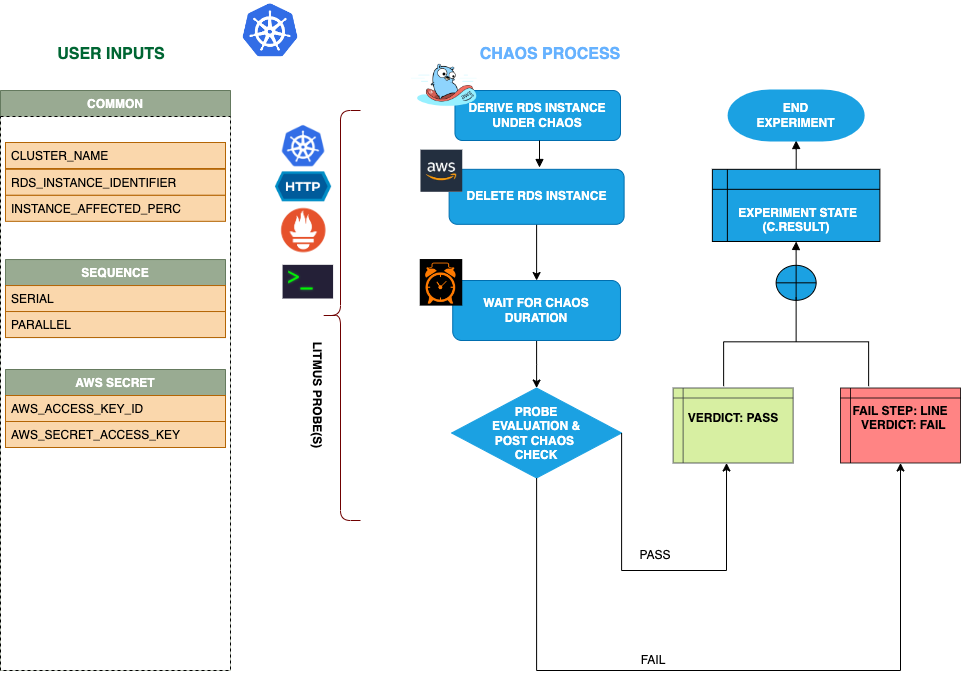

## Introduction

- RDS Instance delete can induce an RDS instance delete chaos on AWS RDS cluster. It derives the instance under chaos from RDS cluster.


:::tip Fault execution flow chart

:::


## Prerequisites

:::info

- Ensure that Kubernetes Version >= 1.17

**AWS RDS Access Requirement:**

- Ensure that you have sufficient AWS access to delete RDS instances.

- Ensure to create a Kubernetes secret having the AWS access configuration(key) in the `CHAOS_NAMESPACE`. A sample secret file looks like:

```yaml
apiVersion: v1
kind: Secret
metadata:
  name: cloud-secret
type: Opaque
stringData:
  cloud_config.yml: |-
    # Add the cloud AWS credentials respectively
    [default]
    aws_access_key_id = XXXXXXXXXXXXXXXXXXX
    aws_secret_access_key = XXXXXXXXXXXXXXX
```

- If you change the secret key name (from `cloud_config.yml`) please also update the `AWS_SHARED_CREDENTIALS_FILE` ENV value on `experiment.yaml`with the same name.

## Default Validations

:::info

- RDS instance should be in healthy state.

:::

## Experiment tunables

<details>
    <summary>Check the Experiment Tunables</summary>
    <h2>Mandatory Fields</h2>
    <table>
        <tr>
        <th> Variables </th>
        <th> Description </th>
        <th> Notes </th>
        </tr>
        <tr> 
        <td> CLUSTER_NAME </td>
        <td> Name of the target RDS cluster</td>
        <td> Eg. rds-cluster-1 </td>
        </tr>
        <tr> 
        <td> RDS_INSTANCE_IDENTIFIER </td>
        <td> Name of the target RDS Instances</td>
        <td> Eg. rds-cluster-1-instance </td>
        </tr>
        <tr>
        <td> REGION </td>
        <td> The region name of the target RDS cluster</td>
        <td> Eg. us-east-1 </td>
        </tr>
    </table>
    <h2>Optional Fields</h2>
    <table>
      <tr>
        <th> Variables </th>
        <th> Description </th>
        <th> Notes </th>
      </tr>
      <tr>
        <td> TOTAL_CHAOS_DURATION </td>
        <td> The total time duration for chaos insertion (sec) </td>
        <td> Defaults to 30s </td>
      </tr>
      <tr>
        <td> INSTANCE_AFFECTED_PERC </td>
        <td> The Percentage of total rds instance that are part of rds cluster to target </td>
        <td> Defaults to 0 (corresponds to 1 instance), provide numeric value only </td>
      </tr>
      <tr>
        <td> SEQUENCE </td>
        <td> It defines sequence of chaos execution for multiple instance</td>
        <td> Default value: parallel. Supported: serial, parallel </td>
      </tr>
      <tr> 
        <td> AWS_SHARED_CREDENTIALS_FILE </td>
        <td> Provide the path for aws secret credentials</td>
        <td> Defaults to <code>/tmp/cloud_config.yml</code> </td>
      </tr>
      <tr>
        <td> RAMP_TIME </td>
        <td> Period to wait before and after injection of chaos in sec </td>
        <td> Eg. 30 </td>
      </tr>
    </table>
</details>

## Experiment Examples

### Common and AWS specific tunables

Refer the [common attributes](../common-tunables-for-all-experiments) and [AWS specific tunable](./aws-experiments-tunables) to tune the common tunables for all experiments and aws specific tunables.

### RDS_CLUSTER_NAME

It defines the cluster name of the target RDS cluster. We can also provide the `RDS_CLUSTER_NAME` using `CLUSTER_NAME` ENVs. If not provided, the experiment will select the Instance Identifier provided.

Use the following example to tune this:

[embedmd]:# (./static/manifests/rds-instance-delete/instance-delete-cluster.yaml yaml)
```yaml
# delete the rds instance
apiVersion: litmuschaos.io/v1alpha1
kind: ChaosEngine
metadata:
  name: engine-nginx
spec:
  engineState: "active"
  annotationCheck: "false"
  chaosServiceAccount: litmus-admin
  experiments:
  - name: rds-instance-delete
    spec:
      components:
        env:
        # provide the name of rds cluster
        - name: CLUSTER_NAME
          value: 'rds-demo-cluster'
        - name: REGION
          value: 'us-east-2'
        - name: TOTAL_CHAOS_DURATION
          VALUE: '60'
```
### RDS_INSTANCE_IDENTIFIER 
 
It defines the RDS instnace name. We can provide the RDS_INSTANCE_IDENTIFIER using `RDS_INSTANCE_IDENTIFIER` ENVs.

Use the following example to tune this:

[embedmd]:# (./static/manifests/rds-instance-delete/instance-delete-instance.yaml yaml)
```yaml
# delete the rds instance
apiVersion: litmuschaos.io/v1alpha1
kind: ChaosEngine
metadata:
  name: engine-nginx
spec:
  engineState: "active"
  annotationCheck: "false"
  chaosServiceAccount: litmus-admin
  experiments:
  - name: rds-instance-delete
    spec:
      components:
        env:
        # provide the rds instance identifier 
        - name: RDS_INSTANCE_IDENTIFIER
          value: 'rds-demo-instance-1,rds-demo-instance-2'
        - name: INSTANCE_AFFECTED_PERC
          value: '100'
        - name: REGION
          value: 'us-east-2'
        - name: TOTAL_CHAOS_DURATION
          value: '60'
```
