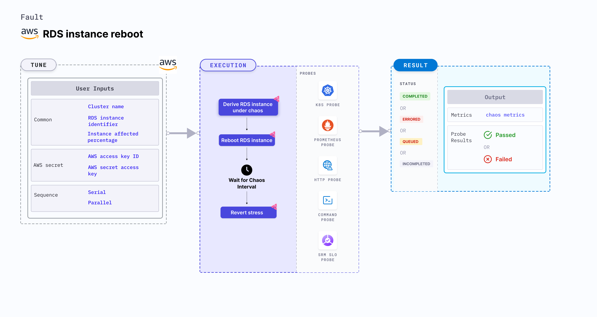

RDS instance reboot can induce an RDS instance reboot chaos on AWS RDS cluster. It derives the instance under chaos from RDS cluster.




## Usage

<details>
<summary>View fault usage</summary>
<div>
This fault determines the resilience of an application to RDS instance reboot.
</div>
</details>

## Prerequisites

- Kubernetes >= 1.17
- AWS access to reboot RDS instances.
- Kubernetes secret that has the AWS access configuration(key) in the `CHAOS_NAMESPACE`. A sample secret file looks like:

```yaml
apiVersion: v1
kind: Secret
metadata:
  name: cloud-secret
type: Opaque
stringData:
  cloud_config.yml: |-
    # Add the cloud AWS credentials respectively
    [default]
    aws_access_key_id = XXXXXXXXXXXXXXXXXXX
    aws_secret_access_key = XXXXXXXXXXXXXXX
```

- It is recommended to use the same secret name, i.e. `cloud-secret`. Otherwise, you will need to update the `AWS_SHARED_CREDENTIALS_FILE` environment variable in the fault template and you may be unable to use the default health check probes. 

- Refer to [AWS Named Profile For Chaos](./security/aws-switch-profile.md) to know how to use a different profile for AWS faults.

## Permissions required

Here is an example AWS policy to execute the fault.

<details>
<summary>View policy for the fault</summary>

```json
{
    "Version": "2012-10-17",
    "Statement": [
        {
            "Effect": "Allow",
            "Action": [
                "ec2:DescribeInstanceStatus",
                "ec2:DescribeInstances",
                "rds:DescribeDBClusters",
                "rds:DescribeDBInstances",
                "rds:RebootDBInstance"
            ],
            "Resource": "*"
        }
    ]
}
```
</details>

Refer to the [superset permission/policy](./security/policy-for-all-aws-faults.md) to execute all AWS faults.

## Default validations

- The RDS instance should be in a healthy state.

## Fault tunables

<details>
    <summary>Fault tunables</summary>
    <h2>Mandatory fields</h2>
    <table>
        <tr>
        <th> Variables </th>
        <th> Description </th>
        <th> Notes </th>
        </tr>
        <tr> 
        <td> CLUSTER_NAME </td>
        <td> Name of the target RDS cluster</td>
        <td> For example, rds-cluster-1 </td>
        </tr>
        <tr> 
        <td> RDS_INSTANCE_IDENTIFIER </td>
        <td> Name of the target RDS Instances</td>
        <td> For example, rds-cluster-1-instance </td>
        </tr>
        <tr>
        <td> REGION </td>
        <td> The region name of the target ECS cluster</td>
        <td> For example, us-east-1 </td>
        </tr>
    </table>
    <h2>Optional fields</h2>
    <table>
      <tr>
        <th> Variables </th>
        <th> Description </th>
        <th> Notes </th>
      </tr>
      <tr>
        <td> TOTAL_CHAOS_DURATION </td>
        <td> The total time duration for chaos insertion (sec) </td>
        <td> Defaults to 30s </td>
      </tr>
      <tr>
        <td> INSTANCE_AFFECTED_PERC </td>
        <td> The Percentage of total RDS instance that are part of RDS cluster to target </td>
        <td> Defaults to 0 (corresponds to 1 instance), provide numeric value only </td>
      </tr>
      <tr>
        <td> SEQUENCE </td>
        <td> It defines sequence of chaos execution for multiple instance</td>
        <td> Default value: parallel. Supported: serial, parallel </td>
      </tr>
      <tr> 
        <td> AWS_SHARED_CREDENTIALS_FILE </td>
        <td> Provide the path for aws secret credentials</td>
        <td> Defaults to <code>/tmp/cloud_config.yml</code> </td>
      </tr>
      <tr>
        <td> RAMP_TIME </td>
        <td> Period to wait before and after injection of chaos in sec </td>
        <td> For example, 30 </td>
      </tr>
    </table>
</details>

## Fault examples

### Common and AWS-specific tunables

Refer to the [common attributes](../common-tunables-for-all-faults) and [AWS-specific tunables](./aws-fault-tunables) to tune the common tunables for all faults and aws specific tunables.

### RDS cluster name

It defines the cluster name of the target RDS cluster. You can provide the RDS_CLUSTER_NAME using `CLUSTER_NAME` environment variable as well. If not provided, the fault selects the Instance Idenfier provided.

Use the following example to tune it:

[embedmd]:# (./static/manifests/rds-instance-reboot/instance-reboot-cluster.yaml yaml)
```yaml
# reboot the RDS instances
apiVersion: litmuschaos.io/v1alpha1
kind: ChaosEngine
metadata:
  name: engine-nginx
spec:
  engineState: "active"
  annotationCheck: "false"
  chaosServiceAccount: litmus-admin
  experiments:
  - name: rds-instance-reboot
    spec:
      components:
        env:
        # provide the name of RDS cluster
        - name: CLUSTER_NAME
          value: 'rds-demo-cluster'
        - name: REGION
          value: 'us-east-2'
        - name: TOTAL_CHAOS_DURATION
          value: '60'
```
### RDS instance identifier 
 
It defines the RDS instance name. You can provide the RDS_INSTANCE_IDENTIFIER using `RDS_INSTANCE_IDENTIFIER` environment variable.

Use the following example to tune it:

[embedmd]:# (./static/manifests/rds-instance-reboot/instance-reboot-instance.yaml yaml)
```yaml
# reboot the RDS instances
apiVersion: litmuschaos.io/v1alpha1
kind: ChaosEngine
metadata:
  name: engine-nginx
spec:
  engineState: "active"
  annotationCheck: "false"
  chaosServiceAccount: litmus-admin
  experiments:
  - name: rds-instance-reboot
    spec:
      components:
        env:
        # provide the RDS instance identifier
        - name: RDS_INSTANCE_IDENTIFIER
          value: 'rds-demo-instance-1,rds-demo-instance-2'
        - name: INSTANCE_AFFECTED_PERC
          value: '100'
        - name: REGION
          value: 'us-east-2'
        - name: TOTAL_CHAOS_DURATION
          value: '60'
```
