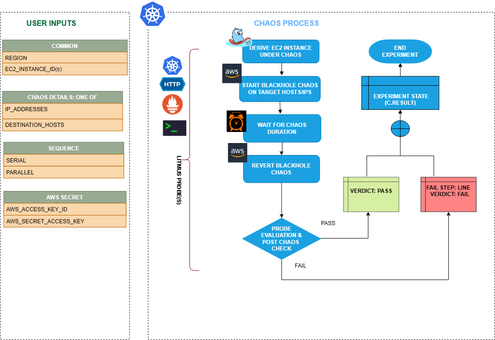

Windows EC2 blackhole chaos causes access loss to the given target hosts/ips by injecting firefall rules.
- It checks the performance of the application (or process) running on the EC2 instances.



## Usage
<details>
<summary>View fault usage</summary>
<div>
This fault degrades the network without the EC2 instance being marked as unhealthy (or unworthy) of traffic. This can be resolved by using a middleware that switches traffic based on some SLOs (performance parameters). This fault limits the impact (blast radius) to only the traffic that you wish to test, by specifying the destination hosts or IP addresses. 

This fault helps improve the resilience of your services over time.
</div>
</details>

## Prerequisites

- Kubernetes > 1.16
- SSM agent is installed and running on the target EC2 Windows instance.
- SSM IAM role should be attached to the target EC2 instance(s).
- Ensure to create a Kubernetes secret having the AWS Access Key ID and Secret Access Key credentials in the `CHAOS_NAMESPACE`. Below is the sample secret file:

```yaml
apiVersion: v1
kind: Secret
metadata:
  name: cloud-secret
type: Opaque
stringData:
  cloud_config.yml: |-
    # Add the cloud AWS credentials respectively
    [default]
    aws_access_key_id = XXXXXXXXXXXXXXXXXXX
    aws_secret_access_key = XXXXXXXXXXXXXXXXXXXXXXXXXXXXXXXXXXXX
```

- It is recommended to use the same secret name, i.e. `cloud-secret`. Otherwise, you will need to update the `AWS_SHARED_CREDENTIALS_FILE` environment variable in the fault template and you may be unable to use the default health check probes. 

- Refer to [AWS Named Profile For Chaos](./security/aws-switch-profile.md) to know how to use a different profile for AWS faults.

## Permissions required

Here is an example AWS policy to execute the fault.

<details>
<summary>View policy for the fault</summary>

```json
{
    "Version": "2012-10-17",
    "Statement": [
        {
            "Effect": "Allow",
            "Action": [
                "ssm:GetDocument",
                "ssm:DescribeDocument",
                "ssm:GetParameter",
                "ssm:GetParameters",
                "ssm:SendCommand",
                "ssm:CancelCommand",
                "ssm:CreateDocument",
                "ssm:DeleteDocument",
                "ssm:GetCommandInvocation",          
                "ssm:UpdateInstanceInformation",
                "ssm:DescribeInstanceInformation"
            ],
            "Resource": "*"
        },
        {
            "Effect": "Allow",
            "Action": [
                "ec2messages:AcknowledgeMessage",
                "ec2messages:DeleteMessage",
                "ec2messages:FailMessage",
                "ec2messages:GetEndpoint",
                "ec2messages:GetMessages",
                "ec2messages:SendReply"
            ],
            "Resource": "*"
        },
        {
            "Effect": "Allow",
            "Action": [
                "ec2:DescribeInstanceStatus",
                "ec2:DescribeInstances"
            ],
            "Resource": [
                "*"
            ]
        }
    ]
}
```
</details>

Refer to the [superset permission/policy](./security/policy-for-all-aws-faults.md) to execute all AWS faults.

## Default validations
The EC2 instance should be in healthy state.

## Fault tunables
<details>
    <summary>Fault tunables</summary>
    <h2>Mandatory fields</h2>
    <table>
      <tr>
        <th> Variables </th>
        <th> Description </th>
        <th> Notes </th>
      </tr>
      <tr>
        <td> EC2_INSTANCE_ID </td>
        <td> ID of the target EC2 instance. </td>
        <td> For example, <code>i-044d3cb4b03b8af1f</code>. Provide any one value either instance id or tag.</td>
      </tr>
      <tr>
        <td> EC2_INSTANCE_TAGS </td>
        <td> Tag of the target EC2 instances. </td>
        <td> For example, <code>type:chaos</code>. Provide any one value either instance id or tag.</td>
      </tr>
      <tr>
        <td> REGION </td>
        <td> The AWS region ID where the EC2 instance has been created. </td>
        <td> For example, <code>us-east-1</code>. </td>
      </tr>
    </table>
    <h2>Optional fields</h2>
    <table>
        <tr>
            <th> Variables </th>
            <th> Description </th>
            <th> Notes </th>
        </tr>
        <tr>
            <td> TOTAL_CHAOS_DURATION </td>
            <td> Duration that you specify, through which chaos is injected into the target resource (in seconds). </td>
            <td> Defaults to 30s. </td>
        </tr>
        <tr>
            <td> AWS_SHARED_CREDENTIALS_FILE </td>
            <td> Provide the path for aws secret credentials.</td>
            <td> Defaults to <code>/tmp/cloud_config.yml</code>.</td>
        </tr>
        <tr>
            <td> IP_ADDRESSES </td>
            <td> IP addresses of the services, the accessibility to which is impacted. </td>
            <td> comma-separated IP(S) can be provided. </td>
        </tr>
        <tr>
            <td> DESTINATION_HOSTS </td>
            <td> DNS Names of the services, the accessibility to which, is impacted. </td>
            <td> if not provided, it will induce network chaos for all ips/destinations or IP_ADDRESSES if already defined. </td>
        </tr>
        <tr>
            <td> SEQUENCE </td>
            <td> It defines sequence of chaos execution for multiple instance. </td>
            <td> Defaults to parallel. Supports serial sequence as well. </td>
        </tr>
        <tr>
            <td> RAMP_TIME </td>
            <td> Period to wait before and after injecting chaos (in seconds).  </td>
            <td> For example, 30s </td>
        </tr>
    </table>
</details>

## Fault examples

### Fault tunables
Refer to the [common attributes](../common-tunables-for-all-faults) to tune the common tunables for all the faults.

### Run with destination IPs

The network faults interrupt traffic for all the given IPs. You can be tuned via `IP_ADDRESSES` environment variable.

`IP_ADDRESSES`: It contains the IP addresses of the services which is impacted.

You can tune it using the following example:

[embedmd]:# (./static/manifests/windows-ec2-blackhole-chaos/destination-ip.yaml yaml)
```yaml
# it injects the chaos into the egress traffic for specific IPs/hosts
apiVersion: litmuschaos.io/v1alpha1
kind: ChaosEngine
metadata:
  name: engine-nginx
spec:
  engineState: "active"
  chaosServiceAccount: litmus-admin
  experiments:
  - name: windows-ec2-blackhole-chaos
    spec:
      components:
        env:
        # supports comma-separated destination ips
        - name: IP_ADDRESSES
          value: '8.8.8.8,192.168.5.6'
        - name: EC2_INSTANCE_ID
          value: 'instance-1'
        - name: REGION
          value: 'us-west-2'
```

### Run with destination hosts

The network faults interrupt traffic for all the hosts by default. The interruption of specific Hosts can be tuned via `DESTINATION_HOSTS` environment variable.

`DESTINATION_HOSTS`: It contains the DNS Names of the services, the accessibility to which, is impacted

You can tune it using the following example:

[embedmd]:# (./static/manifests/windows-ec2-blackhole-chaos/destination-host.yaml yaml)
```yaml
# it injects the chaos into the egress traffic for specific IPs/hosts
apiVersion: litmuschaos.io/v1alpha1
kind: ChaosEngine
metadata:
  name: engine-nginx
spec:
  engineState: "active"
  chaosServiceAccount: litmus-admin
  experiments:
  - name: windows-ec2-blackhole-chaos
    spec:
      components:
        env:
        # supports comma-separated destination hosts
        - name: DESTINATION_HOSTS
          value: 'google.com'
        - name: EC2_INSTANCE_ID
          value: 'instance-1'
        - name: REGION
          value: 'us-west-2'
```
