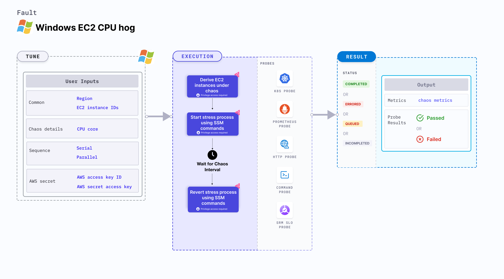

EC2 Windows CPU hog induces CPU stress on the AWS Windows EC2 instances using Amazon SSM Run command. The SSM Run command is executed using SSM documentation that is built into the fault.



## Use cases

EC2 Windows CPU hog:
- Simulates the situation of a lack of CPU for processes running on the instance, which degrades their performance.
- Simulates slow application traffic or exhaustion of the resources, leading to degradation in the performance of processes on the instance.

### Prerequisites
- Kubernetes >= 1.17
- The EC2 instance must be in a healthy state.
- SSM agent must be installed and running on the target EC2 instance.
- SSM IAM role must be attached to the target EC2 instance(s).
- Kubernetes secret must have the AWS Access Key ID and Secret Access Key credentials in the `CHAOS_NAMESPACE`. Below is a sample secret file:
    ```yaml
    apiVersion: v1
    kind: Secret
    metadata:
      name: cloud-secret
    type: Opaque
    stringData:
      cloud_config.yml: |-
        # Add the cloud AWS credentials respectively
        [default]
        aws_access_key_id = XXXXXXXXXXXXXXXXXXX
        aws_secret_access_key = XXXXXXXXXXXXXXXXXXXXXXXXXXXXXXXXXXXX
    ```

:::tip
HCE recommends that you use the same secret name, that is, `cloud-secret`. Otherwise, you will need to update the `AWS_SHARED_CREDENTIALS_FILE` environment variable in the fault template with the new secret name and you won't be able to use the default health check probes.
:::

Below is an example AWS policy to execute the fault.

```json
{
    "Version": "2012-10-17",
    "Statement": [
        {
            "Effect": "Allow",
            "Action": [
                "ssm:GetDocument",
                "ssm:DescribeDocument",
                "ssm:GetParameter",
                "ssm:GetParameters",
                "ssm:SendCommand",
                "ssm:CancelCommand",
                "ssm:CreateDocument",
                "ssm:DeleteDocument",
                "ssm:GetCommandInvocation",
                "ssm:UpdateInstanceInformation",
                "ssm:DescribeInstanceInformation"
            ],
            "Resource": "*"
        },
        {
            "Effect": "Allow",
            "Action": [
                "ec2messages:AcknowledgeMessage",
                "ec2messages:DeleteMessage",
                "ec2messages:FailMessage",
                "ec2messages:GetEndpoint",
                "ec2messages:GetMessages",
                "ec2messages:SendReply"
            ],
            "Resource": "*"
        },
        {
            "Effect": "Allow",
            "Action": [
                "ec2:DescribeInstanceStatus",
                "ec2:DescribeInstances"
            ],
            "Resource": [
                "*"
            ]
        }
    ]
}
```

:::info note
- Go to [AWS named profile for chaos](./security-configurations/aws-switch-profile.md) to use a different profile for AWS faults.
- Go to [superset permission/policy](./security-configurations/policy-for-all-aws-faults.md) to execute all AWS faults.
:::

### Mandatory tunables
 <table>
        <tr>
            <th> Tunable </th>
            <th> Description </th>
            <th> Notes </th>
        </tr>
        <tr>
            <td> EC2_INSTANCE_ID </td>
            <td> ID(s) of the target EC2 instances. </td>
            <td> For example: <code>i-044d3cb4b03b8af1f</code>. For more information, go to <a href="#multiple-ec2-instances"> EC2 instances.</a></td>
        </tr>
        <tr>
            <td> REGION </td>
            <td> AWS region ID where the EC2 instance has been created. </td>
            <td> For example: <code>us-east-1</code>. </td>
        </tr>
    </table>

### Optional tunables
  <table>
        <tr>
            <th> Tunable </th>
            <th> Description </th>
            <th> Notes </th>
        </tr>
        <tr>
            <td> TOTAL_CHAOS_DURATION </td>
            <td> Duration that you specify, through which chaos is injected into the target resource (in seconds).</td>
        <td> Default: 30 s. For more information, go to <a href="/docs/chaos-engineering/chaos-faults/common-tunables-for-all-faults#duration-of-the-chaos"> duration of the chaos. </a></td>
        </tr>
        <tr>
            <td> AWS_SHARED_CREDENTIALS_FILE </td>
            <td> Path to the AWS secret credentials. </td>
            <td> Default: <code>/tmp/cloud_config.yml</code>. </td>
        </tr>
        <tr>
            <td> CPU_CORE </td>
            <td> Number of CPU cores to consume.</td>
            <td> Default: 0. This means all available CPU cores are consumed. For more information, go to <a href="#cpu-core"> CPU core.</a></td>
        </tr>
        <tr>
          <td> CPU_PERCENTAGE </td>
          <td> Percentage of CPU core that is consumed.</td>
          <td> <code>CPU_CORES</code> and <code>CPU_PERCENTAGE</code> are mututally exclusive, and if values for both there tunables are provided, the latter takes precedence. For example, if <code>CPU_CORES</code> is 1 and <code>CPU_PERCENTAGE</code> is 50, 50 percent of the resources are stressed. For more information, go to <a href="#cpu-percentage">CPU percentage</a>.</td>
      </tr>
        <tr>
            <td> SEQUENCE </td>
            <td> Sequence of chaos execution for multiple instances. </td>
            <td> Default: parallel. Supports serial and parallel. For more information, go to <a href="/docs/chaos-engineering/chaos-faults/common-tunables-for-all-faults#sequence-of-chaos-execution"> sequence of chaos execution.</a></td>
        </tr>
        <tr>
            <td> RAMP_TIME </td>
            <td> Period to wait before and after injecting chaos (in seconds). </td>
            <td> For example, 30 s. For more information, go to <a href="/docs/chaos-engineering/chaos-faults/common-tunables-for-all-faults#ramp-time"> ramp time. </a></td>
        </tr>
    </table>

### CPU core

Number of CPU cores utilized on the EC2 instance. Tune it by using the `CPU_CORE` environment variable. All available CPU cores can be consumed by setting this variable to `0`.

The following YAML snippet illustrates the use of this environment variable:

[embedmd]:# (./static/manifests/windows-ec2-cpu-hog/cpu-core.yaml yaml)
```yaml
# CPU cores to utilize
apiVersion: litmuschaos.io/v1alpha1
kind: ChaosEngine
metadata:
  name: engine-nginx
spec:
  engineState: "active"
  chaosServiceAccount: litmus-admin
  experiments:
  - name: windows-ec2-cpu-hog
    spec:
      components:
        env:
        - name: CPU_CORE
          VALUE: '2'
        # ID of the EC2 instance
        - name: EC2_INSTANCE_ID
          value: 'instance-1'
        # region for the EC2 instance
        - name: REGION
          value: 'us-east-1'
```

### CPU percentage
The `CPU_PERCENTAGE` environment variable specifies the percentage of stress applied on the target Windows VM for a specific duration. If the variable is set to `0`, the fault consumes all the available CPU cores.

Following YAML snippet illustrates the use of this input variable.

[embedmd]:# (./static/manifests/windows-cpu-stress/win-cpu-stress-perc.yaml yaml)
```yaml
# CPU hog in the Windows VM
apiVersion: litmuschaos.io/v1alpha1
kind: MachineChaosExperiment
metadata:
  name: windows-cpu-stress
spec:
  infraType: "windows"
  steps:
    - - name: windows-cpu-stress
  tasks:
    - name: windows-cpu-stress
      infraId: ""
      definition:
        chaos:
          fault: windows-cpu-stress
          env:
           # CPU cores for stress
            - name: CPU_PERCENTAGE
              value: '50'
```

:::info note
If both `CPU_CORE` and `CPU_PERCENTAGE` are set to 0, no stress is applied on any of the Windows machine resources.
:::

### Multiple EC2 instances

Multiple EC2 instances specified as comma-separated IDs targeted in one chaos run. Tune it by using the `EC2_INSTANCE_ID` environment variable.

The following YAML snippet illustrates the use of this environment variable:

[embedmd]:# (./static/manifests/windows-ec2-cpu-hog/multiple-instances.yaml yaml)
```yaml
# mutilple instance targets
apiVersion: litmuschaos.io/v1alpha1
kind: ChaosEngine
metadata:
  name: engine-nginx
spec:
  engineState: "active"
  chaosServiceAccount: litmus-admin
  experiments:
  - name: windows-ec2-cpu-hog
    spec:
      components:
        env:
        # ids of the EC2 instances
        - name: EC2_INSTANCE_ID
          value: 'instance-1,instance-2,instance-3'
        # region for the EC2 instance
        - name: REGION
          value: 'us-east-1'
```