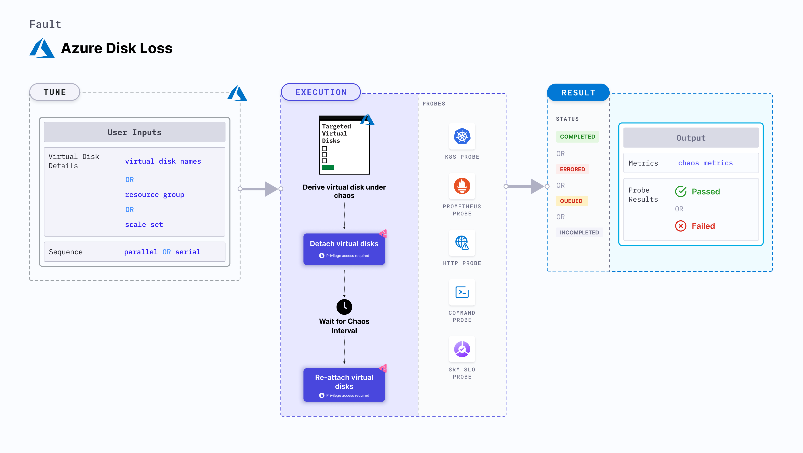

## Introduction
- It causes detachment of virtual disk from an Azure instance before re-attaching it back to the instance after the specified chaos duration.
- It helps to check the performance of the application/process running on the instance.

:::tip Fault execution flow chart

:::

## Uses
<details>
<summary>View the uses of the fault</summary>
<div>
Coming soon.
</div>
</details>

## Prerequisites
:::info
- Ensure that Kubernetes Version > 1.16.
- Ensure that you have sufficient Azure access to detach and attach a disk. 
- We will use Azure [ file-based authentication ](https://docs.microsoft.com/en-us/azure/developer/go/azure-sdk-authorization#use-file-based-authentication) to connect with the instance using Azure GO SDK in the fault. For generating auth file run `az ad sp create-for-rbac --sdk-auth > azure.auth` Azure CLI command.
- Ensure to create a Kubernetes secret having the auth file created in the step in `CHAOS_NAMESPACE`. A sample secret file looks like:
```yaml
apiVersion: v1
kind: Secret
metadata:
  name: cloud-secret
type: Opaque
stringData:
  azure.auth: |-
    {
      "clientId": "XXXXXXXXX",
      "clientSecret": "XXXXXXXXX",
      "subscriptionId": "XXXXXXXXX",
      "tenantId": "XXXXXXXXX",
      "activeDirectoryEndpointUrl": "XXXXXXXXX",
      "resourceManagerEndpointUrl": "XXXXXXXXX",
      "activeDirectoryGraphResourceId": "XXXXXXXXX",
      "sqlManagementEndpointUrl": "XXXXXXXXX",
      "galleryEndpointUrl": "XXXXXXXXX",
      "managementEndpointUrl": "XXXXXXXXX"
    }
```
- If you change the secret key name (from `azure.auth`) please also update the `AZURE_AUTH_LOCATION` ENV value in the ChaosExperiment CR with the same name.
:::

## Default Validations
:::info
- Azure Disk should be connected to an instance.
:::

## Fault Tunables
<details>
    <summary>Check the Fault Tunables</summary>
    <h2>Mandatory Fields</h2>
    <table>
        <tr>
            <th> Variables </th>
            <th> Description </th>
            <th> Notes </th>
        </tr>
        <tr>
            <td> VIRTUAL_DISK_NAMES </td>
            <td> Name of virtual disks to target.</td>
            <td> Provide comma separated names for multiple disks</td>
        </tr>
        <tr>
            <td> RESOURCE_GROUP </td>
            <td> The resource group of the target disk(s)</td>
            <td> </td>
        </tr>
    </table>
    <h2>Optional Fields</h2>
    <table>
        <tr>
            <th> Variables </th>
            <th> Description </th>
            <th> Notes </th>
        </tr>
        <tr>
            <td> SCALE_SET </td>
            <td> Whether disk is connected to Scale set instance</td>
            <td> Accepts "enable"/"disable". Default is "disable"</td>
        </tr>
        <tr>
            <td> TOTAL_CHAOS_DURATION </td>
            <td> The total time duration for chaos insertion (sec) </td>
            <td> Defaults to 30s </td>
        </tr>
        <tr>
            <td> CHAOS_INTERVAL </td>
            <td> The interval (in sec) between successive instance poweroff.</td>
            <td> Defaults to 30s </td>
        </tr>
        <tr>
            <td> SEQUENCE </td>
            <td> It defines sequence of chaos execution for multiple instance</td>
            <td> Default value: parallel. Supported: serial, parallel </td>
        </tr>
        <tr>
            <td> RAMP_TIME </td>
            <td> Period to wait before and after injection of chaos in sec </td>
            <td> Eg: 30 </td>
        </tr>
    </table>
</details>

## Fault Examples

### Common Fault Tunables

Refer the [common attributes](../common-tunables-for-all-faults) to tune the common tunables for all the faults.

### Detach Virtual Disks By Name

It contains comma separated list of disk names subjected to disk loss chaos. It can be tuned via `VIRTUAL_DISK_NAMES` ENV.

Use the following example to tune this:

[embedmd]:# (./static/manifests/azure-disk-loss/azure-disks.yaml yaml)
```yaml
# detach multiple Azure disks by their names
apiVersion: litmuschaos.io/v1alpha1
kind: ChaosEngine
metadata:
  name: engine-nginx
spec:
  engineState: "active"
  chaosServiceAccount: litmus-admin
  experiments:
  - name: azure-disk-loss
    spec:
      components:
        env:
        # comma separated names of the Azure disks attached to VMs
        - name: VIRTUAL_DISK_NAMES
          value: 'disk-01,disk-02'
        # name of the resource group
        - name: RESOURCE_GROUP
          value: 'rg-azure-disks'
```

### Detach Virtual Disks Attached to Scale Set Instances By Name

It contains comma separated list of disk names attached to scale set instances subjected to disk loss chaos. It can be tuned via `VIRTUAL_DISK_NAMES` and `SCALE_SET` ENV.

Use the following example to tune this:

[embedmd]:# (./static/manifests/azure-disk-loss/azure-scale-set-disk.yaml yaml)
```yaml
# detach multiple Azure disks attached to scale set VMs by their names
apiVersion: litmuschaos.io/v1alpha1
kind: ChaosEngine
metadata:
  name: engine-nginx
spec:
  engineState: "active"
  chaosServiceAccount: litmus-admin
  experiments:
  - name: azure-disk-loss
    spec:
      components:
        env:
        # comma separated names of the Azure disks attached to scaleset VMs
        - name: VIRTUAL_DISK_NAMES
          value: 'disk-01,disk-02'
        # name of the resource group
        - name: RESOURCE_GROUP
          value: 'rg-azure-disks'
        # VM belongs to scaleset or not
        - name: SCALE_SET
          value: 'enable'
```
