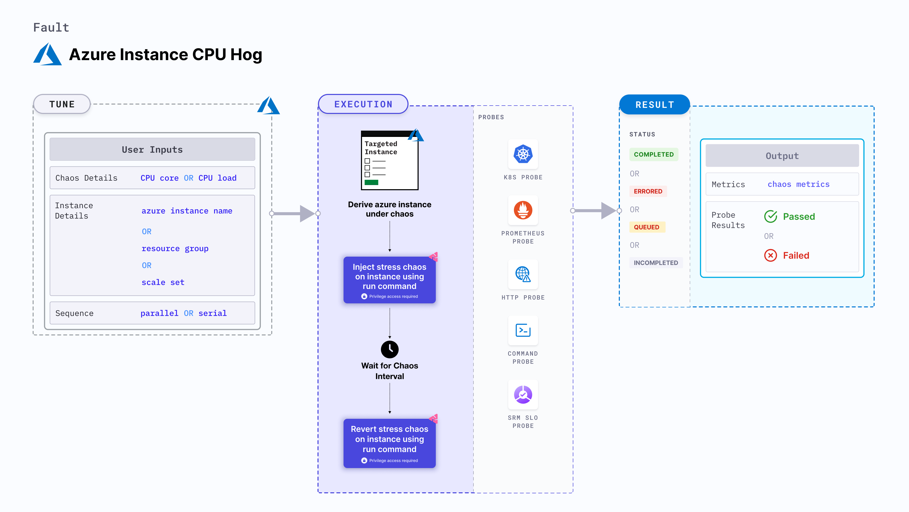

Azure instance CPU hog disrupts the state of infrastructure resources. 
- It induces stress on the Azure instance using the Azure `Run` command. The Azure `Run` command is executed using the in-built bash scripts within the fault.
- It utilizes excess amounts of CPU on the Azure instance using the bash script for a specific duration.



## Use cases
Azure instance CPU hog:
- Determines the resilience of an Azure instance and the application deployed on the instance during unexpected excessive utilization of the CPU resources. 
- Determines how Azure scales the CPU resources to maintain the application when it is under stress. 
- Causes CPU stress on the Azure instance(s). 
- Simulates the situation of lack of CPU for processes running on the application, which degrades their performance. 
- Verifies metrics-based horizontal pod autoscaling.
- Verifies vertical autoscale, that is, demand based CPU addition. 
- Facilitates the scalability of nodes based on growth beyond budgeted pods. 
- Verifies the autopilot functionality of cloud managed clusters. 
- Verifies multi-tenant load issues. When the load on one container increases, the fault checks for any downtime in other containers. 

:::note
- Kubernetes >= 1.17 is required to execute this fault.
- Azure Run Command agent should be installed and running in the target Azure instance.
- Azure disk should be in a healthy state.
- Use Azure [file-based authentication](https://docs.microsoft.com/en-us/azure/developer/go/azure-sdk-authorization#use-file-based-authentication) to connect to the instance using Azure GO SDK. To generate the auth file, run `az ad sp create-for-rbac --sdk-auth > azure.auth` Azure CLI command.
- Kubernetes secret should contain the auth file created in the previous step in the `CHAOS_NAMESPACE`. Below is a sample secret file:

```yaml
apiVersion: v1
kind: Secret
metadata:
  name: cloud-secret
type: Opaque
stringData:
  azure.auth: |-
    {
      "clientId": "XXXXXXXXX",
      "clientSecret": "XXXXXXXXX",
      "subscriptionId": "XXXXXXXXX",
      "tenantId": "XXXXXXXXX",
      "activeDirectoryEndpointUrl": "XXXXXXXXX",
      "resourceManagerEndpointUrl": "XXXXXXXXX",
      "activeDirectoryGraphResourceId": "XXXXXXXXX",
      "sqlManagementEndpointUrl": "XXXXXXXXX",
      "galleryEndpointUrl": "XXXXXXXXX",
      "managementEndpointUrl": "XXXXXXXXX"
    }
```
- If you change the secret key name from `azure.auth` to a new name, ensure that you update the `AZURE_AUTH_LOCATION` environment variable in the chaos experiment with the new name.
:::

## Fault tunables

   <h3>Mandatory fields</h3>
    <table>
        <tr>
            <th> Variables </th>
            <th> Description </th>
            <th> Notes </th>
        </tr>
        <tr>
            <td> AZURE_INSTANCE_NAMES </td>
            <td> Names of the target Azure instances. </td>
            <td> Multiple values can be provided as comma-separated strings. For example, <code>instance-1,instance-2. For more information, go to <a href="https://developer.harness.io/docs/chaos-engineering/chaos-faults/azure/azure-instance-stop#stop-instances-by-name"> stop instances by name. </a></code> </td>
        </tr>
        <tr>
            <td> RESOURCE_GROUP </td>
            <td> The Azure Resource Group name where the instances will be created. </td>
            <td> All the instances must be from the same resource group. For more information, go to <a href="https://developer.harness.io/docs/chaos-engineering/chaos-faults/azure/azure-instance-cpu-hog#cpu-core"> resource group field in the YAML file. </a></td>
        </tr>
    </table>
    <h3>Optional fields</h3>
    <table>
        <tr>
            <th> Variables </th>
            <th> Description </th>
            <th> Notes </th>
        </tr>
        <tr>
            <td> TOTAL_CHAOS_DURATION </td>
            <td> Duration that you specify, through which chaos is injected into the target resource (in seconds). </td>
            <td> Defaults to 30s. For more information, go to <a href="https://developer.harness.io/docs/chaos-engineering/chaos-faults/common-tunables-for-all-faults#duration-of-the-chaos"> duration of the chaos.</a></td>
        </tr>
        <tr>
            <td> CHAOS_INTERVAL </td>
            <td> Time interval between two successive container kills (in seconds).</td>
            <td> Defaults to 60s. For more information, go to <a href="https://developer.harness.io/docs/chaos-engineering/chaos-faults/common-tunables-for-all-faults#chaos-interval"> chaos interval.</a></td>
        </tr>
        <tr>
          <td> AZURE_AUTH_LOCATION </td>
          <td> Name of the Azure secret credential files. </td>
          <td> Defaults to <code>azure.auth</code>. </td>
        </tr>
        <tr>
            <td> SCALE_SET </td>
            <td> Check if the instance is a part of Scale Set.</td>
            <td> Defaults to <code>disable</code>. Also supports <code>enable</code>. For more information, go to <a href="https://developer.harness.io/docs/chaos-engineering/chaos-faults/azure/azure-instance-stop#stop-scale-set-instances"> scale set instances.</a></td>
        </tr>
        <tr>
            <td> INSTALL_DEPENDENCIES </td>
            <td> Install dependencies to run the chaos. </td>
            <td> Defaults to <code>true</code>. Also supports <code>false</code>. </td>
        </tr>
        <tr>
            <td> CPU_CORE </td>
            <td> Number of CPU cores that will be subject to stress. For more information, go to <a href=""> </a></td>
            <td> Defaults to 0. For more information, go to <a href="https://developer.harness.io/docs/chaos-engineering/chaos-faults/azure/azure-instance-cpu-hog#cpu-core"> CPU core.</a></td>
        </tr>
        <tr>
            <td> CPU_LOAD </td>
            <td> Percentage load exerted on a single CPU core. </td>
            <td> Defaults to 100. For more information, go to <a href="https://developer.harness.io/docs/chaos-engineering/chaos-faults/azure/azure-instance-cpu-hog#cpu-percentage"> CPU percentage.</a></td>
        </tr>
        <tr>
            <td> SEQUENCE </td>
            <td> Sequence of chaos execution for multiple target pods.</td>
            <td> Defaults to parallel. Also supports <code>serial</code> sequence. For more information, go to <a href="https://developer.harness.io/docs/chaos-engineering/chaos-faults/common-tunables-for-all-faults#sequence-of-chaos-execution"> sequence of chaos execution.</a></td>
        </tr>
        <tr>
            <td> RAMP_TIME </td>
            <td> Period to wait before and after injecting chaos (in seconds). </td>
            <td> For example, 30s. For more information, go to <a href="https://developer.harness.io/docs/chaos-engineering/chaos-faults/common-tunables-for-all-faults#ramp-time"> ramp time.</a></td>
        </tr>
    </table>

### CPU core

It specifies the number of CPU cores utilised on the Azure instance. Tune it by using the `CPU_CORE` environment variable.

Use the following example to tune it:

[embedmd]:# (./static/manifests/azure-instance-cpu-hog/cpu-core.yaml yaml)
```yaml
# CPU cores to utilize
apiVersion: litmuschaos.io/v1alpha1
kind: ChaosEngine
metadata:
  name: engine-nginx
spec:
  engineState: "active"
  chaosServiceAccount: litmus-admin
  experiments:
  - name: azure-instance-cpu-hog
    spec:
      components:
        env:
        - name: CPU_CORE
          VALUE: '2'
        # name of the Azure instance
        - name: AZURE_INSTANCE_NAMES
          value: 'instance-1'
        # resource group for the Azure instance
        - name: RESOURCE_GROUP
          value: 'rg-azure'
```

### CPU percentage

It specifies the amount of CPU utilised (in percentage) on the Azure instance. Tune it by using the `CPU_LOAD` environment variable.

Use the following example to tune it:

[embedmd]:# (./static/manifests/azure-instance-cpu-hog/cpu-percentage.yaml yaml)
```yaml
# CPU percentage to utilize
apiVersion: litmuschaos.io/v1alpha1
kind: ChaosEngine
metadata:
  name: engine-nginx
spec:
  engineState: "active"
  chaosServiceAccount: litmus-admin
  experiments:
  - name: azure-instance-cpu-hog
    spec:
      components:
        env:
        - name: CPU_LOAD
          VALUE: '50'
        # name of the Azure instance
        - name: AZURE_INSTANCE_NAMES
          value: 'instance-1'
        # resource group for the Azure instance
        - name: RESOURCE_GROUP
          value: 'rg-azure'
```

### Multiple Azure instances

It specifies comma-separated Azure instance names that are subject to chaos in a single run. Tune it by using the `AZURE_INSTANCE_NAMES` environment variable.

Use the following example to tune it:

[embedmd]:# (./static/manifests/azure-instance-cpu-hog/multiple-instances.yaml yaml)
```yaml
# mutilple instance targets
apiVersion: litmuschaos.io/v1alpha1
kind: ChaosEngine
metadata:
  name: engine-nginx
spec:
  engineState: "active"
  chaosServiceAccount: litmus-admin
  experiments:
  - name: azure-instance-cpu-hog
    spec:
      components:
        env:
        # names of the Azure instance
        - name: AZURE_INSTANCE_NAMES
          value: 'instance-1,instance-2'
        # resource group for the Azure instance
        - name: RESOURCE_GROUP
          value: 'rg-azure'
```

### CPU core with percentage consumption

It specifies the number of CPU cores utilised (in percentage) by the Azure instance. Tune it by using the `CPU_CORE` and `CPU_LOAD` environment variables, respectively.

Use the following example to tune it:

[embedmd]:# (./static/manifests/azure-instance-cpu-hog/cpu-core-with-percentage.yaml yaml)
```yaml
# CPU core with percentage to utilize
apiVersion: litmuschaos.io/v1alpha1
kind: ChaosEngine
metadata:
  name: engine-nginx
spec:
  engineState: "active"
  chaosServiceAccount: litmus-admin
  experiments:
  - name: azure-instance-cpu-hog
    spec:
      components:
        env:
        - name: CPU_CORE
          VALUE: '2'
        - name: CPU_LOAD
          VALUE: '50'
        # name of the Azure instance
        - name: AZURE_INSTANCE_NAMES
          value: 'instance-1'
        # resource group for the Azure instance
        - name: RESOURCE_GROUP
          value: 'rg-azure'
```
