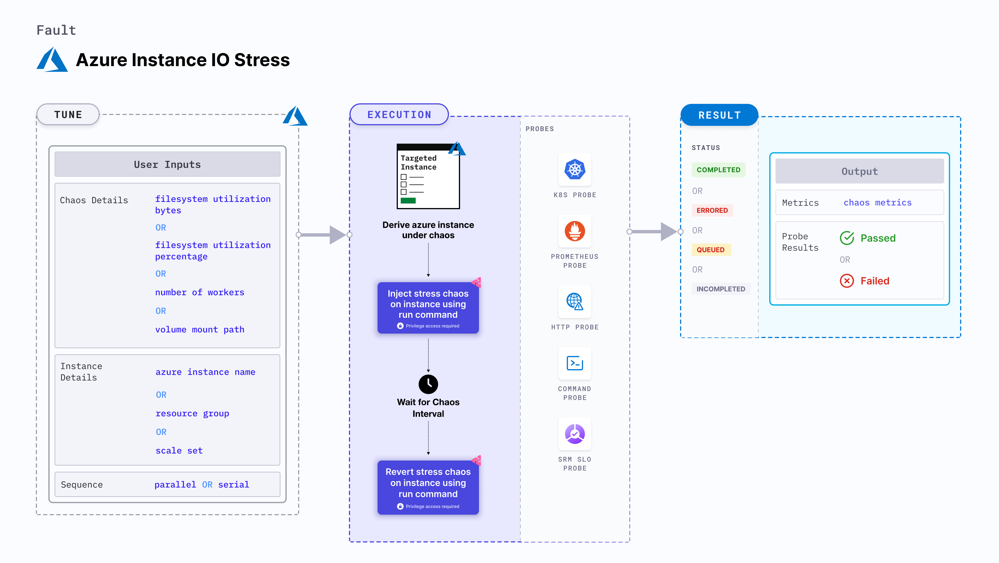

## Introduction

- Azure Instance IO Stress contains chaos to disrupt the state of infra resources. The fault can induce stress chaos on Azure Instance using Azure Run Command, this is carried out by using bash scripts which are in-built in the fault for the given chaos scenario.
- It causes IO Stress chaos on Azure Instance using an bash script for a certain chaos duration.

:::tip Fault execution flow chart

:::

## Uses

### Uses of the fault

:::info

- Filesystem read and write is another very common and frequent scenario we find with processes/applications that can result in the impact on its delivery. These problems are generally referred to as "Noisy Neighbour" problems.
- Injecting a rogue process into a target Azure instance, we starve the main processes/applications (typically pid 1) of the resources allocated to it (where limits are defined) causing slowness in application traffic or in other cases unrestrained use can cause instance to exhaust resources leading to degradation in performance of processes/applications present on the instance. So this category of chaos fault helps to build the immunity on the application undergoing any such stress scenario.

:::

## Prerequisites

:::info

### Verify the prerequisites

- Ensure that Kubernetes Version >= 1.17

**Azure Access Requirement:**

- Ensure that Azure Run Command agent is installed and running in the target Azure instance.
- We will use Azure [file-based authentication](https://docs.microsoft.com/en-us/azure/developer/go/azure-sdk-authorization#use-file-based-authentication) to connect with the instance using Azure GO SDK in the fault. For generating auth file run `az ad sp create-for-rbac --sdk-auth > azure.auth` Azure CLI command.
- Ensure to create a Kubernetes secret having the auth file created in the step in `CHAOS_NAMESPACE`. A sample secret file looks like:

```yaml
apiVersion: v1
kind: Secret
metadata:
  name: cloud-secret
type: Opaque
stringData:
  azure.auth: |-
    {
      "clientId": "XXXXXXXXX",
      "clientSecret": "XXXXXXXXX",
      "subscriptionId": "XXXXXXXXX",
      "tenantId": "XXXXXXXXX",
      "activeDirectoryEndpointUrl": "XXXXXXXXX",
      "resourceManagerEndpointUrl": "XXXXXXXXX",
      "activeDirectoryGraphResourceId": "XXXXXXXXX",
      "sqlManagementEndpointUrl": "XXXXXXXXX",
      "galleryEndpointUrl": "XXXXXXXXX",
      "managementEndpointUrl": "XXXXXXXXX"
    }
```

- If you change the secret key name (from `azure.auth`) please also update the `AZURE_AUTH_LOCATION` ENV value in the ChaosExperiment CR with the same name.

:::

## Default Validations

:::info

- Azure instance should be in healthy state.

:::

## Fault Tunables

<details>
<summary>Check the Fault Tunables</summary>

<h2>Mandatory Fields</h2>

<table>
    <tr>
        <th> Variables </th>
        <th> Description </th>
        <th> Notes </th>
    </tr>
     <tr>
        <td> AZURE_INSTANCE_NAMES </td>
        <td> Names of the target Azure instances </td>
        <td> Multiple values can be provided as comma-separated string. Eg: instance-1,instance-2 </td>
    </tr>
    <tr>
        <td> RESOURCE_GROUP </td>
        <td> The Azure Resource Group name where the instances has been created </td>
        <td> All the instances must be from the same resource group </td>
    </tr>
</table>

<h2>Optional Fields</h2>

<table>
    <tr>
        <th> Variables </th>
        <th> Description </th>
        <th> Notes </th>
    </tr>
    <tr>
        <td> TOTAL_CHAOS_DURATION </td>
        <td> The total time duration for chaos injection (sec) </td>
        <td> Defaults to 30s </td>
    </tr>
    <tr>
        <td> CHAOS_INTERVAL </td>
        <td> The interval (in sec) between successive chaos injection</td>
        <td> Defaults to 60s </td>
    </tr>
    <tr>
        <td> AZURE_AUTH_LOCATION </td>
        <td> Provide the name of the Azure secret credentials files</td>
        <td> Defaults to <code>azure.auth</code> </td>
    </tr>
    <tr>
        <td> SCALE_SET </td>
        <td> Whether the Instance are part of ScaleSet or not. It can be either disable or enable</td>
        <td> Defaults to <code>disable</code> </td>
    </tr>
    <tr>
        <td> INSTALL_DEPENDENCIES </td>
        <td> Select to install dependencies used to run the io chaos. It can be either True or False</td>
        <td> Defaults to True </td>
    </tr>
    <tr>
        <td> FILESYSTEM_UTILIZATION_PERCENTAGE </td>
        <td> Specify the size as percentage of free space on the file system </td>
        <td> Default to 0%, which will result in 1 GB Utilization </td>
    </tr>
    <tr>
        <td> FILESYSTEM_UTILIZATION_BYTES </td>
        <td> Specify the size in GigaBytes(GB). <code>FILESYSTEM_UTILIZATION_PERCENTAGE</code> & <code>FILESYSTEM_UTILIZATION_BYTES</code> are mutually exclusive. If both are provided, <code>FILESYSTEM_UTILIZATION_PERCENTAGE</code> is prioritized. </td>
        <td> Default to 0GB, which will result in 1 GB Utilization </td>
    </tr>
    <tr>
        <td> NUMBER_OF_WORKERS </td>
        <td> It is the number of IO workers involved in IO disk stress </td>
        <td> Default to 4 </td>
    </tr>
    <tr>
        <td> VOLUME_MOUNT_PATH </td>
        <td> Fill the given volume mount path</td>
        <td> Defaults to the user HOME directory </td>
    </tr>
    <tr>
        <td> SEQUENCE </td>
        <td> It defines sequence of chaos execution for multiple instance</td>
        <td> Default value: parallel. Supported: serial, parallel </td>
    </tr>
    <tr>
        <td> RAMP_TIME </td>
        <td> Period to wait before and after injection of chaos in sec </td>
        <td> Eg: 30 </td>
    </tr>
</table>

</details>

## Fault Examples

### Common Fault Tunables

Refer the [common attributes](../common-tunables-for-all-faults) to tune the common tunables for all the faults.

### FILESYSTEM UTILIZATION IN MEGABYTES

It defines the filesytem value to be utilised in megabytes on the Azure instance. It can be tuned via `FILESYSTEM_UTILIZATION_BYTES` ENV.

Use the following example to tune this:

[embedmd]:# (./static/manifests/azure-instance-io-stress/filesystem-bytes.yaml yaml)
```yaml
# filesystem bytes to utilize
apiVersion: litmuschaos.io/v1alpha1
kind: ChaosEngine
metadata:
  name: engine-nginx
spec:
  engineState: "active"
  chaosServiceAccount: litmus-admin
  experiments:
  - name: azure-instance-io-stress
    spec:
      components:
        env:
        - name: FILESYSTEM_UTILIZATION_BYTES
          VALUE: '1024'
        # name of the Azure instance
        - name: AZURE_INSTANCE_NAMES
          value: 'instance-1'
        # resource group for the Azure instance
        - name: RESOURCE_GROUP
          value: 'rg-azure'
```

### FILESYSTEM UTILIZATION IN PERCENTAGE

It defines the filesytem percentage to be utilised on the Azure instance. It can be tuned via `FILESYSTEM_UTILIZATION_PERCENTAGE` ENV.

Use the following example to tune this:

[embedmd]:# (./static/manifests/azure-instance-io-stress/filesystem-percentage.yaml yaml)
```yaml
# filesystem percentage to utilize
apiVersion: litmuschaos.io/v1alpha1
kind: ChaosEngine
metadata:
  name: engine-nginx
spec:
  engineState: "active"
  chaosServiceAccount: litmus-admin
  experiments:
  - name: azure-instance-io-stress
    spec:
      components:
        env:
        - name: FILESYSTEM_UTILIZATION_PERCENTAGE
          VALUE: '50'
        # name of the Azure instance
        - name: AZURE_INSTANCE_NAMES
          value: 'instance-1'
        # resource group for the Azure instance
        - name: RESOURCE_GROUP
          value: 'rg-azure'
```

### MULTIPLE WORKERS

It defines the CPU threads to be run to spike the filesystem utilisation, this will increase the growth of filesystem consumption. It can be tuned via `NUMBER_OF_WORKERS` ENV.

Use the following example to tune this:

[embedmd]:# (./static/manifests/azure-instance-io-stress/multiple-workers.yaml yaml)
```yaml
# multiple workers to utilize resources
apiVersion: litmuschaos.io/v1alpha1
kind: ChaosEngine
metadata:
  name: engine-nginx
spec:
  engineState: "active"
  chaosServiceAccount: litmus-admin
  experiments:
  - name: azure-instance-io-stress
    spec:
      components:
        env:
        - name: NUMBER_OF_WORKERS
          VALUE: '3'
        # name of the Azure instance
        - name: AZURE_INSTANCE_NAMES
          value: 'instance-1'
        # resource group for the Azure instance
        - name: RESOURCE_GROUP
          value: 'rg-azure'
```

### VOLUME MOUNT PATH

It defines volume mount path to target attached to the Azure instance. It can be tuned via `VOLUME_MOUNT_PATH` ENV.

Use the following example to tune this:

[embedmd]:# (./static/manifests/azure-instance-io-stress/volume-path.yaml yaml)
```yaml
# volume path to be used for io stress
apiVersion: litmuschaos.io/v1alpha1
kind: ChaosEngine
metadata:
  name: engine-nginx
spec:
  engineState: "active"
  chaosServiceAccount: litmus-admin
  experiments:
  - name: azure-instance-io-stress
    spec:
      components:
        env:
        - name: VOLUME_MOUNT_PATH
          VALUE: '/tmp'
        # name of the Azure instance
        - name: AZURE_INSTANCE_NAMES
          value: 'instance-1'
        # resource group for the Azure instance
        - name: RESOURCE_GROUP
          value: 'rg-azure'
```

### MULTIPLE Azure INSTANCES

Multiple Azure instances can be targeted in one chaos run. It can be tuned via `AZURE_INSTANCE_NAMES` ENV.

Use the following example to tune this:

[embedmd]:# (./static/manifests/azure-instance-io-stress/multiple-instances.yaml yaml)
```yaml
# mutilple instance targets
apiVersion: litmuschaos.io/v1alpha1
kind: ChaosEngine
metadata:
  name: engine-nginx
spec:
  engineState: "active"
  chaosServiceAccount: litmus-admin
  experiments:
  - name: azure-instance-io-stress
    spec:
      components:
        env:
        - name: MEMORY_CONSUMPTION
          VALUE: '1024'
        # names of the Azure instance
        - name: AZURE_INSTANCE_NAMES
          value: 'instance-1,instance-2'
        # resource group for the Azure instance
        - name: RESOURCE_GROUP
          value: 'rg-azure'
```
