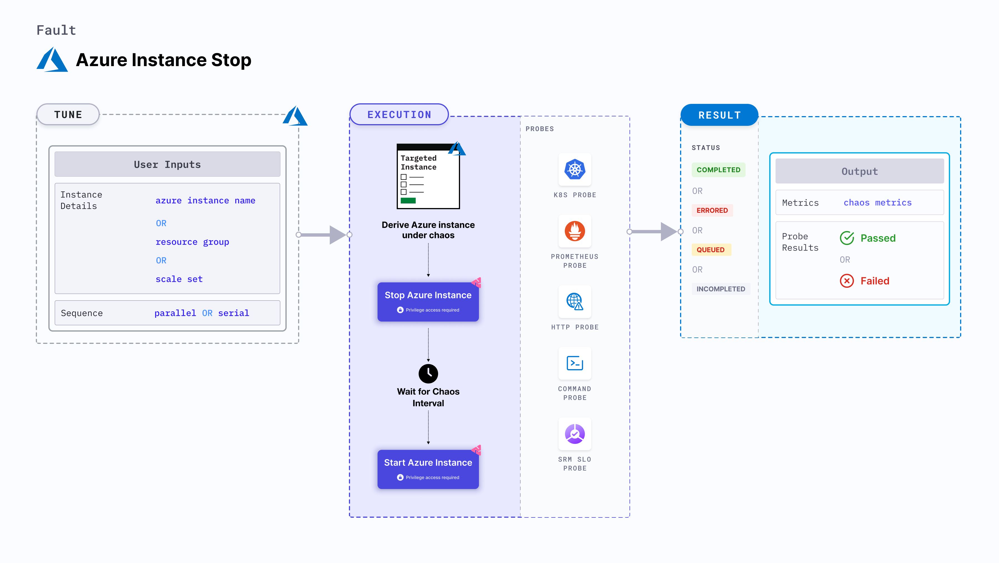

## Introduction
- It results in PowerOff of an Azure instance before bringing it back to running state after the specified chaos duration.
- It checks the performance of the application/process running on the instance.

:::tip Fault execution flow chart

:::

## Uses

<details>
<summary>View the uses of the fault</summary>
<div>
Coming soon.
</div>
</details>

## Prerequisites

:::info
- Kubernetes > 1.16.
- Azure access to stop and start the an instance. 
- Use Azure [ file-based authentication ](https://docs.microsoft.com/en-us/azure/developer/go/azure-sdk-authorization#use-file-based-authentication) to connect to the instance using Azure GO SDK in the experiment. To generate the auth file, run `az ad sp create-for-rbac --sdk-auth > azure.auth` Azure CLI command.
- Kubernetes secret that has the auth file created in the earlier step in `CHAOS_NAMESPACE`. A secret file looks like:

```yaml
apiVersion: v1
kind: Secret
metadata:
  name: cloud-secret
type: Opaque
stringData:
  azure.auth: |-
    {
      "clientId": "XXXXXXXXX",
      "clientSecret": "XXXXXXXXX",
      "subscriptionId": "XXXXXXXXX",
      "tenantId": "XXXXXXXXX",
      "activeDirectoryEndpointUrl": "XXXXXXXXX",
      "resourceManagerEndpointUrl": "XXXXXXXXX",
      "activeDirectoryGraphResourceId": "XXXXXXXXX",
      "sqlManagementEndpointUrl": "XXXXXXXXX",
      "galleryEndpointUrl": "XXXXXXXXX",
      "managementEndpointUrl": "XXXXXXXXX"
    }
```
- If you change the secret key name (from `azure.auth`) please also update the `AZURE_AUTH_LOCATION` ENV value in the ChaosExperiment CR with the same name.
:::

## Default Validations

:::info
- The Azure instance should be in healthy state.
:::

## Fault Tunables
<details>
    <summary>Check the Fault Tunables</summary>
    <h2>Mandatory Fields</h2>
    <table>
      <tr>
        <th> Variables </th>
        <th> Description </th>
        <th> Notes </th>
      </tr>
      <tr>
        <td> AZURE_INSTANCE_NAME </td>
        <td> Instance name of the target Azure instance</td>
        <td> For AKS nodes, the instance name is from the scale set section in Azure and not the node name from AKS node pool </td>
      </tr>
      <tr>
        <td> RESOURCE_GROUP </td>
        <td> The resource group of the target instance</td>
        <td> </td>
      </tr>
    </table>
    <h2>Optional Fields</h2>
    <table>
      <tr>
        <th> Variables </th>
        <th> Description </th>
        <th> Notes </th>
      </tr>
      <tr>
        <td> SCALE_SET </td>
        <td> Whether instance is part of Scale set</td>
        <td> Accepts "enable"/"disable". Default is "disable"</td>
      </tr>
      <tr>
        <td> TOTAL_CHAOS_DURATION </td>
        <td> The total time duration for chaos insertion (sec) </td>
        <td> Defaults to 30s </td>
      </tr>
      <tr>
        <td> CHAOS_INTERVAL </td>
        <td> The interval (in sec) between successive instance power off.</td>
        <td> Defaults to 30s </td>
      </tr>
      <tr>
        <td> SEQUENCE </td>
        <td> It defines sequence of chaos execution for multiple instance</td>
        <td> Default value: parallel. Supported: serial, parallel </td>
      </tr>
      <tr>
        <td> RAMP_TIME </td>
        <td> Period to wait before and after injection of chaos in sec </td>
        <td> Eg. 30 </td>
      </tr>
    </table>
</details>

## Fault Examples

### Common Fault Tunables

Refer the [common attributes](../common-tunables-for-all-faults) to tune the common tunables for all the faults.

### Stop Instances By Name

It has comma separated list of instance names subject to instance stop chaos. You can tune it using the `AZURE_INSTANCE_NAME` environment variable.

You can use the following example to tune it:

[embedmd]:# (./static/manifests/azure-instance-stop/azure-instance.yaml yaml)
```yaml
## contains the Azure instance details
apiVersion: litmuschaos.io/v1alpha1
kind: ChaosEngine
metadata:
  name: engine-nginx
spec:
  engineState: "active"
  chaosServiceAccount: litmus-admin
  experiments:
  - name: azure-instance-stop
    spec:
      components:
        env:
        # comma separated list of Azure instance names
        - name: AZURE_INSTANCE_NAMES
          value: 'instance-01,instance-02'
        # name of the resource group
        - name: RESOURCE_GROUP
          value: 'rg-azure'
```

### Stop Scale Set Instances

It has comma separated list of instance names subject to instance stop chaos that belong to Scale Set or AKS. You can tune it using the `SCALE_SET` environment variable.

You can use the following example to tune it:

[embedmd]:# (./static/manifests/azure-instance-stop/azure-scale-set-instance.yaml yaml)
```yaml
## contains the Azure instance details for scale set instances or AKS nodes
apiVersion: litmuschaos.io/v1alpha1
kind: ChaosEngine
metadata:
  name: engine-nginx
spec:
  engineState: "active"
  chaosServiceAccount: litmus-admin
  experiments:
  - name: azure-instance-stop
    spec:
      components:
        env:
        # comma separated list of Azure instance names
        - name: AZURE_INSTANCE_NAMES
          value: 'instance-01,instance-02'
        # name of the resource group
        - name: RESOURCE_GROUP
          value: 'rg-azure'
        # accepts enable/disable value. default is disable
        - name: SCALE_SET
          value: 'enable'
```
