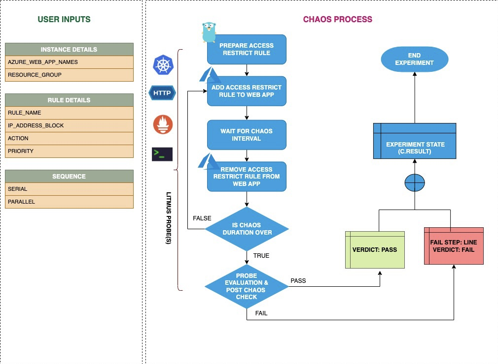

## Introduction
- Cause a split brain condition by restricting access to app-service instance and verify if requests are serviced and recovery is automated upon lifting restrictions
- It helps to check the performance of the application/process running on the instance.

:::tip Fault execution flow chart

:::

## Uses
<details>
<summary>View the uses of the fault</summary>
<div>
Coming soon.
</div>
</details>

## Prerequisites
:::info
- Ensure that Kubernetes Version > 1.16
- Ensure that you have sufficient Azure access to web apps 
- We will use Azure [ file-based authentication ](https://docs.microsoft.com/en-us/azure/developer/go/azure-sdk-authorization#use-file-based-authentication) to connect with the instance using Azure GO SDK in the experiment. For generating auth file run `az ad sp create-for-rbac --sdk-auth > azure.auth` Azure CLI command.
- Ensure to create a Kubernetes secret having the auth file created in the step in `CHAOS_NAMESPACE`. A sample secret file looks like:
```yaml
apiVersion: v1
kind: Secret
metadata:
  name: cloud-secret
type: Opaque
stringData:
  azure.auth: |-
    {
      "clientId": "XXXXXXXXX",
      "clientSecret": "XXXXXXXXX",
      "subscriptionId": "XXXXXXXXX",
      "tenantId": "XXXXXXXXX",
      "activeDirectoryEndpointUrl": "XXXXXXXXX",
      "resourceManagerEndpointUrl": "XXXXXXXXX",
      "activeDirectoryGraphResourceId": "XXXXXXXXX",
      "sqlManagementEndpointUrl": "XXXXXXXXX",
      "galleryEndpointUrl": "XXXXXXXXX",
      "managementEndpointUrl": "XXXXXXXXX"
    }
```
- If you change the secret key name (from `azure.auth`) please also update the `AZURE_AUTH_LOCATION` ENV value in the ChaosExperiment CR with the same name.
:::

## Default Validations
:::info
- Azure target web app should be in running state.
:::

## Fault Tunables
<details>
    <summary>Check the Fault tunables</summary>
    <h2>Mandatory Fields</h2>
    <table>
        <tr>
            <th> Variables </th>
            <th> Description </th>
            <th> Notes </th>
        </tr>
        <tr> 
            <td> AZURE_WEB_APP_NAMES </td>
            <td> Name of Azure web app services to target.</td>
            <td> Provide comma-separated names of the web apps </td>
        </tr>
        <tr>
            <td> RESOURCE_GROUP </td>
            <td> The resource group of the target web app</td>
            <td> </td>
        </tr> 
    </table>
    <h2>Optional Fields</h2>
    <table>
        <tr>
            <th> Variables </th>
            <th> Description </th>
            <th> Notes </th>
        </tr>
        <tr>
            <td> RULE_NAME </td>
            <td> Provide the rule name that should be added as part of chaos injection</td>
            <td> If not provided it will use a default name <code>litmus-experiment-rule</code></td>
        </tr>
        <tr>
            <td> IP_ADDRESS_BLOCK </td>
            <td> Provide the IP address/CIDR Range for the rule</td>
            <td>  Default is <code>0.0.0.0/0</code></td>
        </tr>
        <tr>
            <td> ACTION </td>
            <td> Provide the action you want to perfrom with the rule</td>
            <td> Accepts "allow"/"deny". Default is "deny"</td>
        </tr>
        <tr>
            <td> PRIORITY </td>
            <td> Provide the priority of the rule. Lower the number higher the priority and vice versa</td>
            <td>  Default is "300". For more info <a href="https://learn.microsoft.com/en-us/azure/virtual-network/network-security-groups-overview">refer</a></td>
        </tr>
        <tr> 
            <td> TOTAL_CHAOS_DURATION </td>
            <td> The total time duration for chaos insertion (sec) </td>
            <td> Defaults to 30s </td>
        </tr>
        <tr> 
            <td> CHAOS_INTERVAL </td>
            <td> The interval (in sec) between successive instance poweroff.</td>
            <td> Defaults to 30s </td>
        </tr>
        <tr>
            <td> SEQUENCE </td>
            <td> It defines sequence of chaos execution for multiple instance</td>
            <td> Default value: parallel. Supported: serial, parallel </td>
        </tr>
        <tr>
            <td> RAMP_TIME </td>
            <td> Period to wait before and after injection of chaos in sec </td>
            <td> Eg: 30 </td>
        </tr>
    </table>
</details>

## Fault Examples

### Common Fault Tunables

Refer the [common attributes](../common-tunables-for-all-faults) to tune the common tunables for all the experiments.

### Web App Access Restrict By Name

It contains comma separated list of web app names subjected to chaos. It can be tuned via `AZURE_WEB_APP_NAMES` ENV.

Use the following example to tune this:

[embedmd]:# (./static/manifests/azure-web-access-restrict/azure-web-app-name.yaml yaml)
```yaml
# access restrict on target web app by their names
apiVersion: litmuschaos.io/v1alpha1
kind: ChaosEngine
metadata:
  name: engine-nginx
spec:
  engineState: "active"
  annotationCheck: "false"
  chaosServiceAccount: litmus-admin
  experiments:
  - name: azure-web-access-restrict
    spec:
      components:
        env:
        # comma separated names of the target web apps
        - name: AZURE_WEB_APP_NAMES
          value: 'webApp-01,webApp-02'
        # name of the resource group
        - name: RESOURCE_GROUP
          value: 'chaos-rg'
        - name: TOTAL_CHAOS_DURATION
          VALUE: '60'
```


### Access Restrict For A Certain CIDR Range

It contains a CIDR range to be used in rule. It can be tuned via `IP_ADDRESS_BLOCK`.

Use the following example to tune this:

[embedmd]:# (./static/manifests/azure-web-access-restrict/ip-address-block.yaml yaml)
```yaml
# restrict the web app for a certain 
apiVersion: litmuschaos.io/v1alpha1
kind: ChaosEngine
metadata:
  name: engine-nginx
spec:
  engineState: "active"
  annotationCheck: "false"
  chaosServiceAccount: litmus-admin
  experiments:
  - name: azure-web-access-restrict
    spec:
      components:
        env:
        # provide the value of ip address/CIDR Range
        - name: IP_ADDRESS_BLOCK
          value: '0.0.0.0/0'
        # name of the resource group
        - name: RESOURCE_GROUP
          value: 'chaos-rg'
        - name: TOTAL_CHAOS_DURATION
          VALUE: '60'
```

### Access Restrict With Action

You can tune if you want to allow or deny traffic for the provided rule using `ACTION` ENV. By default it is set to deny.

Use the following example to tune this:

[embedmd]:# (./static/manifests/azure-web-access-restrict/action.yaml yaml)
```yaml
# defines the action for the given network rule
apiVersion: litmuschaos.io/v1alpha1
kind: ChaosEngine
metadata:
  name: engine-nginx
spec:
  engineState: "active"
  annotationCheck: "false"
  chaosServiceAccount: litmus-admin
  experiments:
  - name: azure-web-access-restrict
    spec:
      components:
        env:
        # Provide the action for a rule
        - name: ACTION
          value: 'deny'
         # time duration for the chaos execution
        - name: TOTAL_CHAOS_DURATION
          VALUE: '60'
```

### Access Restrict With Priority

You can define the priority of the network rule created by fault using `PRIORITY` ENV. By default it is set to `300`.

Use the following example to tune this:

[embedmd]:# (./static/manifests/azure-web-access-restrict/priority.yaml yaml)
```yaml
# defines the priority for the network rule
apiVersion: litmuschaos.io/v1alpha1
kind: ChaosEngine
metadata:
  name: engine-nginx
spec:
  engineState: "active"
  annotationCheck: "false"
  chaosServiceAccount: litmus-admin
  experiments:
  - name: azure-web-access-restrict
    spec:
      components:
        env:
        # Provide the priority for a rule
        - name: PRIORITY
          value: '300'
         # time duration for the chaos execution
        - name: TOTAL_CHAOS_DURATION
          VALUE: '60'
```

### Access Restrict With Custom Rule Name

You can define a custom rule name for this chaos using `RULE_NAME` ENV. This rule will be added for a period of chaos duration. If not provided it will by default use `litmus-experiment-rule`.

Use the following example to tune this:

[embedmd]:# (./static/manifests/azure-web-access-restrict/rule-name.yaml yaml)
```yaml
# defines the rule name for the network rule created
apiVersion: litmuschaos.io/v1alpha1
kind: ChaosEngine
metadata:
  name: engine-nginx
spec:
  engineState: "active"
  annotationCheck: "false"
  chaosServiceAccount: litmus-admin
  experiments:
  - name: azure-web-access-restrict
    spec:
      components:
        env:
        # Provide the name of the rule
        - name: RULE_NAME
          value: 'chaos-rule'
```
