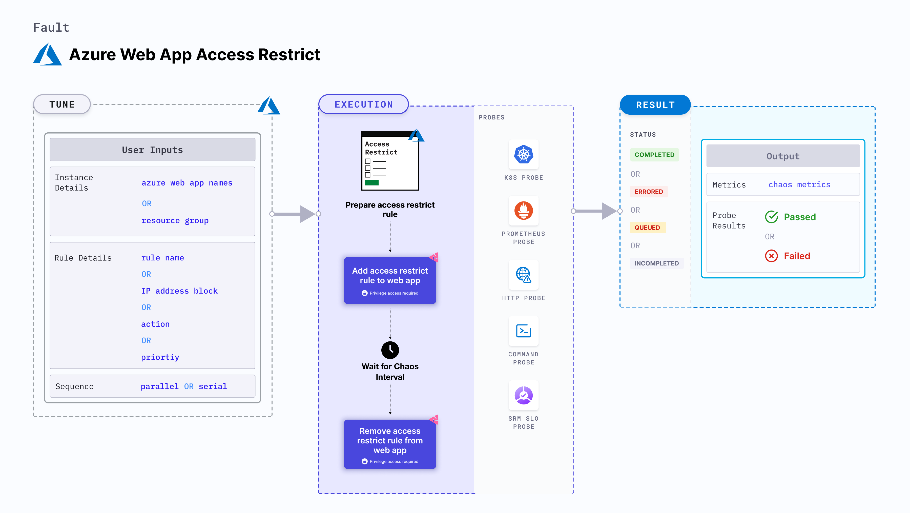

Azure web app access restrict causes a split brain condition by restricting the access to an application service instance.
- This fault checks if the requests have been serviced and recovery is automated after the restrictions have been lifted.
- It checks the performance of the application (or process) running on the instance.



## Use cases

Azure web app access restrict determines the resilience of an application when access to a specific application service instance is restricted.

:::note
- Kubernetes > 1.16 is required to execute this fault.
- Appropriate Azure access to the web applications.
- The target Azure web application should be in the running state.
- Use Azure [ file-based authentication ](https://docs.microsoft.com/en-us/azure/developer/go/azure-sdk-authorization#use-file-based-authentication) to connect to the instance using Azure GO SDK. To generate the auth file, run `az ad sp create-for-rbac --sdk-auth > azure.auth` Azure CLI command.
- Kubernetes secret should contain the auth file created in the previous step in the `CHAOS_NAMESPACE`. Below is a sample secret file:

```yaml
apiVersion: v1
kind: Secret
metadata:
  name: cloud-secret
type: Opaque
stringData:
  azure.auth: |-
    {
      "clientId": "XXXXXXXXX",
      "clientSecret": "XXXXXXXXX",
      "subscriptionId": "XXXXXXXXX",
      "tenantId": "XXXXXXXXX",
      "activeDirectoryEndpointUrl": "XXXXXXXXX",
      "resourceManagerEndpointUrl": "XXXXXXXXX",
      "activeDirectoryGraphResourceId": "XXXXXXXXX",
      "sqlManagementEndpointUrl": "XXXXXXXXX",
      "galleryEndpointUrl": "XXXXXXXXX",
      "managementEndpointUrl": "XXXXXXXXX"
    }
```
- If you change the secret key name from `azure.auth` to a new name, ensure that you update the `AZURE_AUTH_LOCATION` environment variable in the chaos experiment with the new name.
:::

## Fault tunables

  <h3>Mandatory fields</h3>
    <table>
        <tr>
            <th> Variables </th>
            <th> Description </th>
            <th> Notes </th>
        </tr>
        <tr> 
            <td> AZURE_WEB_APP_NAMES </td>
            <td> Name of Athe zure web app services to target.</td>
            <td> Comma-separated names of the web applications. For more information, go to <a href="https://developer.harness.io/docs/chaos-engineering/chaos-faults/azure/azure-web-app-access-restrict#web-app-access-restrict-by-name"> restrict by name.</a></td>
        </tr>
        <tr>
            <td> RESOURCE_GROUP </td>
            <td> The name of the resource group for the target web app</td>
            <td> For example, <code>TeamDevops</code>. For more information, go to <a href="https://developer.harness.io/docs/chaos-engineering/chaos-faults/azure/azure-web-app-access-restrict#web-app-access-restrict-by-name"> resource group field in the YAML file.</a></td>
        </tr> 
    </table>
    <h3>Optional fields</h3>
    <table>
        <tr>
            <th> Variables </th>
            <th> Description </th>
            <th> Notes </th>
        </tr>
        <tr>
            <td> RULE_NAME </td>
            <td> Rule name that is added as a part of the chaos injection. </td>
            <td> If this is not provided, the fault uses the default name, i.e. <code>litmus-experiment-rule</code>. For more information, go to <a href="https://developer.harness.io/docs/chaos-engineering/chaos-faults/azure/azure-web-app-access-restrict#access-restrict-with-custom-rule-name"> restrict with custom rule. </a></td>
        </tr>
        <tr>
            <td> IP_ADDRESS_BLOCK </td>
            <td> IP address (or CIDR range) for the rule. </td>
            <td>  Defaults to <code>0.0.0.0/0</code>. For more information, go to <a href="https://developer.harness.io/docs/chaos-engineering/chaos-faults/azure/azure-web-app-access-restrict#access-restrict-for-a-certain-cidr-range"> restrict for a CIDR range. </a></td>
        </tr>
        <tr>
            <td> ACTION </td>
            <td> Action you wish to perfrom with the rule. </td>
            <td> Defaults to <code>deny</code>. Also supports <code>allow</code> action. For more information, go to <a href="https://developer.harness.io/docs/chaos-engineering/chaos-faults/azure/azure-web-app-access-restrict#access-restrict-with-action"> restrict with action. </a></td>
        </tr>
        <tr>
            <td> PRIORITY </td>
            <td> Priority of the rule, wherein lower the number, higher is the priority and vice-versa. </td>
            <td> Defaults to 300. For more information, refer <a href="https://developer.harness.io/docs/chaos-engineering/chaos-faults/azure/azure-web-app-access-restrict#access-restrict-with-priority"> restrict with priority.</a></td>
        </tr>
        <tr> 
            <td> TOTAL_CHAOS_DURATION </td>
            <td> Duration that you specify, through which chaos is injected into the target resource (in seconds). </td>
            <td> Defaults to 30s. For more information, go to <a href="https://developer.harness.io/docs/chaos-engineering/chaos-faults/common-tunables-for-all-faults#duration-of-the-chaos"> duration of the chaos.</a></td>
        </tr>
        <tr> 
            <td> CHAOS_INTERVAL </td>
            <td> Time interval between two successive instance power offs (in seconds).</td>
            <td> Defaults to 30s. For more information, go to <a href="https://developer.harness.io/docs/chaos-engineering/chaos-faults/common-tunables-for-all-faults#chaos-interval"> chaos interval.</a></td>
        </tr>
        <tr>
            <td> SEQUENCE </td>
            <td> Sequence of chaos execution for multiple instances. </td>
        <td> Defaults to <code>parallel</code>. Also supports <code>serial</code> sequence. For more information, go to <a href="https://developer.harness.io/docs/chaos-engineering/chaos-faults/common-tunables-for-all-faults#sequence-of-chaos-execution"> sequence of chaos execution.</a></td>
        </tr>
        <tr>
            <td> RAMP_TIME </td>
            <td> Period to wait before and after injecting chaos (in seconds). </td>
            <td> For example, 30s. For more information, go to <a href="https://developer.harness.io/docs/chaos-engineering/chaos-faults/common-tunables-for-all-faults#ramp-time"> ramp time.</a></td>
        </tr>
    </table>


### Web app access restrict by name

It specifies a comma-separated list of web application names subject to chaos. Tune it by using the `AZURE_WEB_APP_NAMES` environment variable.

Use the following example to tune it:

[embedmd]:# (./static/manifests/azure-web-access-restrict/azure-web-app-name.yaml yaml)
```yaml
# access restrict on target web app by their names
apiVersion: litmuschaos.io/v1alpha1
kind: ChaosEngine
metadata:
  name: engine-nginx
spec:
  engineState: "active"
  annotationCheck: "false"
  chaosServiceAccount: litmus-admin
  experiments:
  - name: azure-web-access-restrict
    spec:
      components:
        env:
        # comma separated names of the target web apps
        - name: AZURE_WEB_APP_NAMES
          value: 'webApp-01,webApp-02'
        # name of the resource group
        - name: RESOURCE_GROUP
          value: 'chaos-rg'
        - name: TOTAL_CHAOS_DURATION
          VALUE: '60'
```


### Access restrict for a certain CIDR range

It specifies a CIDR range used in the rule. Tune it by using the `IP_ADDRESS_BLOCK` environment variable.

Use the following example to tune it:

[embedmd]:# (./static/manifests/azure-web-access-restrict/ip-address-block.yaml yaml)
```yaml
# restrict the web app for a certain 
apiVersion: litmuschaos.io/v1alpha1
kind: ChaosEngine
metadata:
  name: engine-nginx
spec:
  engineState: "active"
  annotationCheck: "false"
  chaosServiceAccount: litmus-admin
  experiments:
  - name: azure-web-access-restrict
    spec:
      components:
        env:
        # provide the value of ip address/CIDR Range
        - name: IP_ADDRESS_BLOCK
          value: '0.0.0.0/0'
        # name of the resource group
        - name: RESOURCE_GROUP
          value: 'chaos-rg'
        - name: TOTAL_CHAOS_DURATION
          VALUE: '60'
```

### Access restrict with action

It specifies whether to allow or deny the traffic for the rule provided. Tune it by using the `ACTION` environment variable. By default, it is set to `deny`.

Use the following example to tune it:

[embedmd]:# (./static/manifests/azure-web-access-restrict/action.yaml yaml)
```yaml
# defines the action for the given network rule
apiVersion: litmuschaos.io/v1alpha1
kind: ChaosEngine
metadata:
  name: engine-nginx
spec:
  engineState: "active"
  annotationCheck: "false"
  chaosServiceAccount: litmus-admin
  experiments:
  - name: azure-web-access-restrict
    spec:
      components:
        env:
        # Provide the action for a rule
        - name: ACTION
          value: 'deny'
         # duration for the chaos execution
        - name: TOTAL_CHAOS_DURATION
          VALUE: '60'
```

### Access restrict with priority

It specifies the priority of the network rule created by the fault. Tune it by using the `PRIORITY` environment variable. By default, it is set to 300.

Use the following example to tune it:

[embedmd]:# (./static/manifests/azure-web-access-restrict/priority.yaml yaml)
```yaml
# defines the priority for the network rule
apiVersion: litmuschaos.io/v1alpha1
kind: ChaosEngine
metadata:
  name: engine-nginx
spec:
  engineState: "active"
  annotationCheck: "false"
  chaosServiceAccount: litmus-admin
  experiments:
  - name: azure-web-access-restrict
    spec:
      components:
        env:
        # Provide the priority for a rule
        - name: PRIORITY
          value: '300'
         # duration for the chaos execution
        - name: TOTAL_CHAOS_DURATION
          VALUE: '60'
```

### Access restrict with custom rule name

It specifies a custom rule name for the chaos. Tune it by using the `RULE_NAME` environment variable.

Use the following example to tune it:

[embedmd]:# (./static/manifests/azure-web-access-restrict/rule-name.yaml yaml)
```yaml
# defines the rule name for the network rule created
apiVersion: litmuschaos.io/v1alpha1
kind: ChaosEngine
metadata:
  name: engine-nginx
spec:
  engineState: "active"
  annotationCheck: "false"
  chaosServiceAccount: litmus-admin
  experiments:
  - name: azure-web-access-restrict
    spec:
      components:
        env:
        # Provide the name of the rule
        - name: RULE_NAME
          value: 'chaos-rule'
```
