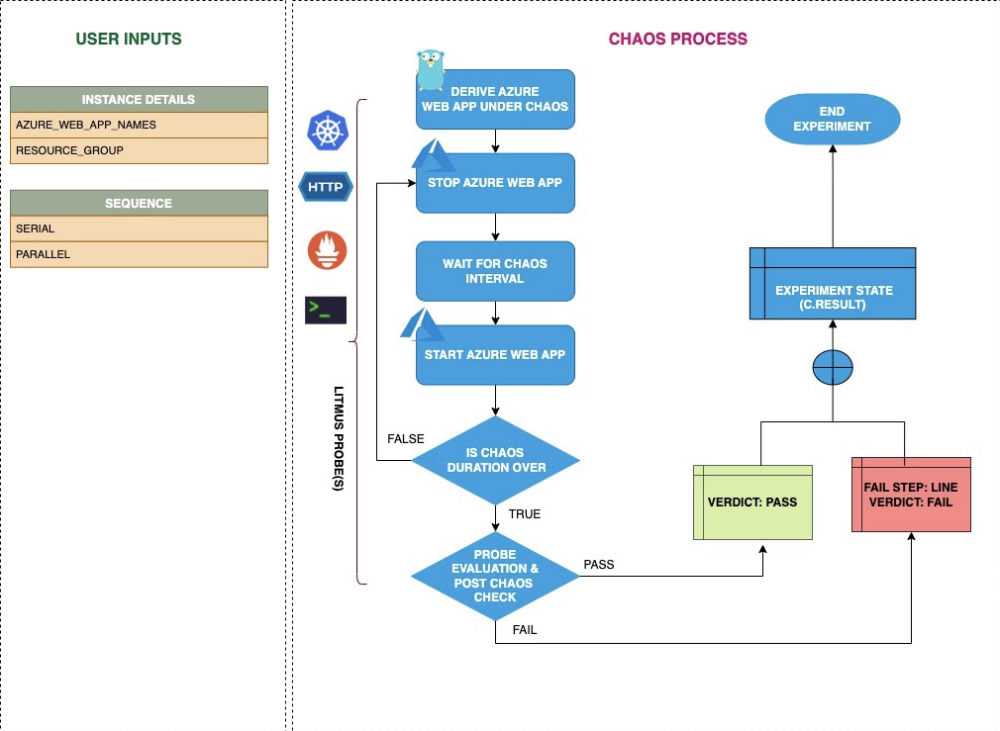

Azure web app stop shuts down the application. It checks whether the requests have been re-routed to another instance on the application service.



## Use cases
Azure web app stop
- Determines the resilience of a web application to unplanned halts (or stops). 
- Determines the resilience based on how quickly and efficiently the application recovers from the failure by re-routing the traffic to a different instance on the same application service. 

:::note
- Kubernetes > 1.16 is required to execute this fault.
- Appropriate Azure access to start and stop the web applications.
- The target Azure web application should be in the running state. 
- Use Azure [ file-based authentication ](https://docs.microsoft.com/en-us/azure/developer/go/azure-sdk-authorization#use-file-based-authentication) to connect to the instance using Azure GO SDK. To generate the auth file, run `az ad sp create-for-rbac --sdk-auth > azure.auth` Azure CLI command.
- Kubernetes secret should contain the auth file created in the previous step in the `CHAOS_NAMESPACE`. Below is a sample secret file:

```yaml
apiVersion: v1
kind: Secret
metadata:
  name: cloud-secret
type: Opaque
stringData:
  azure.auth: |-
    {
      "clientId": "XXXXXXXXX",
      "clientSecret": "XXXXXXXXX",
      "subscriptionId": "XXXXXXXXX",
      "tenantId": "XXXXXXXXX",
      "activeDirectoryEndpointUrl": "XXXXXXXXX",
      "resourceManagerEndpointUrl": "XXXXXXXXX",
      "activeDirectoryGraphResourceId": "XXXXXXXXX",
      "sqlManagementEndpointUrl": "XXXXXXXXX",
      "galleryEndpointUrl": "XXXXXXXXX",
      "managementEndpointUrl": "XXXXXXXXX"
    }
```
- If you change the secret key name from `azure.auth` to a new name, ensure that you update the `AZURE_AUTH_LOCATION` environment variable in the chaos experiment with the new name.
:::

## Fault tunables

<h3>Mandatory fields</h3>
    <table>
        <tr>
            <th> Variables </th>
            <th> Description </th>
            <th> Notes </th>
        </tr>
        <tr> 
            <td> AZURE_WEB_APP_NAMES </td>
            <td> Name of the Azure web application services to target.</td>
            <td> Comma-separated names of web applications. For more information, go to <a href="https://developer.harness.io/docs/chaos-engineering/chaos-faults/azure/azure-web-app-stop#stop-web-app-by-name"> stop Azure web app by name.</a></td>
        </tr>
        <tr>
            <td> RESOURCE_GROUP </td>
            <td> Name of the resource group for the target web applications. </td>
            <td> All the web applications must belong to the same resource group. For more information, go to <a href="https://developer.harness.io/docs/chaos-engineering/chaos-faults/azure/azure-web-app-stop#stop-web-app-by-name"> resource group field in the YAML file. </a></td>
        </tr> 
    </table>
    <h3>Optional fields</h3>
    <table>
        <tr>
            <th> Variables </th>
            <th> Description </th>
            <th> Notes </th>
        </tr>
        <tr> 
            <td> TOTAL_CHAOS_DURATION </td>
            <td> Duration that you specify, through which chaos is injected into the target resource (in seconds).</td>
            <td> Defaults to 30s. For more information, go to <a href="https://developer.harness.io/docs/chaos-engineering/chaos-faults/common-tunables-for-all-faults#duration-of-the-chaos"> duration of the chaos.</a></td>
        </tr>
        <tr> 
            <td> CHAOS_INTERVAL </td>
            <td> Time interval between two successive instance power offs (in seconds).</td>
            <td> Defaults to 30s. For more information, go to <a href="https://developer.harness.io/docs/chaos-engineering/chaos-faults/common-tunables-for-all-faults#chaos-interval"> chaos interval.</a></td>
        </tr>
        <tr>
            <td> SEQUENCE </td>
            <td> Sequence of chaos execution for multiple instances. </td>
        <td> Defaults to <code>parallel</code>. Also supports <code>serial</code> sequence. For more information, go to <a href="https://developer.harness.io/docs/chaos-engineering/chaos-faults/common-tunables-for-all-faults#sequence-of-chaos-execution"> sequence of chaos execution.</a></td>
        </tr>
        <tr>
            <td> RAMP_TIME </td>
            <td> Period to wait before and after injecting chaos (in seconds). </td>
            <td> For example, 30s. For more information, go to <a href="https://developer.harness.io/docs/chaos-engineering/chaos-faults/common-tunables-for-all-faults#ramp-time"> ramp time.</a></td>
        </tr>
    </table>


### Stop web application by name

It specifies a comma-separated list of web application names subject to chaos. Tune it by using the `AZURE_WEB_APP_NAMES` environment variable.

Use the following example to tune it:

[embedmd]:# (./static/manifests/azure-web-app-stop/web-app-stop.yaml yaml)
```yaml
# stop web app for a certain chaos duration 
apiVersion: litmuschaos.io/v1alpha1
kind: ChaosEngine
metadata:
  name: engine-nginx
spec:
  engineState: "active"
  annotationCheck: "false"
  chaosServiceAccount: litmus-admin
  experiments:
  - name: azure-web-app-stop
    spec:
      components:
        env:
        # comma-separated names of the Azure web app
        - name: AZURE_WEB_APP_NAMES
          value: 'webApp-01,webApp-02'
        # name of the resource group
        - name: RESOURCE_GROUP
          value: 'chaos-rg'
        - name: TOTAL_CHAOS_DURATION
          VALUE: '60'
```
