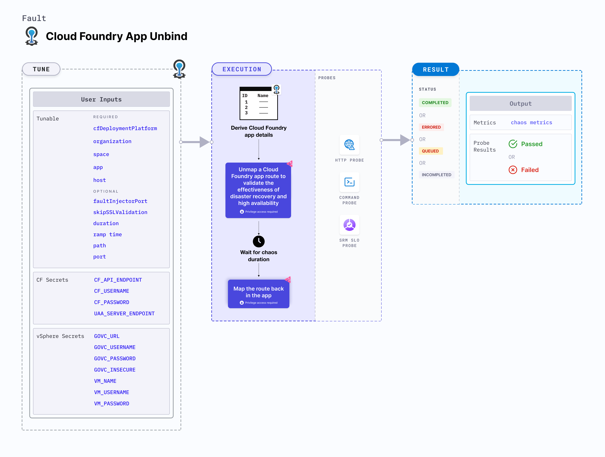

import CFSecrets from './shared/cf-secrets.md';
import VSphereSecrets from './shared/vsphere-secrets.md';

CF app route unmap temporarily unmaps a Cloud Foundry app route and later maps it back to the app.



## Use cases
CF app route unmap:
- Checks resilience against abrupt un-mapping of an app route.
- Validates the effectiveness of disaster recovery and high availability of the app.

### Mandatory tunables
<table>
  <tr>
    <th> Tunable </th>
    <th> Description </th>
    <th> Notes </th>
  </tr>
  <tr>
    <td> cfDeploymentPlatform </td>
    <td> Deployment platform used for Cloud Foundry with respect to where the infrastructure is hosted. </td>
    <td> Supports <code>local</code> and <code>vSphere</code>. For more information, go to <a href="#cf-deployment-platform"> CF deployment platform.</a></td>
  </tr>
  <tr>
    <td> organization </td>
    <td> Organization where the target app resides. </td>
    <td> For example, <code>dev-org</code>. </td>
  </tr>
  <tr>
    <td> space </td>
    <td> Space where the target app resides. </td>
    <td> The space must reside within the given organization. For example, <code>dev-space</code>. </td>
  </tr>
  <tr>
    <td> app </td>
    <td> The app to be stopped </td>
    <td> The app must reside within the given organization and space. For example, <code>cf-app</code>. </td>
  </tr>
  <tr>
    <td> host </td>
    <td> Host name of the route to be unmapped. </td>
    <td> For example, <code>v1</code>. For more information, go to <a href="#host"> host.</a></td>
  </tr>
</table>

### Optional tunables
<table>
  <tr>
    <th> Tunable </th>
    <th> Description </th>
    <th> Notes </th>
  </tr>
  <tr>
    <td> path </td>
    <td> Path of the route to be un-mapped. </td>
    <td> For example, <code>/cart</code>. For more information, go to <a href="#path"> path.</a></td>
  </tr>
  <tr>
    <td> port </td>
    <td> Port of the route to be un-mapped. </td>
    <td> For example, <code>8080</code>. </td>
  </tr>
  <tr>
    <td> faultInjectorPort </td>
    <td> Local server port used by the fault-injector utility. </td>
    <td> Default: <code>50320</code>. If the default port is unavailable, a random port in the range of <code>50320-51320</code> is selected. For more information, go to <a href="#fault-injector-port"> fault injector port.</a></td>
  </tr>
  <tr>
    <td> duration </td>
    <td> Duration through which chaos is injected into the target resource (in seconds). </td>
    <td> Default: 30s. For more information, go to <a href="/docs/chaos-engineering/chaos-faults/common-tunables-for-all-faults#duration-of-the-chaos"> chaos duration.</a> </td>
  </tr>
  <tr>
    <td> skipSSLValidation </td>
    <td> Skip SSL validation while invoking CF APIs. </td>
    <td> Supports <code>true</code> and <code>false</code>. Default: <code>false</code>. For more information, go to <a href="#skip-ssl-validation"> skip SSL validation.</a></td>
  </tr>
  <tr>
    <td> rampTime </td>
    <td> Period to wait before and after injecting chaos (in seconds). </td>
    <td> Default: 0s. For more information, go to <a href="/docs/chaos-engineering/chaos-faults/common-tunables-for-all-faults#ramp-time"> ramp time.</a> </td>
  </tr>
</table>

<CFSecrets />

<VSphereSecrets />

### Host
The `host` input variable determines the host of the route which is un-mapped.
For example, for a route `http://example-app.shared-domain.example.com`, the host is `example-app`.

The following YAML snippet illustrates the use of this input variable:

[embedmd]:# (./static/manifests/cf-app-route-unmap/host.yaml yaml)
```yaml
# host for the route
apiVersion: litmuchaos.io/v1alpha1
kind: LinuxFault
metadata:
  name: cf-app-route-unmap
  labels:
    name: app-route-unmap
spec:
  cfAppRouteUnmap/inputs:
    duration: 30
    cfDeploymentPlatform: vSphere
    app: cf-app
    organization: dev-org
    space: dev-space
    host: example-app
```

### Path
The `path` input variable determines the path of the route which is un-mapped.
For example, for a route `http://example-app.shared-domain.example.com/abc`, the path is `/abc`.

The following YAML snippet illustrates the use of this input variable:

[embedmd]:# (./static/manifests/cf-app-route-unmap/path.yaml yaml)
```yaml
# host and path for the route
apiVersion: litmuchaos.io/v1alpha1
kind: LinuxFault
metadata:
  name: cf-app-route-unmap
  labels:
    name: app-route-unmap
spec:
  cfAppRouteUnmap/inputs:
    duration: 30
    cfDeploymentPlatform: vSphere
    app: cf-app
    organization: dev-org
    space: dev-space
    host: example-app
    path: /abc
```

### CF deployment platform
The `cfDeploymentPlatform` input variable determines the deployment platform used for CF with respect to the infrastructure.
- The deployment platform can be local, that is, the same environment used by the infrastructure, or a remote machine.
- The deployment platform is where the fault-injector utility executes.

The following YAML snippet illustrates the use of this input variable:

[embedmd]:# (./static/manifests/cf-app-route-unmap/cfDeploymentPlatform.yaml yaml)
```yaml
# cf deployment platform
apiVersion: litmuchaos.io/v1alpha1
kind: LinuxFault
metadata:
  name: cf-app-route-unmap
  labels:
    name: app-route-unmap
spec:
  cfAppRouteUnmap/inputs:
    duration: 30
    cfDeploymentPlatform: vSphere
    app: cf-app
    organization: dev-org
    space: dev-space
```

### Skip SSL validation
The `skipSSLValidation` input variable determines whether to skip SSL validation for calling the CF APIs.

The following YAML snippet illustrates the use of this input variable:

[embedmd]:# (./static/manifests/cf-app-route-unmap/skipSSLValidation.yaml yaml)
```yaml
# skip ssl validation for cf
apiVersion: litmuchaos.io/v1alpha1
kind: LinuxFault
metadata:
  name: cf-app-route-unmap
  labels:
    name: app-route-unmap
spec:
  cfAppRouteUnmap/inputs:
    duration: 30
    cfDeploymentPlatform: vSphere
    app: cf-app
    organization: dev-org
    space: dev-space
    skipSSLValidation: true
```

### Fault injector port
The `faultInjectorPort` input variable determines the port used for the fault-injector local server.

The following YAML snippet illustrates the use of this input variable:

[embedmd]:# (./static/manifests/cf-app-route-unmap/faultInjectorPort.yaml yaml)
```yaml
# fault injector port
apiVersion: litmuchaos.io/v1alpha1
kind: LinuxFault
metadata:
  name: cf-app-route-unmap
  labels:
    name: app-route-unmap
spec:
  cfAppRouteUnmap/inputs:
    duration: 30
    cfDeploymentPlatform: local
    app: cf-app
    organization: dev-org
    space: dev-space
    faultInjectorPort: 50331
```
