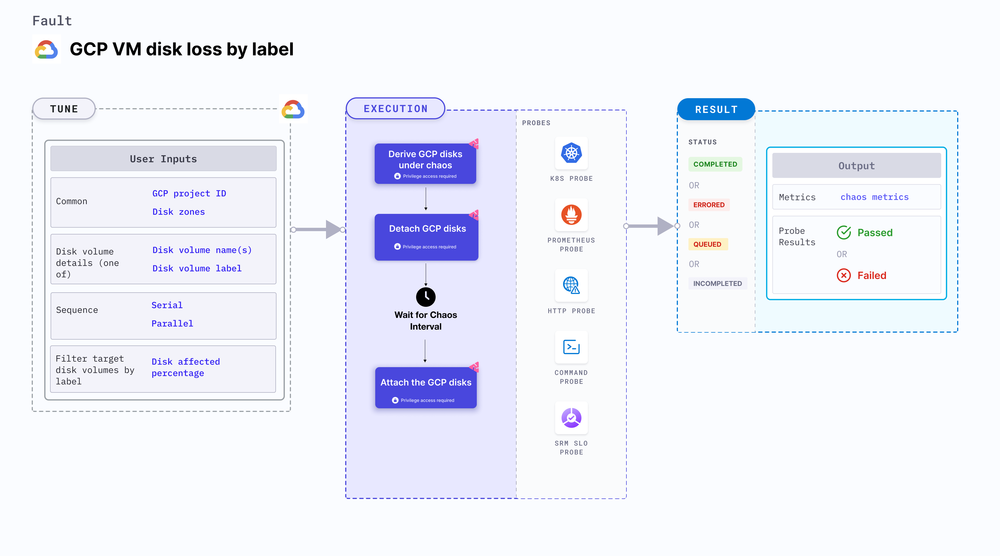

GCP VM disk loss by label disrupts the state of GCP persistent disk volume filtered using a label by detaching it from its VM instance for a specific duration.



## Usage
<details>
<summary>View fault usage</summary>
<div>
This fault can be used to determine the resilience of the GKE infrastructure. It helps determine how quickly a node can recover when a persistent disk volume is detached from the VM instance associated with it.
</div>
</details>

## Prerequisites
- Kubernetes > 1.16.
- Service account should have editor access (or owner access) to the GCP project.
- Target disk volume should not be a boot disk of any VM instance.
- Kubernetes secret that has the GCP service account credentials in the default namespace. Below is a sample secret file:
```yaml
apiVersion: v1
kind: Secret
metadata:
  name: cloud-secret
type: Opaque
stringData:
  type:
  project_id:
  private_key_id:
  private_key:
  client_email:
  client_id:
  auth_uri:
  token_uri:
  auth_provider_x509_cert_url:
  client_x509_cert_url:
```

## Default validations
All the disk volumes that have the target label are attached to their respective instances.

## Fault tunables
<details>
    <summary>Fault tunables</summary>
    <h2>Mandatory Fields</h2>
    <table>
      <tr>
        <th> Variables </th>
        <th> Description </th>
        <th> Notes </th>
      </tr>
      <tr>
        <td> GCP_PROJECT_ID </td>
        <td> The ID of the GCP project, of which the disk volumes are a part. </td>
        <td> All the target disk volumes should belong to a single GCP project. </td>
      </tr>
      <tr>
        <td> DISK_VOLUME_LABEL </td>
        <td>Label of the target non-boot persistent disk volume. </td>
        <td> This value is provided as a <code>key:value</code> pair or as a <code>key</code> if the corresponding value is empty. For example, <code>disk:target-disk</code>. </td>
      </tr>
      <tr>
        <td> ZONES </td>
        <td> The zone of the target disk volumes. </td>
        <td> Only one zone is provided, which indicates that all target disks reside in the same zone. </td>
      </tr>
    </table>
    <h2>Optional Fields</h2>
    <table>
      <tr>
        <th> Variables </th>
        <th> Description </th>
        <th> Notes </th>
      </tr>
      <tr>
        <td> TOTAL_CHAOS_DURATION </td>
        <td> Duration that you specify, through which chaos is injected into the target resource (in seconds). </td>
        <td> Defaults to 30s. </td>
      </tr>
       <tr>
        <td> CHAOS_INTERVAL </td>
        <td> Time interval between two successive chaos iterations (in seconds). </td>
        <td> Defaults to 30s. </td>
      </tr>
      <tr>
        <td> DISK_AFFECTED_PERC </td>
        <td> Percentage of total disks that are filtered using the target label (specify numeric values only. </td>
        <td> Defaults to 0 (that corresponds to 1 disk). </td>
      </tr>
      <tr>
        <td> SEQUENCE </td>
        <td> Sequence of chaos execution for multiple target disks. </td>
        <td> Defaults to parallel. It supports serial sequence as well. </td>
      </tr>
      <tr>
        <td> RAMP_TIME </td>
        <td> Period to wait before and after injecting chaos (in seconds).</td>
        <td> For example, 30s. </td>
      </tr>
    </table>
</details>

## Fault examples

### Common fault tunables
Refer to the [common attributes](../common-tunables-for-all-faults) to tune the common tunables for all the faults.

### Detach volumes by label

It contains the label of disk volumes that are subject to disk loss. It detaches all the disks with the `DISK_VOLUME_LABEL` label in the `ZONES` zone within the `GCP_PROJECT_ID` project. It re-attaches the disk volume after waiting for the duration specified by `TOTAL_CHAOS_DURATION` environment variable.

`NOTE:` The `DISK_VOLUME_LABEL` accepts only one label and `ZONES` accepts only one zone name. Therefore, all the disks must reside in the same zone.

Use the following example to tune it:

[embedmd]:# (./static/manifests/gcp-vm-disk-loss-by-label/gcp-disk-loss.yaml yaml)
```yaml
apiVersion: litmuschaos.io/v1alpha1
kind: ChaosEngine
metadata:
  name: engine-nginx
spec:
  engineState: "active"
  chaosServiceAccount: litmus-admin
  experiments:
  - name: gcp-vm-disk-loss-by-label
    spec:
      components:
        env:
        - name: DISK_VOLUME_LABEL
          value: 'disk:target-disk'
        - name: ZONES
          value: 'us-east1-b'
        - name: GCP_PROJECT_ID
          value: 'my-project-4513'
        - name: TOTAL_CHAOS_DURATION
          VALUE: '60'
```
