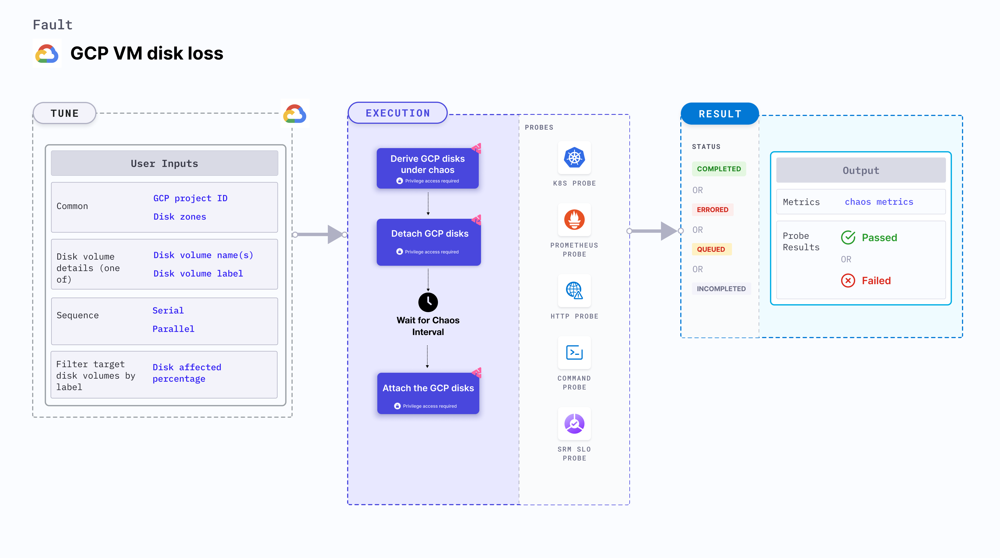

GCP VM disk loss disrupts the state of GCP persistent disk volume using the disk name by detaching the disk volume from its VM instance for a specific duration.



## Usage
<details>
<summary>View fault usage</summary>
<div>
This fault can be used to determine the resilience of the GKE infrastructure. It helps determine how quickly a node can recover when a persistent disk volume is detached from the VM instance associated with it.
</div>
</details>

## Prerequisites
- Kubernetes > 1.16.
- Service account should have editor access (or owner access) to the GCP project.
- Target disk volume should not be a boot disk of any VM instance.
- Kubernetes secret that has the GCP service account credentials in the default namespace. Below is a sample secret file:

```yaml
apiVersion: v1
kind: Secret
metadata:
  name: cloud-secret
type: Opaque
stringData:
  type:
  project_id:
  private_key_id:
  private_key:
  client_email:
  client_id:
  auth_uri:
  token_uri:
  auth_provider_x509_cert_url:
  client_x509_cert_url:
```


## Default validations
All the disk volumes are attached to their respective instances.

## Fault tunables
<details>
    <summary>Fault tunables</summary>
    <h2>Mandatory Fields</h2>
    <table>
      <tr>
        <th> Variables </th>
        <th> Description </th>
        <th> Notes </th>
      </tr>
      <tr>
        <td> GCP_PROJECT_ID </td>
        <td> The ID of the GCP project, of which the disk volumes are a part. </td>
        <td> All the target disk volumes should belong to a single GCP project. </td>
      </tr>
      <tr>
        <td> DISK_VOLUME_NAMES </td>
        <td> Nmaes of the target non-boot persistent disk volume.</td>
        <td> Multiple disk volume names can be provided as disk1,disk2,.. and so on. </td>
      </tr>
      <tr>
        <td> ZONES </td>
        <td> The zone of the target disk volumes. </td>
        <td> Only one zone is provided, which indicates that all target disks should reside in the same zone. </td>
      </tr>
    </table>
    <h2>Optional Fields</h2>
    <table>
      <tr>
        <th> Variables </th>
        <th> Description </th>
        <th> Notes </th>
      </tr>
      <tr>
        <td> TOTAL_CHAOS_DURATION </td>
        <td> Duration that you specify, through which chaos is injected into the target resource (in seconds). </td>
        <td> Defaults to 30s. </td>
      </tr>
       <tr>
        <td> CHAOS_INTERVAL </td>
        <td> Time interval between two successive chaos iterations (in seconds). </td>
        <td> Defaults to 30s. </td>
      </tr>
      <tr>
        <td> SEQUENCE </td>
        <td> Sequence of chaos execution for multiple target disks. </td>
        <td> Defaults to parallel. It supports serial sequence as well. </td>
      </tr>
      <tr>
        <td> RAMP_TIME </td>
        <td> Period to wait before and after injecting chaos (in seconds).</td>
        <td> For example, 30s. </td>
      </tr>
    </table>
</details>

## Fault examples

### Common fault tunables
Refer to the [common attributes](../common-tunables-for-all-faults) to tune the common tunables for all the faults.

### Detach volumes by names

It contains a comma-separated list of volume names that are subject to disk loss. This fault detaches all the disks with the given `DISK_VOLUME_NAMES` disk names in the `ZONES` zone in the `GCP_PROJECT_ID` project. It re-attaches the disk volume after waiting for the duration specified by `TOTAL_CHAOS_DURATION` environment variable.

`NOTE:` `DISK_VOLUME_NAMES` environment variable contains multiple comma-separated disk names. The comma-separated zone names should be provided in the same order as disk names.

Use the following example to tune it:

[embedmd]:# (./static/manifests/gcp-vm-disk-loss/gcp-disk-loss.yaml yaml)
```yaml
## details of the GCP disk
apiVersion: litmuschaos.io/v1alpha1
kind: ChaosEngine
metadata:
  name: engine-nginx
spec:
  engineState: "active"
  chaosServiceAccount: litmus-admin
  experiments:
  - name: gcp-vm-disk-loss
    spec:
      components:
        env:
        # comma separated list of disk volume names
        - name: DISK_VOLUME_NAMES
          value: 'disk-01,disk-02'
        # comma separated list of zone names corresponds to the DISK_VOLUME_NAMES
        # it should be provided in same order of DISK_VOLUME_NAMES
        - name: ZONES
          value: 'zone-01,zone-02'
        # GCP project ID to which disk volume belongs
        - name: GCP_PROJECT_ID
          value: 'project-id'
        - name: TOTAL_CHAOS_DURATION
          VALUE: '60'
```
