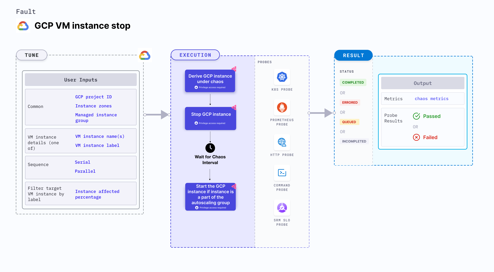

## Introduction
- It causes power-off of GCP VM instances filtered by a label before bringing it back to the running state after the specified chaos duration.
- It helps to check the performance of the application/process running on the VM instance.
- When the `MANAGED_INSTANCE_GROUP` is `enable` then the fault will not try to start the instances post chaos, instead it will check the addition of new instances to the instance group.

:::tip Fault execution flow chart

:::

## Uses
<details>
<summary>View the uses of the fault</summary>
<div>
Coming soon.
</div>
</details>

## Prerequisites
:::info
- Ensure that Kubernetes Version > 1.16.
- Ensure that you have sufficient GCP permissions to stop and start the GCP VM instances.
- Ensure to create a Kubernetes secret having the GCP service account credentials in the default namespace. A sample secret file looks like:
```yaml
apiVersion: v1
kind: Secret
metadata:
  name: cloud-secret
type: Opaque
stringData:
  type:
  project_id:
  private_key_id:
  private_key:
  client_email:
  client_id:
  auth_uri:
  token_uri:
  auth_provider_x509_cert_url:
  client_x509_cert_url:
```
:::

## Default Validations
:::info
- All the VM instances having the target label are in a healthy state.
:::

## Fault Tunables
<details>
    <summary>Check the Fault Tunables</summary>
    <h2>Mandatory Fields</h2>
    <table>
      <tr>
        <th> Variables </th>
        <th> Description </th>
        <th> Notes </th>
      </tr>
      <tr>
        <td> GCP_PROJECT_ID </td>
        <td> GCP project ID to which the VM instances belong </td>
        <td> All the VM instances must belong to a single GCP project </td>
      </tr>
      <tr>
        <td> INSTANCE_LABEL </td>
        <td> Name of target VM instances </td>
        <td> The <code>INSTANCE_LABEL</code> should be provided as <code>key:value</code> or <code>key</code> if the corresponding value is empty ex: <code>vm:target-vm</code> </td>
      </tr>
      <tr>
        <td> ZONES </td>
        <td> The zone of the target VM instances </td>
        <td> Only one zone can be provided i.e. all target instances should lie in the same zone </td>
      </tr>
    </table>
    <h2>Optional Fields</h2>
    <table>
      <tr>
        <th> Variables </th>
        <th> Description </th>
        <th> Notes </th>
      </tr>
      <tr>
        <td> TOTAL_CHAOS_DURATION </td>
        <td> The total time duration for chaos insertion (sec) </td>
        <td> Defaults to 30s </td>
      </tr>
       <tr>
        <td> CHAOS_INTERVAL </td>
        <td> The interval (in sec) between successive instance termination </td>
        <td> Defaults to 30s </td>
      </tr>
      <tr>
        <td> MANAGED_INSTANCE_GROUP </td>
        <td> Set to <code>enable</code> if the target instance is the part of a managed instance group </td>
        <td> Defaults to <code>disable</code> </td>
      </tr>
      <tr>
        <td> INSTANCE_AFFECTED_PERC </td>
        <td> The percentage of total VMs filtered using the label to target </td>
        <td> Defaults to 0 (corresponds to 1 instance), provide numeric value only </td>
      </tr>
      <tr>
        <td> SEQUENCE </td>
        <td> It defines sequence of chaos execution for multiple instance </td>
        <td> Default value: parallel. Supported: serial, parallel </td>
      </tr>
      <tr>
        <td> RAMP_TIME </td>
        <td> Period to wait before and after injection of chaos in sec </td>
        <td> Eg. 30 </td>
      </tr>
    </table>
</details>

## Fault Examples

### Common Fault Tunables
Refer the [common attributes](../common-tunables-for-all-faults) to tune the common tunables for all the faults.

### Target GCP Instances

It will stop all the instances with filtered by the label `INSTANCE_LABEL` and corresponding `ZONES` zone in `GCP_PROJECT_ID` project.

`NOTE:` The `INSTANCE_LABEL` accepts only one label and `ZONES` also accepts only one zone name. Therefore, all the instances must lie in the same zone.

Use the following example to tune this:

[embedmd]:# (./static/manifests/gcp-vm-instance-stop-by-label/gcp-instance.yaml yaml)
```yaml
apiVersion: litmuschaos.io/v1alpha1
kind: ChaosEngine
metadata:
  name: engine-nginx
spec:
  engineState: "active"
  chaosServiceAccount: litmus-admin
  experiments:
  - name: gcp-vm-instance-stop-by-label
    spec:
      components:
        env:
        - name: INSTANCE_LABEL
          value: 'vm:target-vm'
        - name: ZONES
          value: 'us-east1-b'
        - name: GCP_PROJECT_ID
          value: 'my-project-4513'
        - name: TOTAL_CHAOS_DURATION
          VALUE: '60'
```

### Manged Instance Group

If vm instances belong to a managed instance group then provide the `MANAGED_INSTANCE_GROUP` as `enable` else provided it as `disable`, which is the default value.

Use the following example to tune this:

[embedmd]:# (./static/manifests/gcp-vm-instance-stop-by-label/managed-instance-group.yaml yaml)
```yaml
apiVersion: litmuschaos.io/v1alpha1
kind: ChaosEngine
metadata:
  name: engine-nginx
spec:
  engineState: "active"
  chaosServiceAccount: litmus-admin
  experiments:
  - name: gcp-vm-instance-stop-by-label
    spec:
      components:
        env:
        - name: MANAGED_INSTANCE_GROUP
          value: 'enable'
        - name: INSTANCE_LABEL
          value: 'vm:target-vm'
        - name: ZONES
          value: 'us-east1-b'
        - name: GCP_PROJECT_ID
          value: 'my-project-4513'
        - name: TOTAL_CHAOS_DURATION
          VALUE: '60'
```
