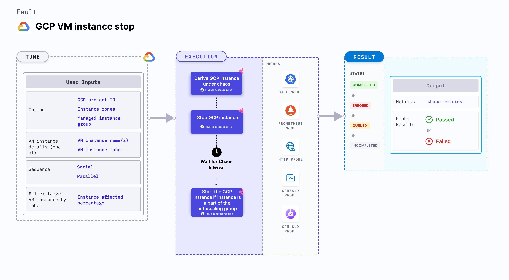

## Introduction
- It powers off of a GCP VM instance by instance name or list of instance names before bringing it back to the running state after the specified chaos duration.
- It checks the performance of the application/process running on the VM instance.
- When the `MANAGED_INSTANCE_GROUP` is `enable`, the fault doesn't start the instances after chaos. It checks the instance group for new instances.

:::tip Fault execution flow chart

:::

## Uses
<details>
<summary>View the uses of the fault</summary>
<div>
Coming soon.
</div>
</details>

## Prerequisites
:::info
- Kubernetes > 1.16.
- GCP permissions to stop and start the GCP VM instances. 
- Kubernetes secret that has the GCP service account credentials in the default namespace. A secret file looks like:
```yaml
apiVersion: v1
kind: Secret
metadata:
  name: cloud-secret
type: Opaque
stringData:
  type:
  project_id:
  private_key_id:
  private_key:
  client_email:
  client_id:
  auth_uri:
  token_uri:
  auth_provider_x509_cert_url:
  client_x509_cert_url:
```
:::

## Default Validations
:::info
- The VM instances should be in a healthy state.
:::

## Fault Tunables
<details>
    <summary>Check the Fault Tunables</summary>
    <h2>Mandatory Fields</h2>
    <table>
      <tr>
        <th> Variables </th>
        <th> Description </th>
        <th> Notes </th>
      </tr>
      <tr>
        <td> GCP_PROJECT_ID </td>
        <td> GCP project ID to which the VM instances belong </td>
        <td> All the VM instances must belong to a single GCP project </td>
      </tr>
      <tr>
        <td> VM_INSTANCE_NAMES </td>
        <td> Name of target VM instances </td>
        <td> Multiple instance names can be provided as instance1,instance2,... </td>
      </tr>
      <tr>
        <td> ZONES </td>
        <td> The zones of the target VM instances </td>
        <td> Zone for every instance name has to be provided as zone1,zone2,... in the same order of <code>VM_INSTANCE_NAMES</code> </td>
      </tr>
    </table>
    <h2>Optional Fields</h2>
    <table>
      <tr>
        <th> Variables </th>
        <th> Description </th>
        <th> Notes </th>
      </tr>
      <tr>
        <td> TOTAL_CHAOS_DURATION </td>
        <td> The total time duration for chaos insertion (sec) </td>
        <td> Defaults to 30s </td>
      </tr>
       <tr>
        <td> CHAOS_INTERVAL </td>
        <td> The interval (in sec) between successive instance termination </td>
        <td> Defaults to 30s </td>
      </tr>
      <tr>
        <td> MANAGED_INSTANCE_GROUP </td>
        <td> Set to <code>enable</code> if the target instance is the part of a managed instance group </td>
        <td> Defaults to <code>disable</code> </td>
      </tr>
      <tr>
        <td> SEQUENCE </td>
        <td> It defines sequence of chaos execution for multiple instance </td>
        <td> Default value: parallel. Supported: serial, parallel </td>
      </tr>
      <tr>
        <td> RAMP_TIME </td>
        <td> Period to wait before and after injection of chaos in sec </td>
        <td> Eg. 30 </td>
      </tr>
    </table>
</details>

## Fault Examples

### Common Fault Tunables
Refer the [common attributes](../common-tunables-for-all-faults) to tune the common tunables for all the faults.

### Target GCP Instances
It stops all the instances with the given `VM_INSTANCE_NAMES` instance names and corresponding `ZONES` zone names in `GCP_PROJECT_ID` project. 

`NOTE:` The `VM_INSTANCE_NAMES` contains multiple comma-separated VM instances. The comma-separated zone names should be provided in the same order as the instance names.

Use the following example to tune it:

[embedmd]:# (./static/manifests/gcp-vm-instance-stop/gcp-instance.yaml yaml)
```yaml
## details of the GCP instance
apiVersion: litmuschaos.io/v1alpha1
kind: ChaosEngine
metadata:
  name: engine-nginx
spec:
  engineState: "active"
  chaosServiceAccount: litmus-admin
  experiments:
  - name: gcp-vm-instance-stop
    spec:
      components:
        env:
        # comma separated list of vm instance names
        - name: VM_INSTANCE_NAMES
          value: 'instance-01,instance-02'
        # comma separated list of zone names corresponds to the VM_INSTANCE_NAMES
        # it should be provided in same order of VM_INSTANCE_NAMES
        - name: ZONES
          value: 'zone-01,zone-02'
        # GCP project ID to which vm instance belongs
        - name: GCP_PROJECT_ID
          value: 'project-id'
```

### Managed Instance Group

If VM instances belong to a managed instance group, specify the `MANAGED_INSTANCE_GROUP` as `enable`, otherwise specify it as `disable`, which is the default value. 

Use the following example to tune it:

[embedmd]:# (./static/manifests/gcp-vm-instance-stop/managed-instance-group.yaml yaml)
```yaml
## scale up and down to maintain the available instance counts
apiVersion: litmuschaos.io/v1alpha1
kind: ChaosEngine
metadata:
  name: engine-nginx
spec:
  engineState: "active"
  chaosServiceAccount: litmus-admin
  experiments:
  - name: gcp-vm-instance-stop
    spec:
      components:
        env:
        # tells if instances are part of managed instance group
        # supports: enable, disable. default: disable
        - name: MANAGED_INSTANCE_GROUP
          value: 'enable'
        # comma separated list of vm instance names
        - name: VM_INSTANCE_NAMES
          value: 'instance-01,instance-02'
        # comma separated list of zone names corresponds to the VM_INSTANCE_NAMES
        # it should be provided in same order of VM_INSTANCE_NAMES
        - name: ZONES
          value: 'zone-01,zone-02'
        # GCP project ID to which vm instance belongs
        - name: GCP_PROJECT_ID
          value: 'project-id'
        - name: TOTAL_CHAOS_DURATION
          VALUE: '60'
```

### Mutiple Iterations Of Chaos

You can tune different iterations of chaos by setting `CHAOS_INTERVAL` environment variable. It defines the delay between each iteration of chaos.

Use the following example to tune it:

[embedmd]:# (./static/manifests/gcp-vm-instance-stop/chaos-interval.yaml yaml)
```yaml
# defines delay between each successive iteration of the chaos
apiVersion: litmuschaos.io/v1alpha1
kind: ChaosEngine
metadata:
  name: engine-nginx
spec:
  engineState: "active"
  annotationCheck: "false"
  chaosServiceAccount: gcp-vm-instance-stop-sa
  experiments:
  - name: gcp-vm-instance-stop
    spec:
      components:
        env:
        # delay between each iteration of chaos
        - name: CHAOS_INTERVAL
          value: '15'
        # time duration for the chaos execution
        - name: TOTAL_CHAOS_DURATION
          VALUE: '60'
        - name: VM_INSTANCE_NAMES
          value: 'instance-01,instance-02'
        - name: ZONES
          value: 'zone-01,zone-02'
        - name: GCP_PROJECT_ID
          value: 'project-id'
       
```
