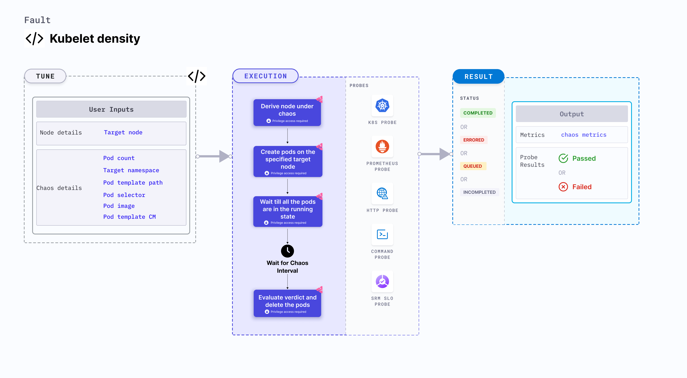

cd---
id: kubelet-density
title: Kubelet Density
---

## Introduction

- It checks the resilience of the kubelet by creating pods on the specified node.
- It helps to check the performance of the kubelet for the specified node

:::tip Fault execution flow chart

:::

## Uses

<details>
<summary>View the uses of the fault</summary>
<div>
Coming soon.
</div>
</details>

## Prerequisites

:::info

- Ensure that Kubernetes Version > 1.16.

:::

## Default Validations

:::info

- The target nodes should be in healthy state before and after chaos injection.

:::

## Fault Tunables

<details>
    <summary>Check the Fault Tunables</summary>
    <h2>Mandatory Fields</h2>
    <table>
      <tr>
        <th> Variables </th>
        <th> Description </th>
        <th> Notes </th>
      </tr>
      <tr>
        <td> TARGET_NODE </td>
        <td> name of the target node</td>
        <td> it selects a random target node, if this env is not set</td>
      </tr>
    </table>
    <h2>Optional Fields</h2>
    <table>
      <tr>
        <th> Variables </th>
        <th> Description </th>
        <th> Notes </th>
      </tr>
      <tr>
        <td> TOTAL_CHAOS_DURATION </td>
        <td> The total time duration for chaos insertion (sec) </td>
        <td> Defaults to 90s </td>
      </tr>
      <tr>
        <td> POD_COUNT </td>
        <td> total number of pods, which needs to be created during chaos</td>
        <td> Defaults to 50 </td>
      </tr>
      <tr>
        <td> TARGET_NAMESPACE </td>
        <td> namespace where pods needs to be created</td>
        <td> Defaults to same as CHAOS_NAMESPACE </td>
      </tr>
      <tr>
        <td> POD_TEMPLATE_CM </td>
        <td> name of the config map, which contains pod template</td>
        <td> </td>
      </tr>
      <tr>
        <td> POD_TEMPLATE_PATH </td>
        <td> path where pod-template configMap is mounted</td>
        <td> Default to <code>/templates/pod.yml</code> </td>
      </tr>
      <tr>
        <td> POD_SELECTOR </td>
        <td> label selectors of the pods</td>
        <td> Defaults to <code>&#123;name: kubelet-density-app&#125;</code> </td>
      </tr>
      <tr>
        <td> POD_IMAGE </td>
        <td> image of the pod</td>
        <td> Defaults to <code>gcr.io/google_containers/pause-amd64:3.0</code> </td>
      </tr>
      <tr>
        <td> RAMP_TIME </td>
        <td> Period to wait before and after injection of chaos in sec </td>
        <td> Eg. 30 </td>
      </tr>
    </table>
</details>

## Fault Examples

### Common Fault Tunables

Refer the [common attributes](../common-tunables-for-all-faults) to tune the common tunables for all the faults.

### Pod Template provided as CM

Experiment creates pods on the target node during chaos. Template of the pod can be provided by mounting pod-template via configmap and
pass its name and mountPath via `POD_TEMPLATE_CM` and `POD_TEMPLATE_PATH` ENV respectively.

Use the following example to tune this:

[embedmd]:# (./static/manifests/kubelet-density/pod-template.yaml yaml)
```yaml
# defines pod template cm and its mount path
apiVersion: litmuschaos.io/v1alpha1
kind: ChaosEngine
metadata:
  name: engine-nginx
spec:
  engineState: "active"
  annotationCheck: "false"
  chaosServiceAccount: litmus-admin
  experiments:
  - name: kubelet-density
    spec:
      components:
        env:
        # name of the pod template cm
        - name: POD_TEMPLATE_CM
          value: 'pod-template-cm'
         # mount path of the cm
        - name: POD_TEMPLATE_PATH
          VALUE: '/templates/pod.yml'
        - name: TARGET_NODE
          value: 'node1'
```

### Pod Count

It contains the number of the pods, which should be created on the target node. It can be tuned via `POD_COUNT` ENV.

Use the following example to tune this:

[embedmd]:# (./static/manifests/kubelet-density/pod-count.yaml yaml)
```yaml
# defines count of the pod
apiVersion: litmuschaos.io/v1alpha1
kind: ChaosEngine
metadata:
  name: engine-nginx
spec:
  engineState: "active"
  annotationCheck: "false"
  chaosServiceAccount: litmus-admin
  experiments:
  - name: kubelet-density
    spec:
      components:
        env:
        # number of pods, which needs to be created
        - name: POD_COUNT
          value: '50'
        - name: TARGET_NODE
          value: 'node1'
```

### Target Namespace

It contains the namespace where pods need to be created. It can be tuned via `TARGET_NAMESPACE` ENV.

Use the following example to tune this:

[embedmd]:# (./static/manifests/kubelet-density/target-namespace.yaml yaml)
```yaml
# defines pod namespace
apiVersion: litmuschaos.io/v1alpha1
kind: ChaosEngine
metadata:
  name: engine-nginx
spec:
  engineState: "active"
  annotationCheck: "false"
  chaosServiceAccount: litmus-admin
  experiments:
  - name: kubelet-density
    spec:
      components:
        env:
        # namespace where pods need to be created
        - name: TARGET_NAMESPACE
          value: 'litmus'
        - name: TARGET_NODE
          value: 'node1'
```

### Pod Image and Pod Selectors

Pod image and label selectors can be tuned via `POD_IMAGE` and `POD_SELECTOR` ENV respectively.

Use the following example to tune this:

[embedmd]:# (./static/manifests/kubelet-density/pod-image-and-selectors.yaml yaml)
```yaml
# defines pod image and label selectors
apiVersion: litmuschaos.io/v1alpha1
kind: ChaosEngine
metadata:
  name: engine-nginx
spec:
  engineState: "active"
  annotationCheck: "false"
  chaosServiceAccount: litmus-admin
  experiments:
  - name: kubelet-density
    spec:
      components:
        env:
        # image of the pod
        - name: POD_IMAGE
          value: 'nginx'
        # pod label selectors
        - name: POD_SELECTOR
          value: '{name: kubelet-density-app}'
        - name: TARGET_NODE
          value: 'node1'
```
