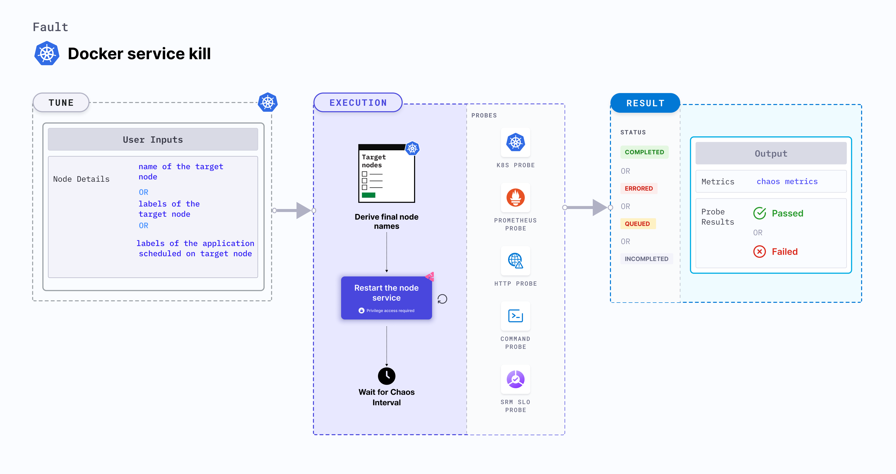

Docker service kill makes the application unreachable on the account of the node turning unschedulable (NotReady).
- Docker service is stopped (or killed) on a node to make it unschedulable for a specific duration defined by the `TOTAL_CHAOS_DURATION` environment variable. 
- The application node goes back to normal state and services are resumed after the chaos duration. 




## Usage
<details>
<summary>View fault usage</summary>
<div>
This fault determines the resilience of an application when a node becomes unschedulable, i.e. NotReady state.
</div>
</details>

## Prerequisites

- Kubernetes > 1.16
- Node specified in the <code>TARGET_NODE</code> environment variable (the node for which Docker service would be killed) should be cordoned before executing the chaos fault. This ensures that the fault resources are not scheduled on it (or subject to eviction). This is achieved by the following steps:
  - Get node names against the applications pods using command <code>kubectl get pods -o wide</code>.
  - Cordon the node using command <code>kubectl cordon &lt;nodename&gt;</code>.


## Default validations

The target nodes should be in the ready state before and after injecting chaos.


## Fault tunables
<details>
    <summary>Fault tunables</summary>
    <h2>Mandatory fields</h2>
    <table>
      <tr>
        <th> Variables </th>
        <th> Description </th>
        <th> Notes </th>
      </tr>
      <tr>
        <td> TARGET_NODE </td>
        <td> Name of the target node. </td>
        <td> For example, <code>node-1</code>. </td>
      </tr>
      <tr>
        <td> NODE_LABEL </td>
        <td> It contains node label, which will be used to filter the target node if TARGET_NODE ENV is not set </td>
        <td> It is mutually exclusive with the TARGET_NODE ENV. If both are provided then it will use the <code>TARGET_NODE</code>. </td>
      </tr>
    </table>
    <h2>Optional Fields</h2>
    <table>
      <tr>
        <th> Variables </th>
        <th> Description </th>
        <th> Notes </th>
      </tr>
      <tr>
        <td> TOTAL_CHAOS_DURATION </td>
        <td> Duration that you specify, through which chaos is injected into the target resource (in seconds). </td>
        <td> Defaults to 60s. </td>
      </tr>
      <tr>
        <td> RAMP_TIME </td>
        <td> Period to wait before injection of chaos in sec </td>
        <td> For example, 30s. </td>
      </tr>
    </table>
</details>

## Fault examples

### Common and node-specific tunables
Refer to the [common attributes](../../common-tunables-for-all-faults) and [node-specific tunables](./common-tunables-for-node-faults) to tune the common tunables for all faults and node specific tunables.  

### Kill docker service

It contains the name of the target node subject to the chaos. You can tune it using the `TARGET_NODE` environment variable.

Use the following example to tune it:

[embedmd]:# (./static/manifests/docker-service-kill/docker-service-kill.yaml yaml)
```yaml
# kill the docker service of the target node
apiVersion: litmuschaos.io/v1alpha1
kind: ChaosEngine
metadata:
  name: engine-nginx
spec:
  engineState: "active"
  annotationCheck: "false"
  chaosServiceAccount: litmus-admin
  experiments:
  - name: docker-service-kill
    spec:
      components:
        env:
        # name of the target node
        - name: TARGET_NODE
          value: 'node01'
        - name: TOTAL_CHAOS_DURATION
          VALUE: '60'
```
