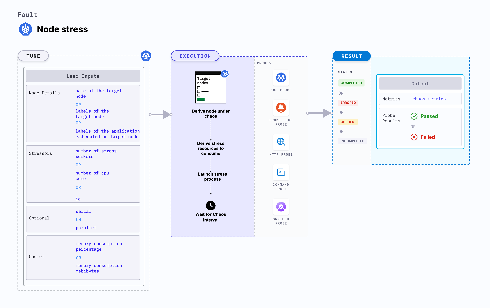

## Introduction
- This fault causes CPU resource exhaustion on the Kubernetes node. The fault aims to verify resiliency of applications whose replicas may be evicted on account on nodes turning unschedulable (Not Ready) due to lack of CPU resources.
- The CPU chaos is injected using a helper pod running the linux stress tool (a workload generator). The chaos is effected for a period equalling the `TOTAL_CHAOS_DURATION`
Application implies services. Can be reframed as: Tests application resiliency upon replica evictions caused due to lack of CPU resources.

:::tip Fault execution flow chart 

:::

## Uses
<details>
<summary>View the uses of the fault</summary>
<div>
Coming soon.
</div>
</details>

## Prerequisites
:::info
- Ensure that Kubernetes Version > 1.16.
:::

## Default Validations
:::note
The target nodes should be in ready state before and after chaos injection.
:::

## Fault Tunables
<details>
    <summary>Check the Fault Tunables</summary>
    <h2>Mandatory Fields</h2>
    <table>
      <tr>
        <th> Variables </th>
        <th> Description </th>
        <th> Notes </th>
      </tr>
      <tr>
        <td> TARGET_NODES </td>
        <td> Comma separated list of nodes, subjected to node CPU hog chaos</td>
        <td> </td>
      </tr>
      <tr>
        <td> NODE_LABEL </td>
        <td> It contains node label, which will be used to filter the target nodes if TARGET_NODES ENV is not set </td>
        <td>It is mutually exclusive with the TARGET_NODES ENV. If both are provided then it will use the TARGET_NODES</td>
      </tr>
    </table>
    <h2>Optional Fields</h2>
    <table>
      <tr>
        <th> Variables </th>
        <th> Description </th>
        <th> Notes </th>
      </tr>
      <tr>
        <td> TOTAL_CHAOS_DURATION </td>
        <td> The time duration for chaos insertion (seconds) </td>
        <td> Defaults to 60 </td>
      </tr>
      <tr>
        <td> LIB </td>
        <td> The chaos lib used to inject the chaos </td>
        <td> Defaults to <code>litmus</code> </td>
      </tr>
      <tr>
        <td> LIB_IMAGE </td>
        <td> Image used to run the stress command </td>
        <td> Defaults to <code>litmuschaos/go-runner:latest</code> </td>
      </tr>
      <tr>
        <td> RAMP_TIME </td>
        <td> Period to wait before & after injection of chaos in sec </td>
        <td> Eg. 30 </td>
        <td> </td>
      </tr>
      <tr>
        <td> NODE_CPU_CORE </td>
        <td> Number of cores of node CPU to be consumed </td>
        <td> Defaults to <code>2</code> </td>
      </tr>  
        <tr>
            <td> NODES_AFFECTED_PERC </td>
            <td> The Percentage of total nodes to target </td>
            <td> Defaults to 0 (corresponds to 1 node), provide numeric value only </td>
        </tr> 
        <tr>
            <td> SEQUENCE </td>
            <td> It defines sequence of chaos execution for multiple target pods </td>
            <td> Default value: parallel. Supported: serial, parallel </td>
        </tr>
    </table>
</details>

## Fault Examples

### Common and Node specific tunables
Refer the [common attributes](../../common-tunables-for-all-faults) and [Node specific tunable](./common-tunables-for-node-faults) to tune the common tunables for all faults and node specific tunables.

### Node CPU Cores
It contains number of cores of node CPU to be consumed. It can be tuned via `NODE_CPU_CORE` ENV.

Use the following example to tune this:

[embedmd]:# (./static/manifests/node-cpu-hog/node-cpu-core.yaml yaml)
```yaml
# stress the CPU of the targeted nodes
apiVersion: litmuschaos.io/v1alpha1
kind: ChaosEngine
metadata:
  name: engine-nginx
spec:
  engineState: "active"
  annotationCheck: "false"
  chaosServiceAccount: litmus-admin
  experiments:
  - name: node-cpu-hog
    spec:
      components:
        env:
        # number of CPU cores to be stressed
        - name: NODE_CPU_CORE
          value: '2'
        - name: TOTAL_CHAOS_DURATION
          VALUE: '60'
```

### Node CPU Load

It contains percentage of node CPU to be consumed. It can be tuned via `CPU_LOAD` ENV.

Use the following example to tune this:

[embedmd]:# (./static/manifests/node-cpu-hog/node-cpu-load.yaml yaml)
```yaml
# stress the CPU of the targeted nodes by load percentage
apiVersion: litmuschaos.io/v1alpha1
kind: ChaosEngine
metadata:
  name: engine-nginx
spec:
  engineState: "active"
  annotationCheck: "false"
  chaosServiceAccount: litmus-admin
  experiments:
  - name: node-cpu-hog
    spec:
      components:
        env:
        # percentage of CPU to be stressed
        - name: CPU_LOAD
          value: "100"
        # node CPU core should be provided as 0 for CPU load
        # to work otherwise it will take CPU core as priority
        - name: NODE_CPU_CORE
          value: '0'
        - name: TOTAL_CHAOS_DURATION
          VALUE: '60'
```
