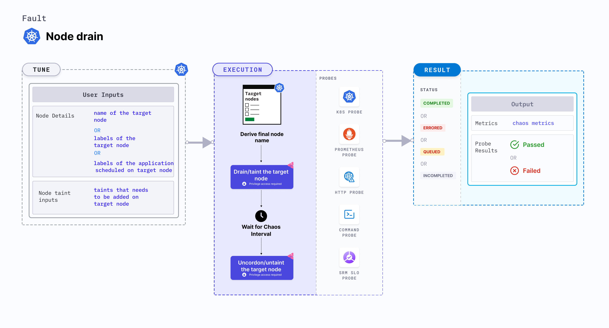

Node drain drains the node of all its resources running on it. 
- Due to this, services running on the target node should be rescheduled to run on other nodes. 




## Usage
<details>
<summary>View the uses of the fault</summary>
<div>
Node drain fault drains all the resources running on a node. This fault determines the resilience of the application when the application replicas scheduled on a node are removed. It validates the application failover capabilities when a node suddenly becomes unavailable.
It simulates node maintenance activity (hardware refresh, OS patching, Kubernetes upgrade). It verifies resource budgeting on cluster nodes (whether request (or limit) settings honored on available nodes), and whether topology constraints are adhered to (node selectors, tolerations, zone distribution, affinity(or anti-affinity) policies) or not. 
</div>
</details>

## Prerequisites

- Kubernetes > 1.16
- Node specified in the <code>TARGET_NODE</code> environment variable (the node for which Docker service would be killed) should be cordoned before executing the chaos fault. This ensures that the fault resources are not scheduled on it (or subject to eviction). This is achieved by the following steps:
  - Get node names against the applications pods using command <code>kubectl get pods -o wide</code>.
  - Cordon the node using command <code>kubectl cordon &lt;nodename&gt;</code>.

## Default validations

The target nodes should be in the ready state before and after injecting chaos.

## Fault tunables
<details>
    <summary>Fault tunables</summary>
    <h2>Mandatory fields</h2>
    <table>
      <tr>
        <th> Variables </th>
        <th> Description </th>
        <th> Notes </th>
      </tr>
      <tr>
        <td> TARGET_NODES </td>
        <td> Comma-separated list of nodes subject to node CPU hog. </td>
        <td> </td>
      </tr>
      <tr>
        <td> NODE_LABEL </td>
        <td> It contains the node label that is used to filter the target nodes.</td>
        <td>It is mutually exclusive with the <code>TARGET_NODES</code> environment variable. If both are provided, <code>TARGET_NODES</code> takes precedence.</td>
      </tr>
    </table>
    <h2>Optional fields</h2>
    <table>
      <tr>
        <th> Variables </th>
        <th> Description </th>
        <th> Notes </th>
      </tr>
      <tr>
        <td> TOTAL_CHAOS_DURATION </td>
        <td> Duration that you specify, through which chaos is injected into the target resource (in seconds). </td>
        <td> Defaults to 60s. </td>
      </tr>
      <tr>
        <td> RAMP_TIME </td>
        <td> Period to wait before and after injecting chaos (in seconds). </td>
        <td> For example, 30s.</td>
      </tr>
    </table>
</details>

## Fault examples
### Common and node-specific tunables
Refer to the [common attributes](../../common-tunables-for-all-faults) and [node-specific tunables](./common-tunables-for-node-faults) to tune the common tunables for all faults and node specific tunables.  

### Drain node

It contains the name of the target node subject to the chaos. You can tune it using the `TARGET_NODE` environment variable.

Use the following example to tune it:

[embedmd]:# (./static/manifests/node-drain/node-drain.yaml yaml)
```yaml
# drain the targeted node
apiVersion: litmuschaos.io/v1alpha1
kind: ChaosEngine
metadata:
  name: engine-nginx
spec:
  engineState: "active"
  annotationCheck: "false"
  chaosServiceAccount: litmus-admin
  experiments:
  - name: node-drain
    spec:
      components:
        env:
        # name of the target node
        - name: TARGET_NODE
          value: 'node01'
        - name: TOTAL_CHAOS_DURATION
          VALUE: '60'
```
