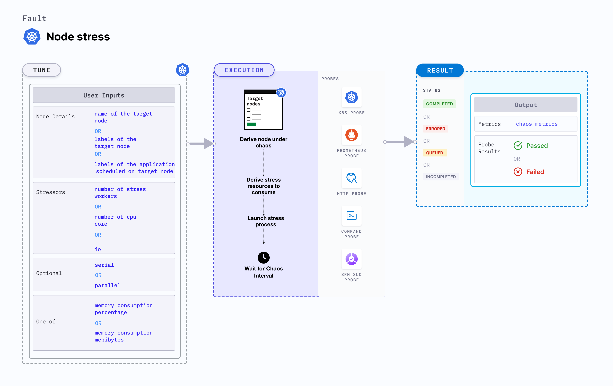

## Introduction

- This fault causes Memory resource exhaustion on the Kubernetes node. The fault aims to verify resiliency of applications whose replicas may be evicted on account on nodes turning unschedulable (Not Ready) due to lack of Memory resources.
- The Memory chaos is injected using a helper pod running the linux stress-ng tool (a workload generator)- The chaos is effected for a period equalling the TOTAL_CHAOS_DURATION and up to <code>MEMORY_CONSUMPTION_PERCENTAGE</code> (out of 100) or <code>MEMORY_CONSUMPTION_MEBIBYTES</code> (in Mebibytes out of total available memory).
- Application implies services. Can be reframed as: Tests application resiliency upon replica evictions caused due to lack of Memory resources.

:::tip Fault execution flow chart 

:::

## Uses
<details>
<summary>View the uses of the fault</summary>
<div>
Coming soon.
</div>
</details>

## Default Validations
:::note
The target nodes should be in ready state before and after chaos injection.
:::

## Fault Tunables
<details>
    <summary>Check the Fault Tunables</summary>
    <h2>Mandatory Fields</h2>
    <table>
      <tr>
        <th> Variables </th>
        <th> Description </th>
        <th> Notes </th>
      </tr>
      <tr>
        <td> TARGET_NODES </td>
        <td> Comma separated list of nodes, subjected to node memory hog chaos</td>
        <td> Eg. node-1,node-2 </td>
      </tr>
      <tr>
        <td> NODE_LABEL </td>
        <td> It contains node label, which will be used to filter the target nodes if <code>TARGET_NODES</code> ENV is not set </td>
        <td>It is mutually exclusive with the <code>TARGET_NODES</code> ENV. If both are provided then it will use the <code>TARGET_NODES</code> </td>
      </tr>
    </table>
    <h2>Optional Fields</h2>
    <table>
      <tr>
        <th> Variables </th>
        <th> Description </th>
        <th> Notes </th>
      </tr>
      <tr>
        <td> TOTAL_CHAOS_DURATION </td>
        <td> The time duration for chaos insertion (in seconds) </td>
        <td> Defaults to 120 </td>
      </tr>
      <tr>
        <td> LIB </td>
        <td> The chaos lib used to inject the chaos </td>
        <td> Defaults to `litmus` </td>
      </tr>
      <tr>
        <td> LIB_IMAGE </td>
        <td> Image used to run the stress command </td>
        <td> Defaults to <code>litmuschaos/go-runner:latest</code> </td>
      </tr>
      <tr>
        <td> MEMORY_CONSUMPTION_PERCENTAGE </td>
        <td> Percent of the total node memory capacity </td>
        <td> Defaults to 30 </td>
      </tr>
      <tr>
        <td> MEMORY_CONSUMPTION_MEBIBYTES </td>
        <td> The size in Mebibytes of total available memory. When using this we need to keep <code>MEMORY_CONSUMPTION_PERCENTAGE</code> empty as the percentage have more precedence</td>
        <td> Eg. 256 </td>
      </tr>  
      <tr>
        <td> NUMBER_OF_WORKERS </td>
        <td> It is the number of VM workers involved in IO disk stress </td>
        <td> Default to 1 </td>
      </tr>
      <tr>
        <td> RAMP_TIME </td>
        <td> Period to wait before and after injection of chaos in sec </td>
        <td> Eg. 30 </td>
      </tr>
      <tr>
        <td> NODES_AFFECTED_PERC </td>
        <td> The Percentage of total nodes to target </td>
        <td> Defaults to 0 (corresponds to 1 node), provide numeric value only </td>
      </tr> 
      <tr>
        <td> SEQUENCE </td>
        <td> It defines sequence of chaos execution for multiple target pods </td>
        <td> Default value: parallel. Supported: serial, parallel </td>
      </tr>
    </table>
</details>

## Fault Examples
### Common and Node specific tunables
Refer the [common attributes](../../common-tunables-for-all-faults) and [Node specific tunable](./common-tunables-for-node-faults) to tune the common tunables for all faults and node specific tunables.  

### Memory Consumption Percentage

It stresses the `MEMORY_CONSUMPTION_PERCENTAGE` percentage of total node capacity of the targeted node. 

Use the following example to tune this:

[embedmd]:# (./static/manifests/node-memory-hog/memory-consumption-percentage.yaml yaml)
```yaml
# stress the memory of the targeted node with MEMORY_CONSUMPTION_PERCENTAGE of node capacity
# it is mutually exclusive with the MEMORY_CONSUMPTION_MEBIBYTES.
# if both are provided then it will use MEMORY_CONSUMPTION_PERCENTAGE for stress
apiVersion: litmuschaos.io/v1alpha1
kind: ChaosEngine
metadata:
  name: engine-nginx
spec:
  engineState: "active"
  annotationCheck: "false"
  chaosServiceAccount: litmus-admin
  experiments:
  - name: node-memory-hog
    spec:
      components:
        env:
        # percentage of total node capacity to be stressed
        - name: MEMORY_CONSUMPTION_PERCENTAGE
          value: '10' # in percentage
        - name: TOTAL_CHAOS_DURATION
          VALUE: '60'
```

### Memory Consumption Mebibytes

It stresses the `MEMORY_CONSUMPTION_MEBIBYTES` MiBi of the memory of the targeted node. 
It is mutually exclusive with the `MEMORY_CONSUMPTION_PERCENTAGE` ENV. If `MEMORY_CONSUMPTION_PERCENTAGE` ENV is set then it will use the percentage for the stress otherwise, it will stress the IO based on `MEMORY_CONSUMPTION_MEBIBYTES` ENV.

Use the following example to tune this:

[embedmd]:# (./static/manifests/node-memory-hog/memory-consumption-mebibytes.yaml yaml)
```yaml
# stress the memory of the targeted node with given MEMORY_CONSUMPTION_MEBIBYTES
# it is mutually exclusive with the MEMORY_CONSUMPTION_PERCENTAGE.
# if both are provided then it will use MEMORY_CONSUMPTION_PERCENTAGE for stress
apiVersion: litmuschaos.io/v1alpha1
kind: ChaosEngine
metadata:
  name: engine-nginx
spec:
  engineState: "active"
  annotationCheck: "false"
  chaosServiceAccount: litmus-admin
  experiments:
  - name: node-memory-hog
    spec:
      components:
        env:
        # node memory to be stressed
        - name: MEMORY_CONSUMPTION_MEBIBYTES
          value: '500' # in MiBi
        - name: TOTAL_CHAOS_DURATION
          VALUE: '60'
```

### Workers For Stress

The workers count for the stress can be tuned with `NUMBER_OF_WORKERS` ENV.

Use the following example to tune this:

[embedmd]:# (./static/manifests/node-memory-hog/workers.yaml yaml)
```yaml
# provide for the workers count for the stress
apiVersion: litmuschaos.io/v1alpha1
kind: ChaosEngine
metadata:
  name: engine-nginx
spec:
  engineState: "active"
  annotationCheck: "false"
  chaosServiceAccount: litmus-admin
  experiments:
  - name: node-memory-hog
    spec:
      components:
        env:
        # total number of workers involved in stress
        - name: NUMBER_OF_WORKERS
          value: '1' 
        - name: TOTAL_CHAOS_DURATION
          VALUE: '60'
```
