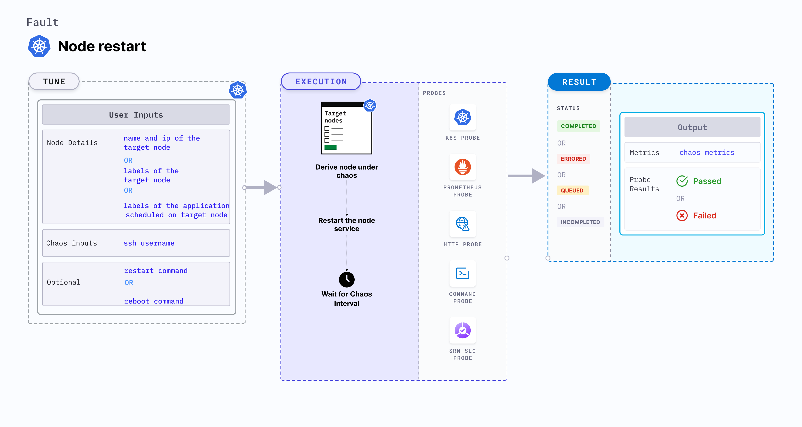

## Introduction

- It causes chaos to disrupt state of node by restarting it.
- It tests deployment sanity (replica availability & uninterrupted service) and recovery workflows of the application pod.

:::tip Fault execution flow chart 

:::

## Uses
<details>
<summary>View the uses of the fault</summary>
<div>
Coming soon.
</div>
</details>

## Prerequisites
:::info
- Ensure that Kubernetes Version > 1.16
- Create a Kubernetes secret named `id-rsa` where the fault will run, where its contents will be the private SSH key for `SSH_USER` used to connect to the node that hosts the target pod in the secret field `ssh-privatekey`. A sample secret is shown below:

        ```yaml
        apiVersion: v1
        kind: Secret
        metadata:
          name: id-rsa
        type: kubernetes.io/ssh-auth
        stringData:
          ssh-privatekey: |-
            # SSH private key for ssh contained here
        ```

    Creating the RSA key pair for remote SSH access should be a trivial exercise for those who are already familiar with an ssh client, which entails the following actions:
        
    1. Create a new key pair and store the keys in a file named `my-id-rsa-key` and `my-id-rsa-key.pub` for the private and public keys respectively: 
        ```
        ssh-keygen -f ~/my-id-rsa-key -t rsa -b 4096
        ```
    2. For each node available, run this following command to copy the public key of `my-id-rsa-key`:
        ```
        ssh-copy-id -i my-id-rsa-key user@node
        ```
        
    For further details, please check this [documentation](https://www.ssh.com/ssh/keygen/). Once you have copied the public key to all nodes and created the secret described earlier, you are ready to start your fault.
:::

## Default Validations
:::note
The target nodes should be in ready state before and after chaos injection.
:::

## Fault Tunables
<details>
    <summary>Check the Fault Tunables</summary>
    <h2>Mandatory Fields</h2>
    <table>
      <tr>
        <th> Variables </th>
        <th> Description </th>
        <th> Notes </th>
      </tr>
      <tr>
        <td> TARGET_NODE </td>
        <td> Name of target node, subjected to chaos. If not provided it will select the random node</td>
        <td> </td>
      </tr>
      <tr>
        <td> NODE_LABEL </td>
        <td> It contains node label, which will be used to filter the target node if TARGET_NODE ENV is not set </td>
        <td>It is mutually exclusive with the TARGET_NODE ENV. If both are provided then it will use the TARGET_NODE</td>
      </tr>
    </table>
    <h2>Optional Fields</h2>
    <table>
      <tr>
        <th> Variables </th>
        <th> Description </th>
        <th> Notes </th>
      </tr>
       <tr>
        <td> LIB_IMAGE </td>
        <td> The image used to restart the node </td>
        <td> Defaults to <code>litmuschaos/go-runner:latest</code> </td>
      </tr>
      <tr>
        <td> SSH_USER </td>
        <td> name of ssh user </td>
        <td> Defaults to <code>root</code> </td>
      </tr>
      <tr>
        <td> TARGET_NODE_IP </td>
        <td> Internal IP of the target node, subjected to chaos. If not provided, the fault will lookup the node IP of the <code>TARGET_NODE</code> node</td>
        <td> Defaults to empty </td>
      </tr>
      <tr>
        <td> REBOOT_COMMAND </td>
        <td> Command used for reboot </td>
        <td> Defaults to <code>sudo systemctl reboot</code> </td>
      </tr>
      <tr>
        <td> TOTAL_CHAOS_DURATION </td>
        <td> The time duration for chaos insertion (sec) </td>
        <td> Defaults to 30s </td>
      </tr>
      <tr>
        <td> RAMP_TIME </td>
        <td> Period to wait before and after injection of chaos in sec </td>
        <td> Eg. 30 </td>
      </tr>
      <tr>
        <td> LIB </td>
        <td> The chaos lib used to inject the chaos </td>
        <td> Defaults to <code>litmus</code> supported litmus only </td>
      </tr>
    </table>
</details>

## Fault Examples

### Common and Node specific tunables
Refer the [common attributes](../../common-tunables-for-all-faults) and [Node specific tunable](./common-tunables-for-node-faults) to tune the common tunables for all faults and node specific tunables.

### Reboot Command

It defines the command used to restart the targeted node. It can be tuned via `REBOOT_COMMAND` ENV.

Use the following example to tune this:

[embedmd]:# (./static/manifests/node-restart/reboot-command.yaml yaml)
```yaml
# provide the reboot command
apiVersion: litmuschaos.io/v1alpha1
kind: ChaosEngine
metadata:
  name: engine-nginx
spec:
  engineState: "active"
  annotationCheck: "false"
  chaosServiceAccount: litmus-admin
  experiments:
  - name: node-restart
    spec:
      components:
        env:
        # command used for the reboot
        - name: REBOOT_COMMAND
          value: 'sudo systemctl reboot'
        # name of the target node
        - name: TARGET_NODE
          value: 'node01'
        - name: TOTAL_CHAOS_DURATION
          VALUE: '60'
```

### SSH User 

It defines the name of the SSH user for the targeted node. It can be tuned via `SSH_USER` ENV.

Use the following example to tune this:

[embedmd]:# (./static/manifests/node-restart/ssh-user.yaml yaml)
```yaml
# name of the ssh user used to ssh into targeted node
apiVersion: litmuschaos.io/v1alpha1
kind: ChaosEngine
metadata:
  name: engine-nginx
spec:
  engineState: "active"
  annotationCheck: "false"
  chaosServiceAccount: litmus-admin
  experiments:
  - name: node-restart
    spec:
      components:
        env:
        # name of the ssh user
        - name: SSH_USER
          value: 'root'
        # name of the target node
        - name: TARGET_NODE
          value: 'node01'
        - name: TOTAL_CHAOS_DURATION
          VALUE: '60'
```

### Target Node Internal IP

It defines the internal IP of the targeted node. It is an optional field, if internal IP is not provided then it will derive the internal IP of the targeted node. It can be tuned via `TARGET_NODE_IP` ENV.

Use the following example to tune this:

[embedmd]:# (./static/manifests/node-restart/target-node-ip.yaml yaml)
```yaml
# internal ip of the targeted node
apiVersion: litmuschaos.io/v1alpha1
kind: ChaosEngine
metadata:
  name: engine-nginx
spec:
  engineState: "active"
  annotationCheck: "false"
  chaosServiceAccount: litmus-admin
  experiments:
  - name: node-restart
    spec:
      components:
        env:
        # internal ip of the targeted node
        - name: TARGET_NODE_IP
          value: '10.0.170.92'
        # name of the target node
        - name: TARGET_NODE
          value: 'node01'
        - name: TOTAL_CHAOS_DURATION
          VALUE: '60'
```
