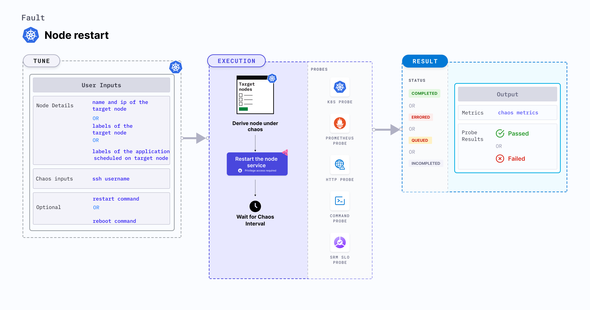

Node restart disrupts the state of the node by restarting it.
- It tests deployment sanity (replica availability and uninterrupted service) and recovery workflows of the application pod.





## Usage
<details>
<summary>View the uses of the fault</summary>
<div>
This fault determines the deployment sanity (replica availability and uninterrupted service) and recovery workflows of the application pod. It simulates loss of critical services (or node-crash). It verifies resource budgeting on cluster nodes (whether request(or limit) settings honored on available nodes), and whether topology constraints are adhered to (node selectors, tolerations, zone distribution, affinity(or anti-affinity) policies) or not.
</div>
</details>

## Prerequisites

- Kubernetes > 1.16
- Create a Kubernetes secret named `id-rsa` where the fault will be executed. The contents of the secret will be the private SSH key for `SSH_USER` that will be used to connect to the node that hosts the target pod in the secret field `ssh-privatekey`. Below is a sample secret file:

```yaml
apiVersion: v1
        kind: Secret
        metadata:
          name: id-rsa
        type: kubernetes.io/ssh-auth
        stringData:
          ssh-privatekey: |-
            # SSH private key for ssh contained here
```

Creating the RSA key pair for remote SSH access for those who are already familiar with an SSH client, has been summarized below.
        
1. Create a new key pair and store the keys in a file named `my-id-rsa-key` and `my-id-rsa-key.pub` for the private and public keys respectively: 
```
ssh-keygen -f ~/my-id-rsa-key -t rsa -b 4096
```
2. For each available node, run the below command that copies the public key of `my-id-rsa-key`:
```
ssh-copy-id -i my-id-rsa-key user@node
```
        
For further details, refer to [this](https://www.ssh.com/ssh/keygen/) documentation. After copying the public key to all nodes and creating the secret, you are all set to execute the fault.


## Default validations

The target nodes should be in the ready state before and after injecting chaos.


## Fault tunables
<details>
    <summary>Fault tunables</summary>
    <h2>Mandatory fields</h2>
    <table>
      <tr>
        <th> Variables </th>
        <th> Description </th>
        <th> Notes </th>
      </tr>
      <tr>
        <td> TARGET_NODE </td>
        <td> Name of the target node subject to chaos. If this is not provided, a random node is selected. </td>
        <td> </td>
      </tr>
      <tr>
        <td> NODE_LABEL </td>
       <td> It contains the node label that is used to filter the target nodes.</td>
        <td>It is mutually exclusive with the <code>TARGET_NODES</code> environment variable. If both are provided, <code>TARGET_NODES</code> takes precedence.</td>
      </tr>
    </table>
    <h2>Optional fields</h2>
    <table>
      <tr>
        <th> Variables </th>
        <th> Description </th>
        <th> Notes </th>
      </tr>
       <tr>    
        <td> LIB_IMAGE </td>
        <td> Image used to run the stress command. </td>
        <td> Defaults to <code>litmuschaos/go-runner:latest</code>. </td>
      </tr>
      <tr>
        <td> SSH_USER </td>
        <td> Name of the SSH user. </td>
        <td> Defaults to <code>root</code>. </td>
      </tr>
      <tr>
        <td> TARGET_NODE_IP </td>
        <td> Internal IP of the target node subject to chaos. If not provided, the fault uses the node IP of the <code>TARGET_NODE</code>. </td>
        <td> Defaults to empty. </td>
      </tr>
      <tr>
        <td> REBOOT_COMMAND </td>
        <td> Command used to reboot. </td>
        <td> Defaults to <code>sudo systemctl reboot</code>. </td>
      </tr>
      <tr>
        <td> TOTAL_CHAOS_DURATION </td>
        <td> Duration that you specify, through which chaos is injected into the target resource (in seconds). </td>
        <td> Default to 120s. </td>
      </tr>
      <tr>
        <td> RAMP_TIME </td>
        <td> Period to wait before and after injecting chaos (in seconds). </td>
        <td> For example, 30s. </td>
      </tr>
    </table>
</details>

## Fault examples

### Common and Node specific tunables
Refer the [common attributes](../../common-tunables-for-all-faults) and [Node specific tunable](./common-tunables-for-node-faults) to tune the common tunables for all faults and node specific tunables.

### Reboot Command

It defines the command used to restart the targeted node. It can be tuned via `REBOOT_COMMAND` ENV.

Use the following example to tune this:

[embedmd]:# (./static/manifests/node-restart/reboot-command.yaml yaml)
```yaml
# provide the reboot command
apiVersion: litmuschaos.io/v1alpha1
kind: ChaosEngine
metadata:
  name: engine-nginx
spec:
  engineState: "active"
  annotationCheck: "false"
  chaosServiceAccount: litmus-admin
  experiments:
  - name: node-restart
    spec:
      components:
        env:
        # command used for the reboot
        - name: REBOOT_COMMAND
          value: 'sudo systemctl reboot'
        # name of the target node
        - name: TARGET_NODE
          value: 'node01'
        - name: TOTAL_CHAOS_DURATION
          VALUE: '60'
```

### SSH User 

It defines the name of the SSH user for the targeted node. It can be tuned via `SSH_USER` ENV.

Use the following example to tune this:

[embedmd]:# (./static/manifests/node-restart/ssh-user.yaml yaml)
```yaml
# name of the ssh user used to ssh into targeted node
apiVersion: litmuschaos.io/v1alpha1
kind: ChaosEngine
metadata:
  name: engine-nginx
spec:
  engineState: "active"
  annotationCheck: "false"
  chaosServiceAccount: litmus-admin
  experiments:
  - name: node-restart
    spec:
      components:
        env:
        # name of the ssh user
        - name: SSH_USER
          value: 'root'
        # name of the target node
        - name: TARGET_NODE
          value: 'node01'
        - name: TOTAL_CHAOS_DURATION
          VALUE: '60'
```

### Target Node Internal IP

It defines the internal IP of the targeted node. It is an optional field, if internal IP is not provided then it will derive the internal IP of the targeted node. It can be tuned via `TARGET_NODE_IP` ENV.

Use the following example to tune this:

[embedmd]:# (./static/manifests/node-restart/target-node-ip.yaml yaml)
```yaml
# internal ip of the targeted node
apiVersion: litmuschaos.io/v1alpha1
kind: ChaosEngine
metadata:
  name: engine-nginx
spec:
  engineState: "active"
  annotationCheck: "false"
  chaosServiceAccount: litmus-admin
  experiments:
  - name: node-restart
    spec:
      components:
        env:
        # internal ip of the targeted node
        - name: TARGET_NODE_IP
          value: '10.0.170.92'
        # name of the target node
        - name: TARGET_NODE
          value: 'node01'
        - name: TOTAL_CHAOS_DURATION
          VALUE: '60'
```
