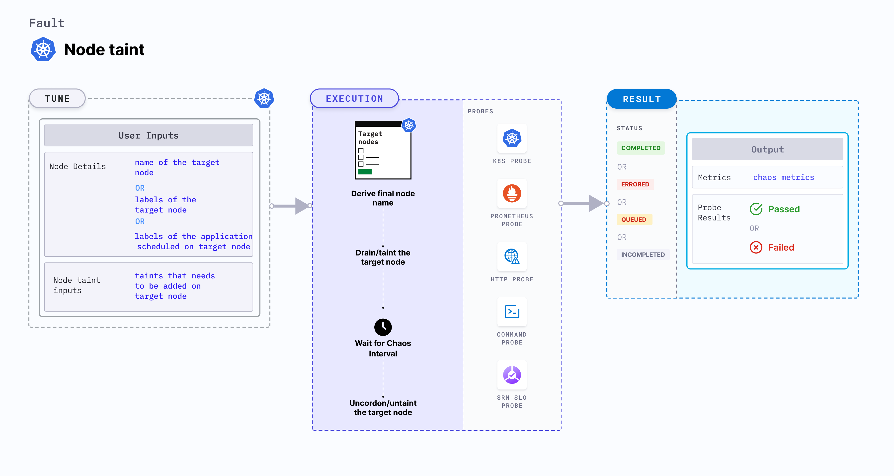

## Introduction
- It taints the node to apply the desired effect. The resources which contains the correspoing tolerations can only bypass the taints.

:::tip Fault execution flow chart 

:::

## Uses
<details>
<summary>View the uses of the fault</summary>
<div>
Coming soon.
</div>
</details>

## Prerequisites
:::info
- Ensure that Kubernetes Version > 1.16.
- Ensure that the node specified in the fault ENV variable <code>TARGET_NODE</code> (the node for which docker service need to be killed) should be cordoned before execution of the chaos fault to ensure that the fault resources are not scheduled on it or subjected to eviction. This can be achieved with the following steps:
  - Get node names against the applications pods: <code>kubectl get pods -o wide</code>
  - Cordon the node <code>kubectl cordon &lt;nodename&gt;</code>
:::

## Default Validations
:::note
The target nodes should be in ready state before and after chaos injection.
:::

## Fault Tunables
<details>
    <summary>Check the Fault Tunables</summary>
    <h2>Mandatory Fields</h2>
    <table>
      <tr>
        <th> Variables </th>
        <th> Description </th>
        <th> Notes </th>
      </tr>
      <tr>
        <td> TARGET_NODE </td>
        <td> Name of the node to be tainted</td>
        <td> </td>
      </tr>
      <tr>
        <td> NODE_LABEL </td>
        <td> It contains node label, which will be used to filter the target node if <code>TARGET_NODE</code> ENV is not set </td>
        <td>It is mutually exclusive with the <code>TARGET_NODE</code> ENV. If both are provided then it will use the <code>TARGET_NODE</code> </td>
      </tr>
      <tr>
        <td> TAINT_LABEL </td>
        <td> Label and effect to be tainted on application node </td>
        <td> </td>
      </tr>
    </table>
    <h2>Optional Fields</h2>
    <table>
      <tr>
        <th> Variables </th>
        <th> Description </th>
        <th> Notes </th>
      </tr>
      <tr>
        <td> TOTAL_CHAOS_DURATION </td>
        <td> The time duration for chaos insertion (seconds) </td>
        <td> Defaults to 60s </td>
      </tr>
      <tr>
        <td> LIB </td>
        <td> The chaos lib used to inject the chaos </td>
        <td> Defaults to `litmus` </td>
      </tr>
      <tr>
        <td> RAMP_TIME </td>
        <td> Period to wait before injection of chaos in sec </td>
        <td> Eg. 30 </td>
      </tr>
    </table>
</details>

## Fault Examples

### Common and Node specific tunables
Refer the [common attributes](../../common-tunables-for-all-faults) and [Node specific tunable](./common-tunables-for-node-faults) to tune the common tunables for all faults and node specific tunables.

### Taint Label

It contains label and effect to be tainted on application node. It can be tuned via `TAINT_LABEL` ENV.

Use the following example to tune this:

[embedmd]:# (./static/manifests/node-taint/taint-labels.yaml yaml)
```yaml
# node tainted with provided key and effect
apiVersion: litmuschaos.io/v1alpha1
kind: ChaosEngine
metadata:
  name: engine-nginx
spec:
  engineState: "active"
  annotationCheck: "false"
  chaosServiceAccount: litmus-admin
  experiments:
  - name: node-taint
    spec:
      components:
        env:
        # label and effect to be tainted on the targeted node
        - name: TAINT_LABEL
          value: 'key=value:effect'
        - name: TOTAL_CHAOS_DURATION
          VALUE: '60'
```
