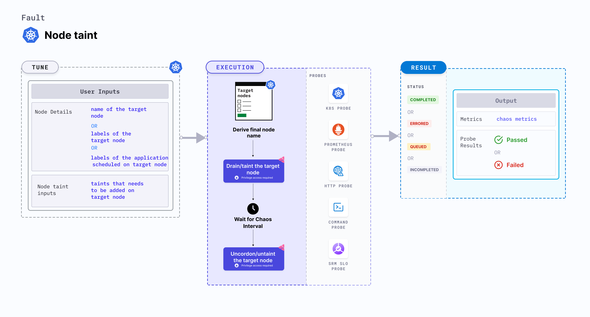

Node taint taints (contaminates) the node by applying the desired effect. 
- The resources that contain the corresponding tolerations only can bypass the taints.



## Usage
<details>
<summary>View the uses of the fault</summary>
<div>
The fault aims to verify resiliency of applications when the nodes of a container (or deployment) are contaminated.
</div>
</details>

## Prerequisites

- Kubernetes > 1.16
- Node specified in the <code>TARGET_NODE</code> environment variable (the node for which Docker service would be killed) should be cordoned before executing the chaos fault. This ensures that the fault resources are not scheduled on it (or subject to eviction). This is achieved by the following steps:
  - Get node names against the applications pods using command <code>kubectl get pods -o wide</code>.
  - Cordon the node using command <code>kubectl cordon &lt;nodename&gt;</code>.


## Default validations

The target nodes should be in the ready state before and after injecting chaos.

## Fault tunables
<details>
    <summary>Fault tunables</summary>
    <h2>Mandatory fields</h2>
    <table>
      <tr>
        <th> Variables </th>
        <th> Description </th>
        <th> Notes </th>
      </tr>
      <tr>
        <td> TARGET_NODE </td>
        <td> Name of the node to be tainted. </td>
        <td> </td>
      </tr>
      <tr>
         <td> NODE_LABEL </td>
        <td> It contains node label, which will be used to filter the target nodes if <code>TARGET_NODES</code> ENV is not set </td>
        <td>It is mutually exclusive with the <code>TARGET_NODES</code> ENV. If both are provided then it will use the <code>TARGET_NODES</code>. </td>
      </tr>
      <tr>
        <td> TAINT_LABEL </td>
        <td> Label and the effect to be tainted on the application node. </td>
        <td> </td>
      </tr>
    </table>
    <h2>Optional fields</h2>
    <table>
      <tr>
        <th> Variables </th>
        <th> Description </th>
        <th> Notes </th>
      </tr>
      <tr>
        <td> TOTAL_CHAOS_DURATION </td>
        <td> Duration that you specify, through which chaos is injected into the target resource (in seconds). </td>
        <td> Defaults to 60s. </td>
      </tr>
      <tr>
        <td> RAMP_TIME </td>
        <td> Period to wait before and after injecting chaos (in seconds). </td>
        <td> For example, 30s. </td>
      </tr>
    </table>
</details>

## Fault examples

### Common and node-specific tunables
Refer to the [common attributes](../../common-tunables-for-all-faults) and [node-specific tunables](./common-tunables-for-node-faults) to tune the common tunables for all faults and node specific tunables.

### Taint label

It contains the label and the effect to be tainted on the application node. You can tune it using the `TAINT_LABEL` environment variable.

Use the following example to tune it:

[embedmd]:# (./static/manifests/node-taint/taint-labels.yaml yaml)
```yaml
# node tainted with provided key and effect
apiVersion: litmuschaos.io/v1alpha1
kind: ChaosEngine
metadata:
  name: engine-nginx
spec:
  engineState: "active"
  annotationCheck: "false"
  chaosServiceAccount: litmus-admin
  experiments:
  - name: node-taint
    spec:
      components:
        env:
        # label and effect to be tainted on the targeted node
        - name: TAINT_LABEL
          value: 'key=value:effect'
        - name: TOTAL_CHAOS_DURATION
          VALUE: '60'
```
