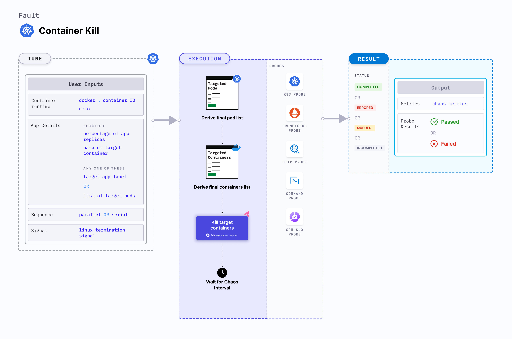

Container kill is a Kubernetes pod-level chaos fault that causes container failure on specific (or random) replicas of an application resource.
- It tests an application's deployment sanity (replica availability and uninterrupted service) and recovery workflow.
- It tests the recovery of pods that possess sidecar containers.




## Usage
<details>
<summary>View fault usage</summary>
<div>
It tests an application's deployment sanity (replica availability and uninterrupted service) and recovery workflow when certain replicas are not available.
</div>
</details>

## Prerequisites
- Kubernetes > 1.16.


## Default validations

The application pods should be in running state before and after chaos injection.


## Fault tunables
<details>
    <summary>Fault tunables</summary>
    <h2>Optional fields</h2>
    <table>
      <tr>
        <th> Variables </th>
        <th> Description  </th>
        <th> Notes </th>
      </tr>
      <tr>
        <td> TARGET_CONTAINER </td>
        <td> Name of the container that is killed inside the pod. </td>
        <td> If it is not provided, the fault deletes first container. </td>
      </tr>
      <tr>
        <td> CHAOS_INTERVAL </td>
        <td> Time interval between two successive container kills (in seconds). </td>
        <td> Defaults to 10s. </td>
      </tr>
      <tr>
        <td> TOTAL_CHAOS_DURATION </td>
        <td> Duration that you specify, through which chaos is injected into the target resource (in seconds). </td>
        <td> Defaults to 20s. </td>
      </tr>
      <tr>
        <td> PODS_AFFECTED_PERC </td>
        <td> Percentage of total pods to target, takes numeric values only. </td>
        <td> Defaults to 0 (corresponds to 1 replica). </td>
      </tr> 
      <tr>
        <td> TARGET_PODS </td>
        <td> Comma-separated list of application pod name subject to container kill.</td>
        <td> If it is not provided, target pods are randomly based on appLabels provided. </td>
      </tr>
      <tr>
        <td> LIB_IMAGE </td>
        <td> Image used to kill the container. </td>
        <td> Defaults to <code>litmuschaos/go-runner:latest</code>. </td>
      </tr>
      <tr>
        <td> RAMP_TIME </td>
        <td> Period to wait before injecting chaos (in seconds). </td>
        <td> For example, 30s. </td>
      </tr>
      <tr>
        <td> SEQUENCE </td>
        <td> It defines sequence of chaos execution for multiple target pods </td>
        <td> Default value: parallel. Supported: serial, parallel </td>
      </tr>
      <tr>
        <td> SIGNAL </td>
        <td> It contains termination signal used for container kill </td>
        <td> Defaults to SIGKILL. </td>
      </tr>
      <tr>
        <td> SOCKET_PATH </td>
        <td> Path to the <code>containerd/crio/docker</code> socket file. </td>
        <td> Defaults to <code>/var/run/docker.sock</code>. </td>
      </tr>
      <tr>
        <td> CONTAINER_RUNTIME </td>
        <td> Container runtime interface for the cluster. </td>
        <td> Defaults to docker. Supported docker, containerd and crio.</td>
      </tr>
    </table>
</details>

## Fault examples

### Common and pod-specific tunables
Refer to the [common attributes](../../common-tunables-for-all-faults) and [pod-specific tunables](./common-tunables-for-pod-faults) to tune the common tunables for all fault and pod specific tunables.

### Kill specific container

It defines the name of the target container which is subject to chaos. You can tune it using `TARGET_CONTAINER` environment variable. If `TARGET_CONTAINER` environment variable is set to empty, the fault uses the first container of the target pod.

[embedmd]: # "./static/manifests/container-kill/kill-specific-container.yaml yaml"

```yaml
# kill the specific target container
apiVersion: litmuschaos.io/v1alpha1
kind: ChaosEngine
metadata:
  name: engine-nginx
spec:
  engineState: "active"
  annotationCheck: "false"
  appinfo:
    appns: "default"
    applabel: "app=nginx"
    appkind: "deployment"
  chaosServiceAccount: litmus-admin
  experiments:
    - name: container-kill
      spec:
        components:
          env:
            # name of the target container
            - name: TARGET_CONTAINER
              value: "nginx"
            - name: TOTAL_CHAOS_DURATION
              VALUE: "60"
```

### Container runtime and socket path

It defines the `CONTAINER_RUNTIME` and `SOCKET_PATH` environment variable that help set the container runtime and socket file path, respectively.

- `CONTAINER_RUNTIME`: It supports `docker`, `containerd`, and `crio` runtimes. The default value is `docker`.
- `SOCKET_PATH`: It contains the path of the docker socket file by default(`/var/run/docker.sock`). For `containerd`, specify path as `/var/containerd/containerd.sock`. For `crio`, speecify path as `/var/run/crio/crio.sock`.

[embedmd]: # "./static/manifests/container-kill/container-runtime-and-socket-path.yaml yaml"

```yaml
## provide the container runtime and socket file path
apiVersion: litmuschaos.io/v1alpha1
kind: ChaosEngine
metadata:
  name: engine-nginx
spec:
  engineState: "active"
  annotationCheck: "false"
  appinfo:
    appns: "default"
    applabel: "app=nginx"
    appkind: "deployment"
  chaosServiceAccount: litmus-admin
  experiments:
    - name: container-kill
      spec:
        components:
          env:
            # runtime for the container
            # supports docker, containerd, crio
            - name: CONTAINER_RUNTIME
              value: "docker"
            # path of the socket file
            - name: SOCKET_PATH
              value: "/var/run/docker.sock"
            - name: TOTAL_CHAOS_DURATION
              VALUE: "60"
```

### Signal for kill

It defines the Linux signal passed while killing the container. You can tune it using the `SIGNAL` environment variable. Its default value is set to `SIGTERM`.

[embedmd]: # "./static/manifests/container-kill/signal.yaml yaml"

```yaml
# specific linux signal passed while kiiling container
apiVersion: litmuschaos.io/v1alpha1
kind: ChaosEngine
metadata:
  name: engine-nginx
spec:
  engineState: "active"
  annotationCheck: "false"
  appinfo:
    appns: "default"
    applabel: "app=nginx"
    appkind: "deployment"
  chaosServiceAccount: litmus-admin
  experiments:
    - name: container-kill
      spec:
        components:
          env:
            # signal passed while killing container
            # defaults to SIGTERM
            - name: SIGNAL
              value: "SIGKILL"
            - name: TOTAL_CHAOS_DURATION
              VALUE: "60"
```