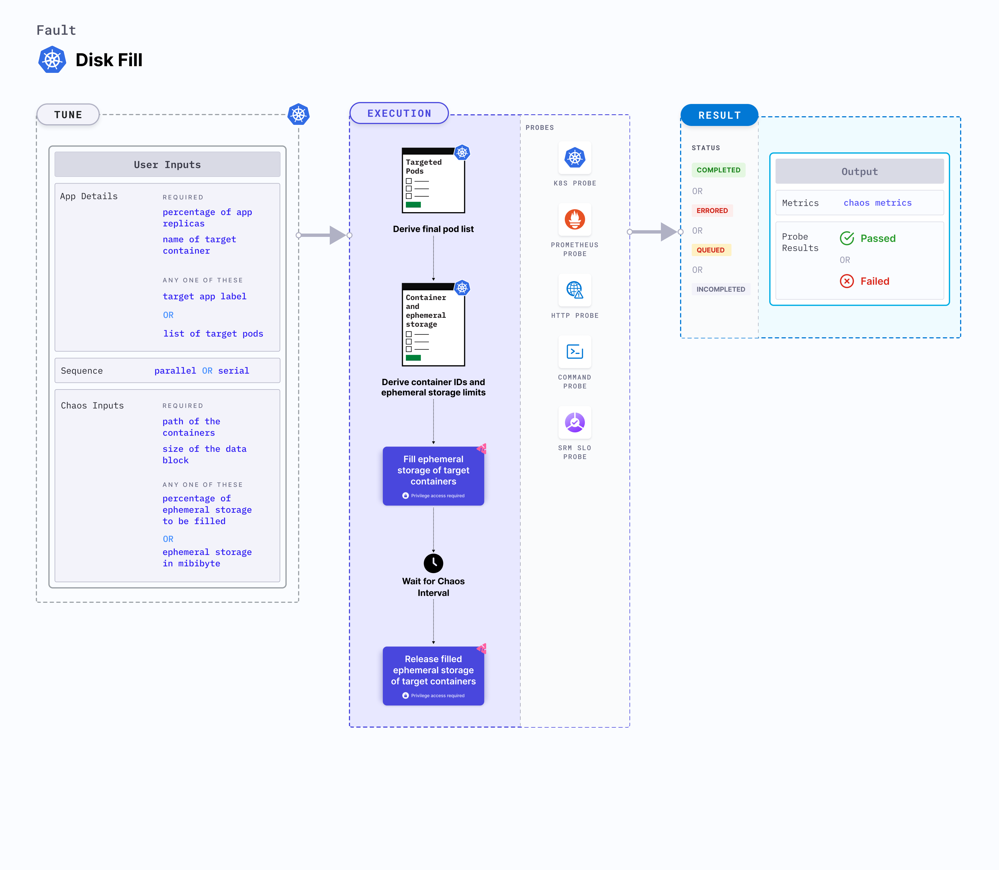

Disk fill is a Kubernetes pod-level chaos fault that applies disk stress by filling the pod's ephemeral storage on a node.
- It evicts the application pod if its capacity exceeds the pod's ephemeral storage limit.
- It tests the ephemeral storage limits and ensures that the parameters are sufficient.
- It evaluates the application's resilience to disk stress (or replica) evictions.




## Usage
<details>
<summary>View fault usage</summary>
<div>
This fault tests the ephemeral storage limits and ensures that the parameters are sufficient.
</div>
</details>

## Prerequisites

- Kubernetes> 1.16.
- Adequate Ephemeral storage requests and limits should be set for the application before running the fault. An example specification is shown below:
    ```yaml
    apiVersion: v1
    kind: Pod
    metadata:
      name: frontend
    spec:
      containers:
      - name: db
        image: mysql
        env:
        - name: MYSQL_ROOT_PASSWORD
          value: "password"
        resources:
          requests:
            ephemeral-storage: "2Gi"
          limits:
            ephemeral-storage: "4Gi"
      - name: wp
        image: wordpress
        resources:
          requests:
            ephemeral-storage: "2Gi"
          limits:
            ephemeral-storage: "4Gi"
    ```


## Default validations

The application pods should be running before and after injecting chaos.


## Fault tunables
<details>
    <summary>Fault tunables</summary>
    <h2>Optional fields</h2>
    <table>
      <tr>
        <th> Variables </th>
        <th> Description </th>
        <th> Notes </th>
      </tr>
      <tr> 
        <td> FILL_PERCENTAGE </td>
        <td> Percentage to fill the ephemeral storage limit. This limit is set in the target pod. </td>
        <td> It can be set to more than 100, that will force evict the pod.</td>
      </tr>
      <tr>
        <td> EPHEMERAL_STORAGE_MEBIBYTES </td>
        <td> Ephemeral storage required to be filled (in mebibytes). It is mutually exclusive with <code>FILL_PERCENTAGE</code> environment variable. If both are provided, <code>FILL_PERCENTAGE</code> takes precedence.</td>
        <td> </td>
      </tr>
    </table>
    <h2>Optional fields</h2>
    <table>
      <tr>
        <th> Variables </th>
        <th> Description </th>
        <th> Notes </th>
      </tr>
      <tr> 
        <td> TARGET_CONTAINER </td>
        <td> Name of the container subject to disk fill. </td>
        <td> If it is not provided, the first container in the target pod will be subject to chaos. </td>
      </tr>
      <tr> 
        <td> CONTAINER_PATH </td>
        <td> Storage location of containers</td>
        <td> Defaults to '/var/lib/docker/containers' </td>
      </tr>
      <tr> 
        <td> TOTAL_CHAOS_DURATION </td>
        <td> The time duration for chaos insertion (sec) </td>
        <td> Defaults to 60s </td>
      </tr>
      <tr>
        <td> TARGET_PODS </td>
        <td> Comma separated list of application pod name subjected to disk fill chaos</td>
        <td> If not provided, it will select target pods randomly based on provided appLabels</td>
      </tr> 
      <tr>
        <td> DATA_BLOCK_SIZE </td>
        <td> It contains data block size used to fill the disk(in KB)</td>
        <td> Defaults to 256, it supports unit as KB only</td>
      </tr> 
      <tr>
        <td> PODS_AFFECTED_PERC </td>
        <td> The Percentage of total pods to target </td>
        <td> Defaults to 0 (corresponds to 1 replica), provide numeric value only </td>
      </tr> 
      <tr>
        <td> LIB_IMAGE </td>
        <td> The image used to fill the disk </td>
        <td> Defaults to <code>litmuschaos/go-runner:latest</code> </td>
      </tr>
      <tr>
        <td> RAMP_TIME </td>
        <td> Period to wait before injection of chaos in sec </td>
        <td> For example, 30 </td>
      </tr>
      <tr>
        <td> SEQUENCE </td>
        <td> It defines sequence of chaos execution for multiple target pods </td>
        <td> Default value: parallel. Supported: serial, parallel </td>
      </tr>
    </table>
</details>

## Fault examples

### Common and pod-specific tunables
Refer to the [common attributes](../../common-tunables-for-all-faults) and [pod-specific tunables](./common-tunables-for-pod-faults) to tune the common tunables for all fault and pod specific tunables. 

### Disk fill percentage

It fills the `FILL_PERCENTAGE` parameter of the ephemeral storage limit specified at `resource.limits.ephemeral-storage` within the target application.

Use the following example to tune it:

[embedmd]: # "./static/manifests/disk-fill/fill-percentage.yaml yaml"

```yaml
## percentage of ephemeral storage limit specified at `resource.limits.ephemeral-storage` inside target application
apiVersion: litmuschaos.io/v1alpha1
kind: ChaosEngine
metadata:
  name: engine-nginx
spec:
  engineState: "active"
  annotationCheck: "false"
  appinfo:
    appns: "default"
    applabel: "app=nginx"
    appkind: "deployment"
  chaosServiceAccount: litmus-admin
  experiments:
    - name: disk-fill
      spec:
        components:
          env:
            ## percentage of ephemeral storage limit, which needs to be filled
            - name: FILL_PERCENTAGE
              value: "80" # in percentage
            - name: TOTAL_CHAOS_DURATION
              VALUE: "60"
```

### Disk fill mebibytes

It fills the `EPHEMERAL_STORAGE_MEBIBYTES` parameter of ephemeral storage in the target pod.
It is mutually exclusive with the `FILL_PERCENTAGE` environment variable. If `FILL_PERCENTAGE` environment variable is set, it uses the percentage for the fill. Otherwise, it fills the ephemeral storage based on `EPHEMERAL_STORAGE_MEBIBYTES` environment variable.

Use the following example to tune it:

[embedmd]: # "./static/manifests/disk-fill/ephemeral-storage-mebibytes.yaml yaml"

```yaml
# ephemeral storage which needs to fill in will application
# if ephemeral-storage limits is not specified inside target application
apiVersion: litmuschaos.io/v1alpha1
kind: ChaosEngine
metadata:
  name: engine-nginx
spec:
  engineState: "active"
  annotationCheck: "false"
  appinfo:
    appns: "default"
    applabel: "app=nginx"
    appkind: "deployment"
  chaosServiceAccount: litmus-admin
  experiments:
    - name: disk-fill
      spec:
        components:
          env:
            ## ephemeral storage size, which needs to be filled
            - name: EPHEMERAL_STORAGE_MEBIBYTES
              value: "256" #in MiBi
            - name: TOTAL_CHAOS_DURATION
              VALUE: "60"
```

### Data block size

It defines the size of the data block required to fill the ephemeral storage of the target pod. You can tune it using the `DATA_BLOCK_SIZE` environment variable. It is in terms of `KB`.
The default value of `DATA_BLOCK_SIZE` is `256`.

Use the following example to tune it:

[embedmd]: # "./static/manifests/disk-fill/data-block-size.yaml yaml"

```yaml
# size of the data block used to fill the disk
apiVersion: litmuschaos.io/v1alpha1
kind: ChaosEngine
metadata:
  name: engine-nginx
spec:
  engineState: "active"
  annotationCheck: "false"
  appinfo:
    appns: "default"
    applabel: "app=nginx"
    appkind: "deployment"
  chaosServiceAccount: litmus-admin
  experiments:
    - name: disk-fill
      spec:
        components:
          env:
            ## size of data block used to fill the disk
            - name: DATA_BLOCK_SIZE
              value: "256" #in KB
            - name: TOTAL_CHAOS_DURATION
              VALUE: "60"
```

### Container path

It defines the storage location of the containers inside the host (node or VM). You can tune it using the `CONTAINER_PATH` environment variable.

Use the following example to tune it:

[embedmd]: # "./static/manifests/disk-fill/container-path.yaml yaml"

```yaml
# path inside node/vm where containers are present
apiVersion: litmuschaos.io/v1alpha1
kind: ChaosEngine
metadata:
  name: engine-nginx
spec:
  engineState: "active"
  annotationCheck: "false"
  appinfo:
    appns: "default"
    applabel: "app=nginx"
    appkind: "deployment"
  chaosServiceAccount: litmus-admin
  experiments:
    - name: disk-fill
      spec:
        components:
          env:
            # storage location of the containers
            - name: CONTAINER_PATH
              value: "/var/lib/docker/containers"
            - name: TOTAL_CHAOS_DURATION
              VALUE: "60"
```