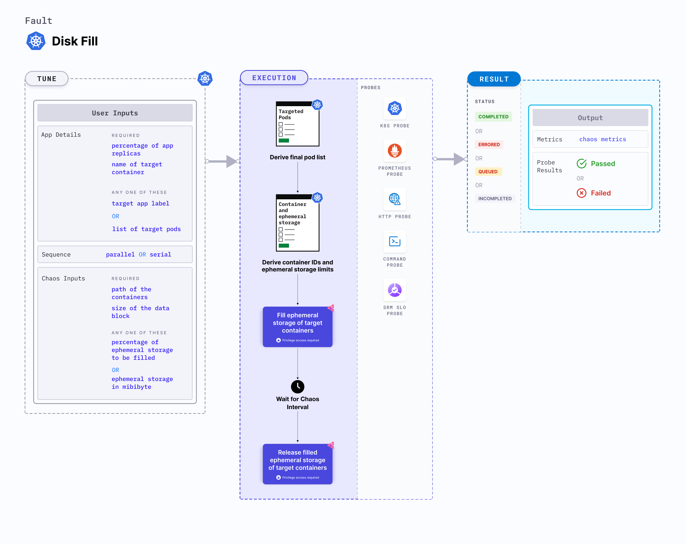

Disk fill is a Kubernetes pod-level chaos fault that:
- Applies disk stress by filling the pod's ephemeral storage on a node.
- Evicts the application pod if its capacity exceeds the pod's ephemeral storage limit.
- Tests the ephemeral storage limits and ensures that the parameters are sufficient.
- Evaluates the application's resilience to disk stress (or replica) evictions.



## Usage
<details>
<summary>View fault usage</summary>
<div>
Disk fill is used to determine how the application behaves when the disk is under stress, that is, when ephermal storage is added to the pod.   
</div>
</details>

## Prerequisites
- Kubernetes > 1.16
- Specify ephemeral storage requests and limits for the application before fault implementation. An example specification is shown below:
    ```yaml
    apiVersion: v1
    kind: Pod
    metadata:
      name: frontend
    spec:
      containers:
      - name: db
        image: mysql
        env:
        - name: MYSQL_ROOT_PASSWORD
          value: "password"
        resources:
          requests:
            ephemeral-storage: "2Gi"
          limits:
            ephemeral-storage: "4Gi"
      - name: wp
        image: wordpress
        resources:
          requests:
            ephemeral-storage: "2Gi"
          limits:
            ephemeral-storage: "4Gi"
    ```

## Default validation
The application pods should be running before and after injecting chaos.

## Implementation

**NOTE:** It is assumed that you already have the boutique application set up in a namespace. If not, follow [this](provide link) to set up your boutique application.

To execute disk fill fault, [setup experiment](provide) and infrastructure.

After successful setup of chaos infrastructure:
* Choose the **disk-fill** fault from the list of Kubernetes faults available;
* Specify parameters for the **Target application**, **Tune fault**, and **Probes**;
    <details>
      <summary>Fault Tunables</summary>
      <h2>Populate one of the below fields (If both are populated, `FILL_PERCENTAGE` takes precedence.) </h2>
      <table>
        <tr>
          <th> Variables </th>
          <th> Description </th>
          <th> Notes </th>
        </tr>
        <tr> 
          <td> FILL_PERCENTAGE </td>
          <td> Percentage of the ephemeral storage limit to be filled. </td>
          <td> The value can be more than 100, that force evicts the pod. Ephemeral storage limits are set on the target pod.</td>
        </tr>
        <tr>
          <td> EPHEMERAL_STORAGE_MEBIBYTES </td>
          <td> Ephemeral storage to be filled (in MiB).</td>
          <td> <code>FILL_PERCENTAGE</code> and <code>EPHEMERAL_STORAGE_MEBIBYTES</code> are mutually exclusive.</td>
        </tr>
      </table>
      <h2>Optional Fields</h2>
      <table>
        <tr>
          <th> Variables </th>
          <th> Description </th>
          <th> Notes </th>
        </tr>
        <tr> 
          <td> TARGET_CONTAINER </td>
          <td> Name of container subject to disk fill. </td>
          <td> If you don't provide this value, the first container in the target pod will be subject to chaos. </td>
        </tr>
        <tr> 
          <td> CONTAINER_PATH </td>
          <td> Storage location of containers. </td>
          <td> Defaults to '/var/lib/docker/containers' </td>
        </tr>
        <tr> 
          <td> TOTAL_CHAOS_DURATION </td>
          <td> Duration to insert chaos (in seconds). </td>
          <td> Defaults to 60s </td>
        </tr>
        <tr>
          <td> TARGET_PODS </td>
          <td> Comma separated list of application pod names subject to disk fill chaos. </td>
          <td> If the pod names have not been provided, the target pods are randomly based on the appLabels provided. </td>
        </tr> 
        <tr>
          <td> DATA_BLOCK_SIZE </td>
          <td> Data block size to use for filling the disk (in KB).</td>
          <td> Defaults to 256 KB.</td>
        </tr> 
        <tr>
          <td> PODS_AFFECTED_PERC </td>
          <td> Percentage of total pods that the chaos experiment targets (numeric values only). </td>
          <td> Defaults to 0 (corresponds to 1 replica). </td>
        </tr> 
        <tr> 
          <td> CONTAINER_PATH </td>
          <td> Path to cotainer runtime used during disk fill </td>
          <td> If the path hasn't been provided, the first container in the target pod is subject to chaos. </td>
        </tr>
        <tr>
          <td> LIB </td>
          <td> The chaos library used to inject chaos. </td>
          <td> Defaults to `litmus` (support litmus only). </td>
        </tr>
        <tr>
          <td> LIB_IMAGE </td>
          <td> Image that uses the helper pod to inject chaos. </td>
          <td> Defaults to <code>litmuschaos/go-runner:latest</code> </td>
        </tr>
        <tr>
          <td> RAMP_TIME </td>
          <td> Period to wait before injecting chaos (in seconds). </td>
          <td> For example, 30s. </td>
        </tr>
        <tr>
          <td> SEQUENCE </td>
          <td> Sequence of chaos execution for multiple target pods. </td>
          <td> Defaults to parallel. It supports serial sequence as well. </td>
        </tr>
      </table>
  </details>

* Close this pane by clicking on **X** at the top.
* Set fault weights by clicking on **Set fault weights** tab present on top. 
* Click **Run** to execute the experiment.

## Chaos fault validation

To validate the experiment you ran, execute the below commands on your terminal. 

* Fetch all the pods in the boutique namespace (or the namespace where your application is housed).
```
kubectl get pods -n <namespace>
```

* Exec into the microservice on which you will execute the chaos fault.
```
kubectl exec -it <microservice_name> -n <namespace> sh
``` 

* This leads you into the pod, where you can execute the below command to check the disk usage.
```
/app # df -h
```

This displays the amount of storage consumed by the application during chaos. 

## Fault examples

### Common and pod specific tunables

Refer to the [common attributes](../../common-tunables-for-all-faults) and [pod specific tunables](./common-tunables-for-pod-faults) to tune the common tunables for all fault and pod specific tunables. 

### Disk fill percentage

It fills the `FILL_PERCENTAGE` parameter of the ephemeral storage limit specified at `resource.limits.ephemeral-storage` within the target application. 

Use the following example to tune it:

[embedmd]:# (./static/manifests/disk-fill/fill-percentage.yaml yaml)
```yaml
## percentage of ephemeral storage limit specified at `resource.limits.ephemeral-storage` inside target application 
apiVersion: litmuschaos.io/v1alpha1
kind: ChaosEngine
metadata:
  name: engine-nginx
spec:
  engineState: "active"
  annotationCheck: "false"
  appinfo:
    appns: "default"
    applabel: "app=nginx"
    appkind: "deployment"
  chaosServiceAccount: litmus-admin
  experiments:
  - name: disk-fill
    spec:
      components:
        env:
        ## percentage of ephemeral storage limit, which needs to be filled
        - name: FILL_PERCENTAGE
          value: '80' # in percentage
        - name: TOTAL_CHAOS_DURATION
          VALUE: '60'
```

### Disk fill mebibytes

It fills the `EPHEMERAL_STORAGE_MEBIBYTES` parameter of ephemeral storage in the target pod. 
It is mutually exclusive with the `FILL_PERCENTAGE` environment variable. If `FILL_PERCENTAGE` environment variable is set, it uses the percentage for the fill. Otherwise, it fills the ephemeral storage based on `EPHEMERAL_STORAGE_MEBIBYTES` environment variable.

Use the following example to tune it:

[embedmd]:# (./static/manifests/disk-fill/ephemeral-storage-mebibytes.yaml yaml)
```yaml
# ephemeral storage which needs to fill in will application
# if ephemeral-storage limits is not specified inside target application
apiVersion: litmuschaos.io/v1alpha1
kind: ChaosEngine
metadata:
  name: engine-nginx
spec:
  engineState: "active"
  annotationCheck: "false"
  appinfo:
    appns: "default"
    applabel: "app=nginx"
    appkind: "deployment"
  chaosServiceAccount: litmus-admin
  experiments:
  - name: disk-fill
    spec:
      components:
        env:
        ## ephemeral storage size, which needs to be filled
        - name: EPHEMERAL_STORAGE_MEBIBYTES
          value: '256' #in MiBi
        - name: TOTAL_CHAOS_DURATION
          VALUE: '60'
```

### Data block size

It defines the size of the data block required to fill the ephemeral storage of the target pod. You can tune it using the `DATA_BLOCK_SIZE` environment variable. It is in terms of `KB`.
The default value of `DATA_BLOCK_SIZE` is `256`.

Use the following example to tune it:

[embedmd]:# (./static/manifests/disk-fill/data-block-size.yaml yaml)
```yaml
# size of the data block used to fill the disk
apiVersion: litmuschaos.io/v1alpha1
kind: ChaosEngine
metadata:
  name: engine-nginx
spec:
  engineState: "active"
  annotationCheck: "false"
  appinfo:
    appns: "default"
    applabel: "app=nginx"
    appkind: "deployment"
  chaosServiceAccount: litmus-admin
  experiments:
  - name: disk-fill
    spec:
      components:
        env:
        ## size of data block used to fill the disk
        - name: DATA_BLOCK_SIZE
          value: '256' #in KB
        - name: TOTAL_CHAOS_DURATION
          VALUE: '60'
```

### Container path

It defines the storage location of the containers inside the host (node or VM). You can tune it using the `CONTAINER_PATH` environment variable. 

Use the following example to tune it:

[embedmd]:# (./static/manifests/disk-fill/container-path.yaml yaml)
```yaml
# path inside node/vm where containers are present 
apiVersion: litmuschaos.io/v1alpha1
kind: ChaosEngine
metadata:
  name: engine-nginx
spec:
  engineState: "active"
  annotationCheck: "false"
  appinfo:
    appns: "default"
    applabel: "app=nginx"
    appkind: "deployment"
  chaosServiceAccount: litmus-admin
  experiments:
  - name: disk-fill
    spec:
      components:
        env:
        # storage location of the containers
        - name: CONTAINER_PATH
          value: '/var/lib/docker/containers'
        - name: TOTAL_CHAOS_DURATION
          VALUE: '60'
```
