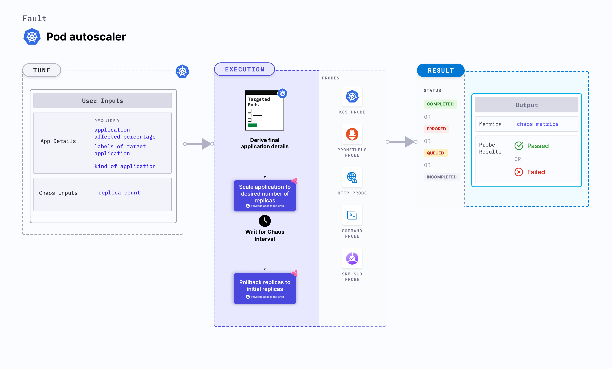

## Introduction
- The experiment aims to check the ability of nodes to accommodate the number of replicas a given application pod.

- This experiment can be used for other scenarios as well, such as for checking the Node auto-scaling feature. For example, check if the pods are successfully rescheduled within a specified period in cases where the existing nodes are already running at the specified limits.

:::tip Fault execution flow chart

:::

## Uses
<details>
<summary>View the uses of the experiment</summary>
<div>
Coming soon.
</div>
</details>

## Prerequisites
:::info
- Ensure that Kubernetes Version > 1.16.
:::

## Default Validations
:::note
The application pods should be in running state before and after chaos injection.
:::

## Experiment tunables
<details>
    <summary>Check the Experiment Tunables</summary>
    <h2>Optional Fields</h2>
    <table>
      <tr>
        <th> Variables </th>
        <th> Description </th>
        <th> Notes </th>
      </tr>
      <tr>
        <td> REPLICA_COUNT  </td>
        <td> Number of replicas upto which we want to scale </td>
        <td> <code>nil</code> </td>
      </tr>
    </table>
    <h2>Optional Fields</h2>
    <table>
      <tr>
        <th> Variables </th>
        <th> Description </th>
        <th> Notes </th>
      </tr>
      <tr>
        <td> TOTAL_CHAOS_DURATION </td>
        <td> The timeout for the chaos experiment (in seconds) </td>
        <td> Defaults to 60 </td>
      </tr>
      <tr>
        <td> LIB </td>
        <td> The chaos lib used to inject the chaos </td>
        <td> Defaults to <code>litmus</code> </td>
      </tr>
      <tr>
        <td> RAMP_TIME </td>
        <td> Period to wait before and after injection of chaos in sec </td>
        <td> </td>
      </tr>
    </table>
</details>

## Experiment Examples

### Common and Pod specific tunables
Refer the [common attributes](../../common-tunables-for-all-experiments) and [Pod specific tunable](./common-tunables-for-pod-experiments) to tune the common tunables for all experiments and pod specific tunables.

### Replica counts

It defines the number of replicas, which should be present in the targeted application during the chaos. It can be tuned via `REPLICA_COUNT` ENV.

Use the following example to tune this:

[embedmd]:# (./static/manifests/pod-autoscaler/replica-count.yaml yaml)
```yaml
# provide the number of replicas 
apiVersion: litmuschaos.io/v1alpha1
kind: ChaosEngine
metadata:
  name: engine-nginx
spec:
  engineState: "active"
  annotationCheck: "false"
  appinfo:
    appns: "default"
    applabel: "app=nginx"
    appkind: "deployment"
  chaosServiceAccount: pod-autoscaler-sa
  experiments:
  - name: pod-autoscaler
    spec:
      components:
        env:
        # number of replica, needs to scale
        - name: REPLICA_COUNT
          value: '3'
        - name: TOTAL_CHAOS_DURATION
          VALUE: '60'
```
