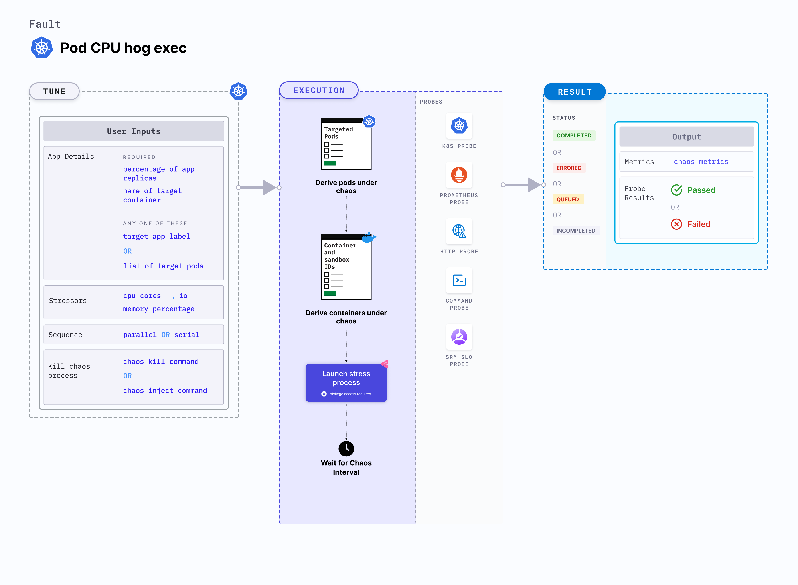

Pod CPU hog exec is a Kubernetes pod-level chaos fault that consumes excess CPU resources of the application container.
- It simulates conditions where the application pods experience CPU spikes due to expected (or undesired) processes thereby testing the behaviour of application stack.




## Use cases

Disk pressure or CPU hog affects Kubernetes applications which result in the eviction of the application replica and impacts its delivery. These issues are referred to as "noisy neighbour" problems.
The fault causes CPU stress on the target pod(s). It simulates the situation of lack of CPU for processes running on the application, which degrades their performance. It also helps verify metrics-based horizontal pod autoscaling as well as vertical autoscale, i.e. demand based CPU addition. It helps scalability of nodes based on growth beyond budgeted pods. It verifies the autopilot functionality of (cloud) managed clusters. 
Injecting a rogue process into a target container starves the main microservice (typically pid 1) of the resources allocated to it (where limits are defined). This slows down the application traffic or exhausts the resources leading to eviction of all pods. These faults helps build immunity to such stress cases.
It benefits include verifying multi-tenant load issues (when the load increases on one container, it does not cause downtime in other containers). 


:::note
- Kubernetes > 1.16 is required to execute this fault.
- The application pods should be in the running state before and after injecting chaos.
:::

## Fault tunables

  <h3>Optional fields</h3>
    <table>
      <tr>
        <th> Variables </th>
        <th> Description </th>
        <th> Notes </th>
      </tr>
      <tr>
        <td> CPU_CORES </td>
        <td> Number of the CPU cores subjected to CPU stress </td>
        <td> Defaults to 1 </td>
      </tr>
      <tr>
        <td> TOTAL_CHAOS_DURATION </td>
        <td> The time duration for chaos insertion (seconds) </td>
        <td> Default to 60s </td>
      </tr>
      <tr>
        <td> TARGET_PODS </td>
        <td> Comma separated list of application pod name subjected to pod CPU hog chaos</td>
        <td> If not provided, it will select target pods randomly based on provided appLabels</td>
      </tr> 
      <tr> 
        <td> TARGET_CONTAINER </td>
        <td> Name of the target container under chaos </td>
        <td> If not provided, it will select the first container of the target pod </td>
      </tr> 
      <tr>
        <td> PODS_AFFECTED_PERC </td>
        <td> The Percentage of total pods to target </td>
        <td> Defaults to 0 (corresponds to 1 replica), provide numeric value only </td>
      </tr>
      <tr>
        <td> CHAOS_INJECT_COMMAND </td>
        <td> The command to inject the CPU chaos </td>
        <td> Default to <code>md5sum /dev/zero</code> </td>
      </tr>
      <tr>
        <td> CHAOS_KILL_COMMAND </td>
        <td> The command to kill the chaos process</td>
        <td> Default to <code>kill $(find /proc -name exe -lname '*/md5sum' 2>&1 | grep -v 'Permission denied' | awk -F/ '&#123;print $(NF-1)&#125;')</code>. Another useful one that generally works (in case the default doesn't) is <code>kill -9 $(ps afx | grep \"[md5sum] /dev/zero\" | awk '&#123;print $1&#125;' | tr '\n' ' ')</code>. In case neither works, please check whether the target pod's base image offers a shell. If yes, identify appropriate shell command to kill the chaos process. </td>
      </tr>
      <tr>
        <td> RAMP_TIME </td>
        <td> Period to wait before injection of chaos in sec </td>
        <td> For example, 30 </td>
      </tr>
      <tr>
        <td> SEQUENCE </td>
        <td> It defines sequence of chaos execution for multiple target pods </td>
        <td> Default value: parallel. Supported: serial, parallel </td>
      </tr>
    </table>


### CPU cores

It specifies the number of CPU cores to target for a duration specified by `TOTAL_CHAOS_DURATION` environment variable. You can tune it using the `CPU_CORE` environment variable. 

Use the following example to tune it:

[embedmd]: # "./static/manifests/pod-cpu-hog-exec/cpu-cores.yaml yaml"

```yaml
# CPU cores for the stress
apiVersion: litmuschaos.io/v1alpha1
kind: ChaosEngine
metadata:
  name: engine-nginx
spec:
  engineState: "active"
  annotationCheck: "false"
  appinfo:
    appns: "default"
    applabel: "app=nginx"
    appkind: "deployment"
  chaosServiceAccount: litmus-admin
  experiments:
    - name: pod-cpu-hog-exec
      spec:
        components:
          env:
            # CPU cores for stress
            - name: CPU_CORES
              value: "1"
            - name: TOTAL_CHAOS_DURATION
              value: "60"
```

### Chaos inject and kill commands

It specifies the `CHAOS_INJECT_COMMAND` and `CHAOS_KILL_COMMAND` environment variables to set the chaos inject and chaos kill commands, respectively.
Default values of commands:

- `CHAOS_INJECT_COMMAND`: "md5sum /dev/zero"
- `CHAOS_KILL_COMMAND`: "kill $(find /proc -name exe -lname '\*/md5sum' 2>&1 | grep -v 'Permission denied' | awk -F/ '{print $(NF-1)}')"

Use the following example to tune it:

[embedmd]: # "./static/manifests/pod-cpu-hog-exec/inject-and-kill-commands.yaml yaml"

```yaml
# provide the chaos kill, used to kill the chaos process
apiVersion: litmuschaos.io/v1alpha1
kind: ChaosEngine
metadata:
  name: engine-nginx
spec:
  engineState: "active"
  annotationCheck: "false"
  appinfo:
    appns: "default"
    applabel: "app=nginx"
    appkind: "deployment"
  chaosServiceAccount: litmus-admin
  experiments:
    - name: pod-cpu-hog-exec
      spec:
        components:
          env:
            # command to create the md5sum process to stress the cpu
            - name: CHAOS_INJECT_COMMAND
              value: "md5sum /dev/zero"
            # command to kill the md5sum process
            # alternative command: "kill -9 $(ps afx | grep \"[md5sum] /dev/zero\" | awk '{print$1}' | tr '\n' ' ')"
            - name: CHAOS_KILL_COMMAND
              value: "kill $(find /proc -name exe -lname '*/md5sum' 2>&1 | grep -v 'Permission denied' | awk -F/ '{print $(NF-1)}')"
            - name: TOTAL_CHAOS_DURATION
              value: "60"
```
