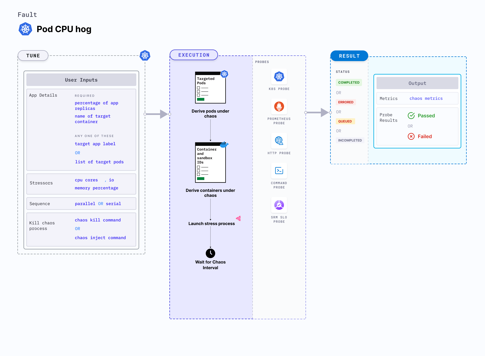

Pod CPU hog is a Kubernetes pod-level chaos fault that excessively consumes CPU resources, resulting in a significant increase in the CPU resource usage of a pod.
- Simulates a situation where an application's CPU resource usage unexpectedly spikes.




## Use cases

Disk pressure or CPU hog affects Kubernetes applications which result in the eviction of the application replica and impacts its delivery. These issues are referred to as "noisy neighbour" problems.
The fault causes CPU stress on the target pod(s). It simulates the situation of lack of CPU for processes running on the application, which degrades their performance. It also helps verify metrics-based horizontal pod autoscaling as well as vertical autoscale, i.e. demand based CPU addition. It helps scalability of nodes based on growth beyond budgeted pods. It verifies the autopilot functionality of (cloud) managed clusters. 
Injecting a rogue process into a target container starves the main microservice (typically pid 1) of the resources allocated to it (where limits are defined). This slows down the application traffic or exhausts the resources leading to eviction of all pods. These faults helps build immunity to such stress cases.
It benefits include verifying multi-tenant load issues (when the load increases on one container, it does not cause downtime in other containers). 


:::note
- Kubernetes > 1.16 is required to execute this fault.
- The application pods should be in the running state before and after injecting chaos.
:::

## Fault tunables

  <h3>Optional fields</h3>
    <table>
      <tr>
        <th> Variables </th>
        <th> Description </th>
        <th> Notes </th>
      </tr>
      <tr>
        <td> CPU_CORES </td>
        <td> Number of the CPU cores subjected to CPU stress </td>
        <td> Default to 1 </td>
      </tr>
      <tr>
        <td> TOTAL_CHAOS_DURATION </td>
        <td> The time duration for chaos insertion (seconds) </td>
        <td> Default to 60s </td>
      </tr>
      <tr>
        <td> LIB_IMAGE </td>
        <td> Image used to run the helper pod. </td>
        <td> Defaults to <code>litmuschaos/go-runner:1.13.8</code> </td>
      </tr>
      <tr>
        <td> STRESS_IMAGE </td>
        <td> Container run on the node at runtime by the pumba lib to inject stressors. Only used in LIB <code>pumba</code></td>
        <td> Default to <code>alexeiled/stress-ng:latest-ubuntu</code> </td>
      </tr>
      <tr>
        <td> TARGET_PODS </td>
        <td> Comma separated list of application pod name subjected to pod CPU hog chaos</td>
        <td> If not provided, it will select target pods randomly based on provided appLabels</td>
      </tr> 
      <tr> 
        <td> TARGET_CONTAINER </td>
        <td> Name of the target container under chaos </td>
        <td> If not provided, it will select the first container of the target pod </td>
      </tr> 
      <tr>
        <td> PODS_AFFECTED_PERC </td>
        <td> The Percentage of total pods to target </td>
        <td> Defaults to 0 (corresponds to 1 replica), provide numeric value only </td>
      </tr>
      <tr>
        <td> CONTAINER_RUNTIME </td>
        <td> container runtime interface for the cluster</td>
        <td> Defaults to containerd, supported values: docker, containerd and crio </td>
      </tr>
      <tr>
        <td> SOCKET_PATH </td>
        <td> Path of the containerd/crio/docker socket file </td>
        <td> Defaults to <code>/run/containerd/containerd.sock</code> </td>
      </tr> 
      <tr>
        <td> RAMP_TIME </td>
        <td> Period to wait before injection of chaos in sec </td>
        <td> For example, 30 </td>
      </tr>
      <tr>
        <td> SEQUENCE </td>
        <td> It defines sequence of chaos execution for multiple target pods </td>
        <td> Default value: parallel. Supported: serial, parallel </td>
      </tr>
    </table>


### CPU Cores

It specifies the number of CPU cores to target for a duration specified by `TOTAL_CHAOS_DURATION` environment variable. You can tune it using the `CPU_CORE` environment variable. 

Use the following example to tune tithis:

[embedmd]:# (./static/manifests/pod-cpu-hog/cpu-cores.yaml yaml)
```yaml
# CPU cores for the stress
apiVersion: litmuschaos.io/v1alpha1
kind: ChaosEngine
metadata:
  name: engine-nginx
spec:
  engineState: "active"
  annotationCheck: "false"
  appinfo:
    appns: "default"
    applabel: "app=nginx"
    appkind: "deployment"
  chaosServiceAccount: litmus-admin
  experiments:
  - name: pod-cpu-hog
    spec:
      components:
        env:
        # CPU cores for stress
        - name: CPU_CORES
          value: '1'
        - name: TOTAL_CHAOS_DURATION
          value: '60'
```

### CPU load

It contains percentage of pod CPU to be consumed. You can tune it using the `CPU_LOAD` ENV.

Use the following example to tune it:

[embedmd]: # "./static/manifests/pod-cpu-hog/cpu-load.yaml yaml"

```yaml
# CPU load for the stress
apiVersion: litmuschaos.io/v1alpha1
kind: ChaosEngine
metadata:
  name: engine-nginx
spec:
  engineState: "active"
  annotationCheck: "false"
  appinfo:
    appns: "default"
    applabel: "app=nginx"
    appkind: "deployment"
  chaosServiceAccount: litmus-admin
  experiments:
    - name: pod-cpu-hog
      spec:
        components:
          env:
            # CPU load in percentage for the stress
            - name: CPU_LOAD
              value: "100"
            # CPU core should be provided as 0 for CPU load
            # to work, otherwise it will take CPU core as priority
            - name: CPU_CORES
              value: "0"
            - name: TOTAL_CHAOS_DURATION
              value: "60"
```

### Container runtime and socket path

It defines the `CONTAINER_RUNTIME` and `SOCKET_PATH` ENV to set the container runtime and socket file path.

- `CONTAINER_RUNTIME`: It supports `docker`, `containerd`, and `crio` runtimes. The default value is `containerd`.
- `SOCKET_PATH`: It contains path of containerd socket file by default(`/run/containerd/containerd.sock`). For `docker`, specify path as `/var/run/docker.sock`. For `crio`, specify path as `/var/run/crio/crio.sock`.

Use the following example to tune it:

[embedmd]: # "./static/manifests/pod-cpu-hog/container-runtime-and-socket-path.yaml yaml"

```yaml
## provide the container runtime and socket file path
apiVersion: litmuschaos.io/v1alpha1
kind: ChaosEngine
metadata:
  name: engine-nginx
spec:
  engineState: "active"
  annotationCheck: "false"
  appinfo:
    appns: "default"
    applabel: "app=nginx"
    appkind: "deployment"
  chaosServiceAccount: litmus-admin
  experiments:
    - name: pod-cpu-hog
      spec:
        components:
          env:
            # runtime for the container
            # supports docker, containerd, crio
            - name: CONTAINER_RUNTIME
              value: "containerd"
            # path of the socket file
            - name: SOCKET_PATH
              value: "/run/containerd/containerd.sock"
            - name: TOTAL_CHAOS_DURATION
              VALUE: "60"
```