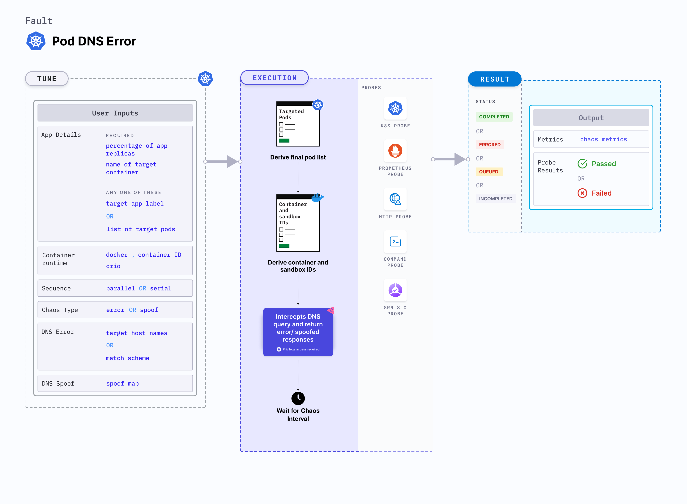

## Introduction
- Pod-dns-spoof injects chaos to spoof dns resolution in kubernetes pods.
- It causes dns resolution of target hostnames/domains to wrong IPs as specified by SPOOF_MAP in the engine config.

:::tip Fault execution flow chart

:::

## Uses
<details>
<summary>View the uses of the fault</summary>
<div>
Coming soon.
</div>
</details>

## Prerequisites
:::info
- Ensure that Kubernetes Version > 1.16.
:::

## Default Validations
:::note
The application pods should be in running state before and after chaos injection.
:::

## Fault Tunables
<details>
    <summary>Check the Fault Tunables</summary>
    <h2>Optional Fields</h2>
    <table>
      <tr>
        <th> Variables </th>
        <th> Description  </th>
        <th> Notes </th>
      </tr>
      <tr>
        <td> TARGET_CONTAINER </td>
        <td> Name of container which is subjected to dns spoof </td>
        <td> None </td>
      </tr>
      <tr>
        <td> TOTAL_CHAOS_DURATION </td>
        <td> The time duration for chaos insertion (seconds) </td>
        <td> Default (60s) </td>
      </tr>
      <tr>
        <td> SPOOF_MAP </td>
        <td> Map of the target hostnames eg. '&#123;"abc.com":"spoofabc.com"&#125;' where key is the hostname that needs to be spoofed and value is the hostname where it will be spoofed/redirected to.</td>
        <td> If not provided, no hostnames/domains will be spoofed</td>
      </tr>
      <tr>
        <td> PODS_AFFECTED_PERC </td>
        <td> The Percentage of total pods to target </td>
        <td> Defaults to 0 (corresponds to 1 replica), provide numeric value only </td>
      </tr>
      <tr>
        <td> CONTAINER_RUNTIME </td>
        <td> container runtime interface for the cluster</td>
        <td> Defaults to docker, supported values: docker</td>
      </tr>
      <tr>
        <td> SOCKET_PATH </td>
        <td> Path of the docker socket file </td>
        <td> Defaults to <code>/var/run/docker.sock</code> </td>
      </tr>
      <tr>
        <td> LIB </td>
        <td> The chaos lib used to inject the chaos </td>
        <td> Default value: litmus, supported values: litmus </td>
      </tr>
      <tr>
        <td> LIB_IMAGE </td>
        <td> Image used to run the netem command </td>
        <td> Defaults to <code>litmuschaos/go-runner:latest</code> </td>
      </tr>
      <tr>
        <td> RAMP_TIME </td>
        <td> Period to wait before and after injection of chaos in sec </td>
        <td> Eg. 30 </td>
      </tr>
      <tr>
        <td> SEQUENCE </td>
        <td> It defines sequence of chaos execution for multiple target pods </td>
        <td> Default value: parallel. Supported: serial, parallel </td>
      </tr>
    </table>
</details>

## Fault Examples

### Common and Pod specific tunables
Refer the [common attributes](../../common-tunables-for-all-faults) and [Pod specific tunable](./common-tunables-for-pod-faults) to tune the common tunables for all fault and pod specific tunables.

### Spoof Map

It defines the map of the target hostnames eg. '{"abc.com":"spoofabc.com"}' where the key is the hostname that needs to be spoofed and value is the hostname where it will be spoofed/redirected to. It can be tuned via `SPOOF_MAP` ENV.

Use the following example to tune this:

[embedmd]:# (./static/manifests/pod-dns-spoof/spoof-map.yaml yaml)
```yaml
# contains the spoof map for the dns spoofing
apiVersion: litmuschaos.io/v1alpha1
kind: ChaosEngine
metadata:
  name: engine-nginx
spec:
  engineState: "active"
  annotationCheck: "false"
  appinfo:
    appns: "default"
    applabel: "app=nginx"
    appkind: "deployment"
  chaosServiceAccount: litmus-admin
  experiments:
  - name: pod-dns-spoof
    spec:
      components:
        env:
        # map of host names
        - name: SPOOF_MAP
          value: '{"abc.com":"spoofabc.com"}'
        - name: TOTAL_CHAOS_DURATION
          value: '60'
```

### Container Runtime Socket Path

It defines the `CONTAINER_RUNTIME` and `SOCKET_PATH` ENV to set the container runtime and socket file path.

- `CONTAINER_RUNTIME`: It supports `docker` runtime only.
- `SOCKET_PATH`: It contains path of docker socket file by default(`/var/run/docker.sock`).

Use the following example to tune this:

[embedmd]:# (./static/manifests/pod-dns-spoof/container-runtime-and-socket-path.yaml yaml)
```yaml
## provide the container runtime and socket file path
apiVersion: litmuschaos.io/v1alpha1
kind: ChaosEngine
metadata:
  name: engine-nginx
spec:
  engineState: "active"
  annotationCheck: "false"
  appinfo:
    appns: "default"
    applabel: "app=nginx"
    appkind: "deployment"
  chaosServiceAccount: litmus-admin
  experiments:
  - name: pod-dns-spoof
    spec:
      components:
        env:
        # runtime for the container
        # supports docker
        - name: CONTAINER_RUNTIME
          value: 'docker'
        # path of the socket file
        - name: SOCKET_PATH
          value: '/var/run/docker.sock'
        # map of host names
        - name: SPOOF_MAP
          value: '{"abc.com":"spoofabc.com"}'
        - name: TOTAL_CHAOS_DURATION
          VALUE: '60'
```
