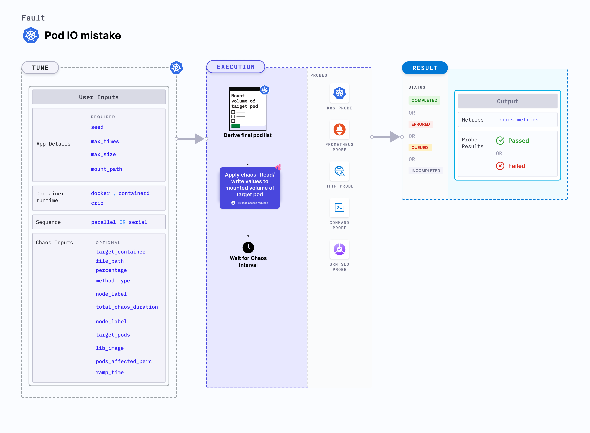

import IOFaultsCaution from './shared/io-faults-caution.md'

Pod IO mistake simulates a scenario where the file system in the mounted volume of the pod reads or writes incorrect values. This fault determines how the application handles data corruption or errors during file operations, ensuring robustness and stability under adverse conditions.



## Use cases
Pod IO mistake:
- Verify the application's ability to detect and recover from data corruption caused by incorrect file read/write operations
- Ensure the application can handle and log errors appropriately when encountering unexpected data values.
- Test how the application manages unauthorized or corrupted data access attempts to prevent security breaches.
- Assess the application's performance and stability when operating with corrupted data to identify potential bottlenecks or failure points.

<IOFaultsCaution />

:::warning
It is recommended to use "mistake" only for READ file system calls. Applying "mistake" to other file system calls can result in unforeseen issues, such as file system damage, corrupted writes and program crashes.
:::

### Permissions required

Below is a sample Kubernetes role that defines the permissions required to execute the fault.

```
apiVersion: rbac.authorization.k8s.io/v1
kind: Role
metadata:
  namespace: hce
  name: pod-io-mistake
spec:
  definition:
    scope: Cluster # Supports "Namespaced" mode too
permissions:
  - apiGroups: [""]
    resources: ["pods"]
    verbs: ["create", "delete", "get", "list", "patch", "deletecollection", "update"]
  - apiGroups: [""]
    resources: ["events"]
    verbs: ["create", "get", "list", "patch", "update"]
  - apiGroups: [""]
    resources: ["pods/log"]
    verbs: ["get", "list", "watch"]
  - apiGroups: [""]
    resources: ["deployments, statefulsets"]
    verbs: ["get", "list"]
  - apiGroups: [""]
    resources: ["replicasets, daemonsets"]
    verbs: ["get", "list"]
  - apiGroups: [""]
    resources: ["chaosEngines", "chaosExperiments", "chaosResults"]
    verbs: ["create", "delete", "get", "list", "patch", "update"]
  - apiGroups: ["batch"]
    resources: ["jobs"]
    verbs: ["create", "delete", "get", "list", "deletecollection"]
```

### Prerequisites
- Kubernetes > 1.16
- The application pods should be in the running state before and after injecting chaos.

### Mandatory tunables

   <table>
      <tr>
        <th> Tunable </th>
        <th> Description </th>
        <th> Notes </th>
      </tr>
      <tr>
        <td> SEED </td>
        <td> Specify the wrong data to be seed </td>
        <td> It supports <code>zero</code> and <code>random</code> values. Defaults to zero. For more information, go to <a href="#mistake">seed</a>.</td>
      </tr>
      <tr>
        <td> MAX_TIMES </td>
        <td> Maximum number of places to seed the wrong data </td>
        <td> Defaults to 1. For more information, go to <a href="#mistake">max times</a>.</td>
      </tr>
      <tr>
        <td> MAX_SIZE </td>
        <td> Maximum size of the data to be seeded in bytes </td>
        <td> Defaults to 8. For more information, go to <a href="#mistake">max size</a>.</td>
      </tr>
      <tr>
        <td> MOUNT_PATH </td>
        <td> The absolute mount path of the volume mounted to the target pod</td>
        <td> For more information, go to <a href="#mount-path">mount path</a>. </td>
      </tr>
    </table>

### Optional tunables
  <table>
      <tr>
        <th> Tunable </th>
        <th> Description </th>
        <th> Notes </th>
      </tr>
      <tr>
        <td> TARGET_CONTAINER </td>
        <td> Name of the container subject to IO error </td>
        <td> If the value is not provided, the fault injects chaos on the first container of the pod. For more information, go to <a href="https://developer.harness.io/docs/chaos-engineering/chaos-faults/kubernetes/pod/common-tunables-for-pod-faults#target-specific-container">target specific container</a>.</td>
      </tr>
      <tr>
        <td> FILE_PATH </td>
        <td> The path for injecting faults can be specified as either a single file or a wildcard. If not provided, it will target all the files present inside the mount path </td>
        <td> For more information, go to <a href="#advanced-fault-tunables">file path</a>. </td>
      </tr>
      <tr>
        <td> PERCENTAGE </td>
        <td> The likelihood of failure per operation, expressed as a percentage </td>
        <td> For more information, go to <a href="#advanced-fault-tunables">percentage</a>. </td>
      </tr>
      <tr>
        <td> METHOD_TYPES </td>
        <td> This contains the file system call or methods. </td>
        <td> For more information, go to <a href="#advanced-fault-tunables">method types</a>. </td>
      </tr>
      <tr>
        <td> CONTAINER_RUNTIME </td>
        <td> Container runtime interface for the cluster </td>
        <td> Default: containerd. Supports docker, containerd and crio. For more information, go to <a href="#container-runtime-and-socket-path">container runtime </a>. </td>
      </tr>
      <tr>
        <td> SOCKET_PATH </td>
        <td> Path of the containerd or crio or docker socket file </td>
        <td> Defaults to <code>/run/containerd/containerd.sock</code>. For more information, go to <a href="#container-runtime-and-socket-path">socket path</a>.</td>
      </tr>
      <tr>
        <td> TOTAL_CHAOS_DURATION </td>
        <td> Duration to inject insert chaos (in seconds) </td>
        <td> Default: 60s. </td>
      </tr>
      <tr>
        <td> NODE_LABEL </td>
        <td> Node label used to filter the target node if <code>TARGET_NODE</code> environment variable is not set. </td>
        <td> It is mutually exclusive with the <code>TARGET_NODE</code> environment variable. If both are provided, the fault uses <code>TARGET_NODE</code>. For more information, go to <a href="/docs/chaos-engineering/chaos-faults/kubernetes/node/common-tunables-for-node-faults#target-nodes-with-labels">node label.</a></td>
      </tr>
      <tr>
        <td> TARGET_PODS </td>
        <td> Comma-separated list of application pod names subject to pod IO error </td>
        <td> If not provided, the fault selects target pods randomly based on provided appLabels. For more information go to <a href="/docs/chaos-engineering/chaos-faults/kubernetes/pod/common-tunables-for-pod-faults/#target-specific-pods">target specific pods</a>.</td>
      </tr>
      <tr>
        <td> LIB_IMAGE </td>
        <td> Image used to inject chaos. </td>
        <td> Default: <code>harness/chaos-go-runner:main-latest</code>. For more information, go to <a href = "/docs/chaos-engineering/chaos-faults/common-tunables-for-all-faults#image-used-by-the-helper-pod">image used by the helper pod.</a></td>
      </tr>
      <tr>
        <td> PODS_AFFECTED_PERC </td>
        <td> Percentage of total pods to target. Provide numeric values. </td>
        <td> Default: 0 (corresponds to 1 replica). For more information, go to <a href="/docs/chaos-engineering/chaos-faults/kubernetes/pod/common-tunables-for-pod-faults#pod-affected-percentage">pod affected percentage</a>.</td>
      </tr>
      <tr>
        <td> RAMP_TIME </td>
        <td> Period to wait before and after injecting chaos (in seconds) </td>
        <td> For example, 30s. For more information, go to <a href="/docs/chaos-engineering/chaos-faults/common-tunables-for-all-faults#ramp-time">ramp time</a>.</td>
      </tr>
      <tr>
        <td> SEQUENCE </td>
        <td> Sequence of chaos execution for multiple target pods </td>
        <td> Default: parallel. Supports serial and parallel. For more information, go to <a href="/docs/chaos-engineering/chaos-faults/common-tunables-for-all-faults#sequence-of-chaos-execution">sequence of chaos execution</a>.</td>
      </tr>
    </table>

### Mistake

- `SEED`: Wrong data to be seeded in system calls of the files located within the mounted volume of the pod. It supports `zero` and `random` values.
- `MAX_TIMES`: Maximum number of locations where incorrect data can be seeded at once.
- `MAX_SIZE`: Maximum size of the data to be seeded, in bytes.

The following YAML snippet illustrates the use of this environment variable:

[embedmd]:# (./static/manifests/pod-io-mistake/mistake.yaml yaml)
```yaml
# it injects io mistake in the file system calls
apiVersion: litmuschaos.io/v1alpha1
kind: ChaosEngine
metadata:
  name: engine-nginx
spec:
  engineState: "active"
  annotationCheck: "false"
  appinfo:
    appns: "default"
    applabel: "app=nginx"
    appkind: "deployment"
  chaosServiceAccount: litmus-admin
  experiments:
  - name: pod-io-mistake
    spec:
      components:
        env:
        # seed the wrong data
        - name: SEED
          value: 'zero'
        # maximum number of places to seed the wrong data
        - name: MAX_TIMES
          value: '1'
        # maximum size of the data to be seeded in bytes
        - name: MAX_SIZE
          value: '8'
        - name: MOUNT_PATH
          value: '/etc/config'
        - name: TOTAL_CHAOS_DURATION
          value: '60'
```

### Mount path

Mount path of the volume mounted to the target application. Tune it by using the `MOUNT_PATH` environment variable.

The following YAML snippet illustrates the use of this environment variable:

[embedmd]:# (./static/manifests/pod-io-mistake/mount-path.yaml yaml)
```yaml
# it injects io mistake in the file system calls
apiVersion: litmuschaos.io/v1alpha1
kind: ChaosEngine
metadata:
  name: engine-nginx
spec:
  engineState: "active"
  annotationCheck: "false"
  appinfo:
    appns: "default"
    applabel: "app=nginx"
    appkind: "deployment"
  chaosServiceAccount: litmus-admin
  experiments:
  - name: pod-io-mistake
    spec:
      components:
        env:
        # mount path of the volume
        - name: MOUNT_PATH
          value: '/etc/config'
        - name: SEED
          value: 'zero'
        - name: TOTAL_CHAOS_DURATION
          value: '60'
```

### Advanced fault tunables

- `FILE_PATH`: The path for injecting faults can be specified as either a single file or a wildcard. By default, it targets all the files present inside the mount path.
- `PERCENTAGE`: The likelihood of failure per operation, expressed as a percentage. Default is 100%.
- `METHOD_TYPES`: This contains the file system call or methods. By default, it targets read and write methods. For all supported methods, refer to the [Methods](https://docs.rs/fuser/0.7.0/fuser/trait.Filesystem.html)

The following YAML snippet illustrates the use of this environment variable:

[embedmd]:# (./static/manifests/pod-io-mistake/advanced-fault-tunables.yaml yaml)
```yaml
# it injects io mistake in the file system calls
apiVersion: litmuschaos.io/v1alpha1
kind: ChaosEngine
metadata:
  name: engine-nginx
spec:
  engineState: "active"
  annotationCheck: "false"
  appinfo:
    appns: "default"
    applabel: "app=nginx"
    appkind: "deployment"
  chaosServiceAccount: litmus-admin
  experiments:
  - name: pod-io-mistake
    spec:
      components:
        env:
        # filter the target files
        - name: FILE_PATH
          value: '/etc/config/file.txt'
        # percentage of i/o calls
        - name: PERCENTAGE
          value: '50'
        # names of the io methods
        - name: METHOD_TYPES
          value: '["read","write"]'
        - name: SEED
          value: 'zero'
        - name: MOUNT_PATH
          value: '/etc/config'
        - name: TOTAL_CHAOS_DURATION
          value: '60'
```

### Container runtime and socket path

The `CONTAINER_RUNTIME` and `SOCKET_PATH` are environment variables to set the container runtime and socket file path, respectively.

- `CONTAINER_RUNTIME`: This supports `docker`, `containerd`, and `crio` runtimes. The default value is `containerd`.
- `SOCKET_PATH`: This contains the path of containerd socket file by default (`/run/containerd/containerd.sock`). For `docker`, specify the path as `/var/run/docker.sock`. For `crio`, specify the path as `/var/run/crio/crio.sock`.

The following YAML snippet illustrates the use of these environment variables:

[embedmd]:# (./static/manifests/pod-io-mistake/container-runtime-and-socket-path.yaml yaml)
```yaml
## provide the container runtime and socket file path
apiVersion: litmuschaos.io/v1alpha1
kind: ChaosEngine
metadata:
  name: engine-nginx
spec:
  engineState: "active"
  annotationCheck: "false"
  appinfo:
    appns: "default"
    applabel: "app=nginx"
    appkind: "deployment"
  chaosServiceAccount: litmus-admin
  experiments:
  - name: pod-io-mistake
    spec:
      components:
        env:
        # runtime for the container
        # supports docker, containerd, crio
        - name: CONTAINER_RUNTIME
          value: 'containerd'
        # path of the socket file
        - name: SOCKET_PATH
          value: '/run/containerd/containerd.sock'
        - name: SEED
          value: 'zero'
        - name: MOUNT_PATH
          value: '/etc/config'
        - name: TOTAL_CHAOS_DURATION
          VALUE: '60'
```
