## Introduction
- Pod memory hog is a Kubernetes pod-level chaos fault that consumes memory resources in excess, resulting in a significant spike in the memory usage of a pod.
- This fault simulates a condition where the memory usage of an application spikes up unexpectedly.  

**Illustration of how pod memory hog is executed**

:::tip Flow chart that describes how the fault is executed

:::

## Usage
<details>
<summary>View the uses of the fault</summary>
<div>
**REWRITE**
Memory usage within containers is subject to various constraints in Kubernetes. If the limits are specified in their spec, exceeding them can cause termination of the container (due to OOMKill of the primary process, often pid 1) - the restart of the container by kubelet, subject to the policy specified. For containers with no limits placed, the memory usage is uninhibited until such time as the Node level OOM behavior takes over. In this case, containers on the node can be killed based on their oom_score and the QoS class a given pod belongs to (bestEffort ones are first to be targeted). This eval is extended to all pods running on the node - thereby causing a bigger blast radius. 

This fault launches a stress process within the target container - which can cause either the primary process in the container to be resource constrained in cases where the limits are enforced OR eat up available system memory on the node in cases where the limits are not specified.
</div>
</details>

## Prerequisites
:::info
- Kubernetes > 1.16
:::

## Steps to implement pod memory hog

**NOTE:** It is assumed that you already have the boutique app set up in a namespace. If not, follow [this](provide link) to set up your boutique application.

To execute pod memory hog, it is essential to tweak a section of the **app.yaml**. In the **deployment** kind, for **cartservice**, uncomment the following lines.

```
resources:
  requests:
    cpu: 200m
    memory: 64Mi
  limits:
    cpu: 300m
    memory: 128Mi
```

[link](provide) to setup experiment to execute chaos faults.

* On the right pane, select **Kubernetes** that displays a list of Kubernetes faults available. Select the **pod-memory-hog**. 

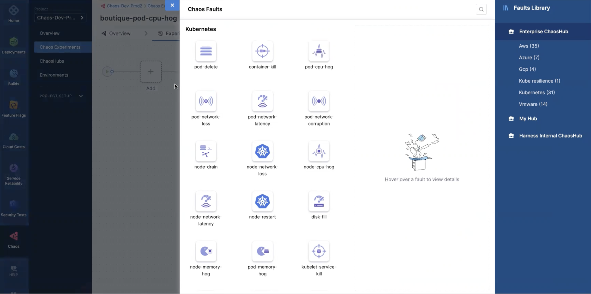

* This leads you to a page where you can specify parameters for the **Target application**, **Tune fault**, and **Probes**.

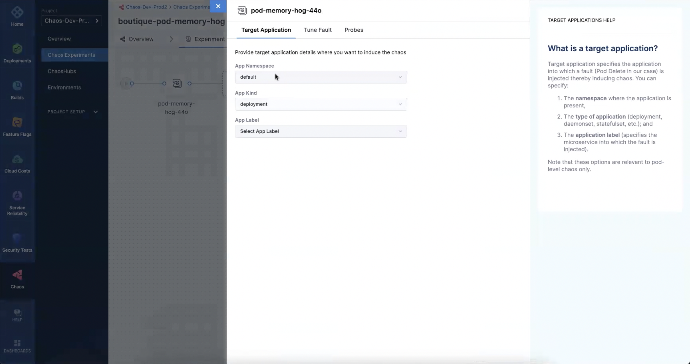

* The **Target application** section has three parameters:
  
**Specify the parameters and explain them**

* The **Tune fault** section has three parameters

**Specify the parameters and explain them. Mention about container runtime, containerd, socket path.**

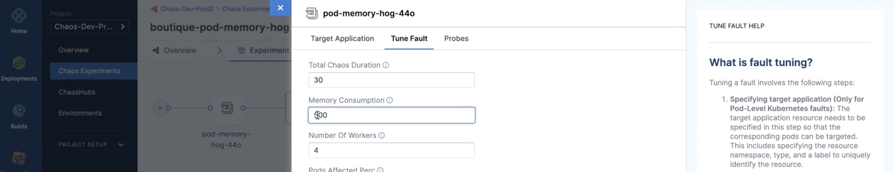

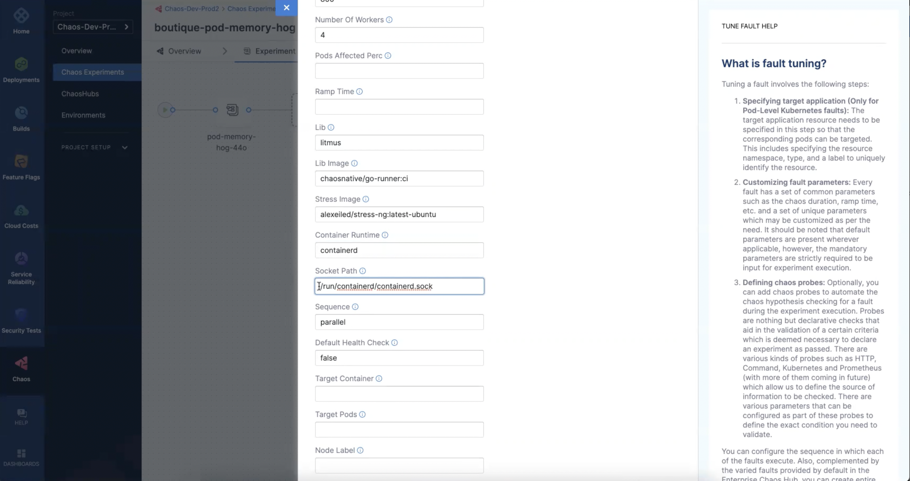

* In the **Probes** section, click on **Deploy new probe** to add a new probe. 

**Specify the parameters and explain them**

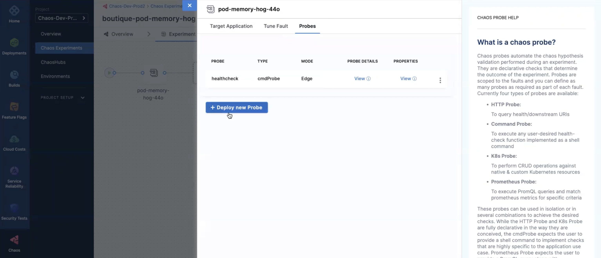

* Specify the **Probe name**, **Probe type**, and **Probe mode**. Click on **Continue**.
**Specify the parameters and explain them**


* Specify properties . Click **Continue**.
**Specify the parameters and explain them**


* Specify details . Click **Setup the probe**.
**Specify the parameters and explain them**

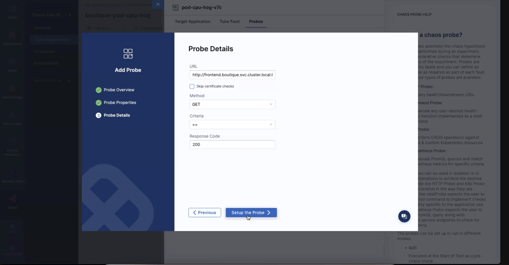

* You can see that the probe has been setup successfully with the parameters you specified. Close this pane by clicking on **X** at the top.

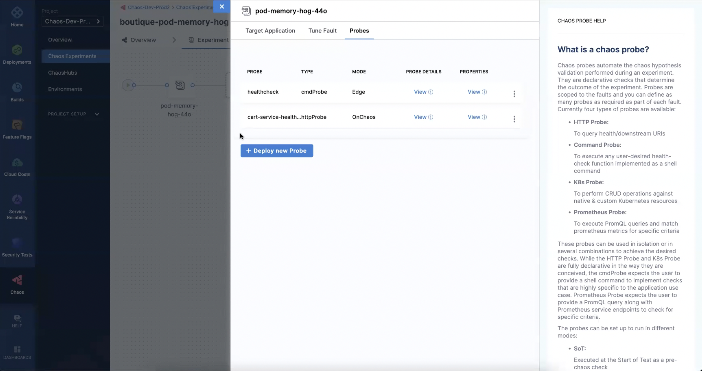

* Navigate to the next step of setting fault weights. Click the **Set fault weights** present on top. 

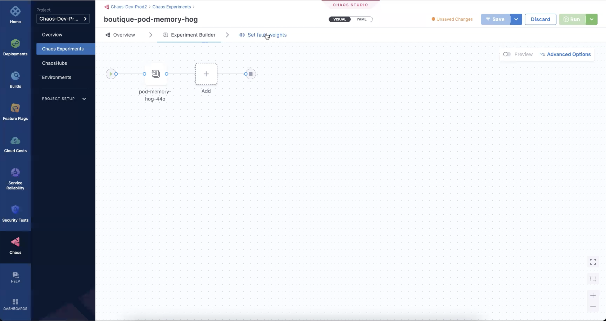

* Click **Run** to execute the experiment.

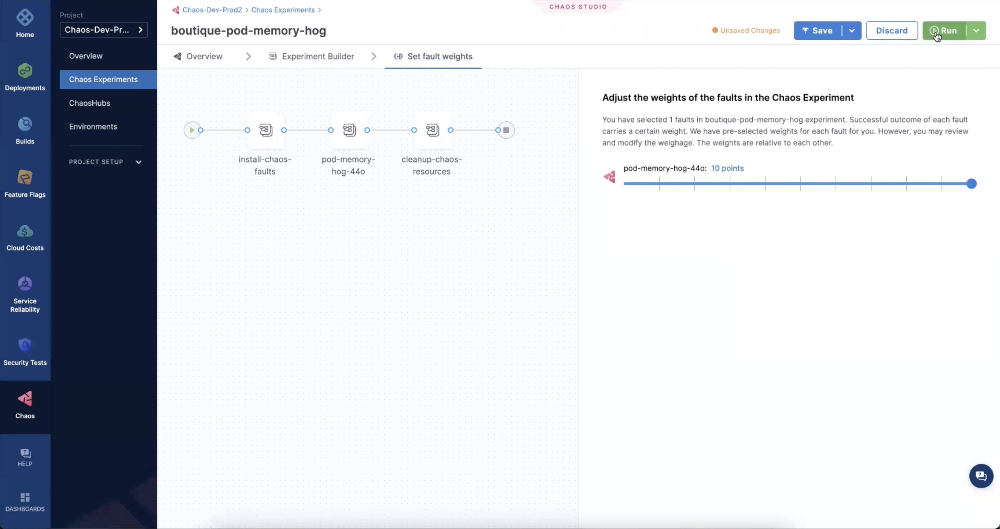

* Visit [this link](provide link) to set up Grafana dashboard to visualize the results before and after injecting chaos into the application. 

* Here is a representation of how memory usage is before chaos has been injected. You can execute the following command to check the memory usage:
```
kubectl top pods <service name> -n <application namespace>
```

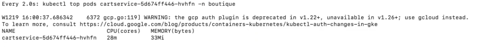

* Here is a representation of how memory usage changes after chaos has been injected.

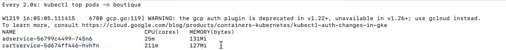

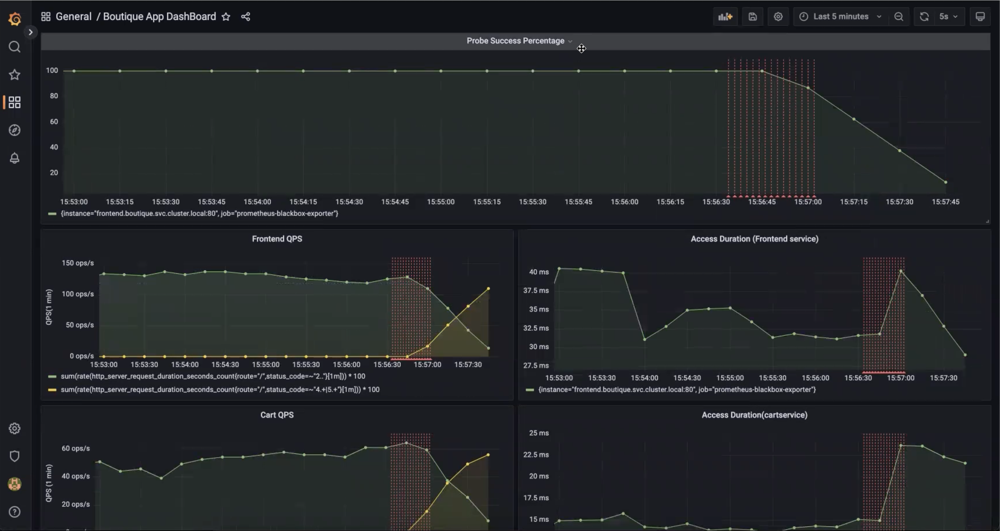


## Default validation
:::note
The pods in the application should be in the running state before and after the chaos has been injected.
:::

## Fault tunables
<details>
    <summary>Check the Fault Tunables</summary>
    <h2>Optional Fields</h2>
    <table>
      <tr>
        <th> Variables </th>
        <th> Description </th>
        <th> Notes </th>
      </tr>
      <tr>
        <td> MEMORY_CONSUMPTION </td>
        <td> The amount of memory used of hogging a Kubernetes pod (megabytes)</td>
        <td> Defaults to 500MB </td>
      </tr>
      <tr>
        <td> NUMBER_OF_WORKERS </td>
        <td> The number of workers used to run the stress process </td>
        <td> Defaults to 1 </td>
      </tr>  
      <tr>
        <td> TOTAL_CHAOS_DURATION </td>
        <td> The time duration for chaos insertion (seconds) </td>
        <td> Defaults to 60s </td>
      </tr>
      <tr>
        <td> LIB </td>
        <td> The chaos lib used to inject the chaos. Available libs are <code>litmus</code> and <code>pumba</code> </td>
        <td> Defaults to <code>litmus</code> </td>
      </tr>
      <tr>
        <td> LIB_IMAGE </td>
        <td> Image used to run the helper pod.</td>
        <td> Defaults to <code>litmuschaos/go-runner:1.13.8</code> </td>
      </tr>
      <tr>
        <td> STRESS_IMAGE </td>
        <td> Container run on the node at runtime by the pumba lib to inject stressors. Only used in LIB <code>pumba</code></td>
        <td> Default to <code>alexeiled/stress-ng:latest-ubuntu</code> </td>
      </tr>
      <tr>
        <td> TARGET_PODS </td>
        <td> Comma separated list of application pod name subjected to pod memory hog chaos</td>
        <td> If not provided, it will select target pods randomly based on provided appLabels</td>
      </tr>
      <tr>
        <td> TARGET_CONTAINER </td>
        <td> Name of the target container under chaos.</td>
        <td> If not provided, it will select the first container of the target pod</td>
      </tr>   
      <tr>
        <td> CONTAINER_RUNTIME </td>
        <td> container runtime interface for the cluster</td>
        <td> Defaults to docker, supported values: docker, containerd and crio for litmus and only docker for pumba LIB </td>
      </tr>
      <tr>
        <td> SOCKET_PATH </td>
        <td> Path of the containerd/crio/docker socket file </td>
        <td> Defaults to <code>/var/run/docker.sock</code> </td>
      </tr>        
      <tr>
        <td> PODS_AFFECTED_PERC </td>
        <td> The Percentage of total pods to target </td>
        <td> Defaults to 0 (corresponds to 1 replica), provide numeric value only </td>
      </tr>
      <tr>
        <td> RAMP_TIME </td>
        <td> Period to wait before injection of chaos in sec </td>
        <td> Eg. 30 </td>
      </tr>
      <tr>
        <td> SEQUENCE </td>
        <td> It defines sequence of chaos execution for multiple target pods </td>
        <td> Default value: parallel. Supported: serial, parallel </td>
      </tr>
    </table>
</details>

## Fault examples

### Common and pod-specific tunables
Refer the [common attributes](../../common-tunables-for-all-faults) and [pod specific tunables](./common-tunables-for-pod-faults) to tune the common tunables for all fault and pod specific tunables.

### Memory consumption

It stresses the `MEMORY_CONSUMPTION` MB memory of the targeted pod for the `TOTAL_CHAOS_DURATION` duration.

Use the following example to tune this:

[embedmd]:# (./static/manifests/pod-memory-hog/memory-consumption.yaml yaml)
```yaml
# define the memory consumption in MB
apiVersion: litmuschaos.io/v1alpha1
kind: ChaosEngine
metadata:
  name: engine-nginx
spec:
  engineState: "active"
  annotationCheck: "false"
  appinfo:
    appns: "default"
    applabel: "app=nginx"
    appkind: "deployment"
  chaosServiceAccount: litmus-admin
  experiments:
  - name: pod-memory-hog
    spec:
      components:
        env:
        # memory consumption value
        - name: MEMORY_CONSUMPTION
          value: '500' #in MB
        - name: TOTAL_CHAOS_DURATION
          value: '60'
```

### Workers for stress

The worker's count for the stress can be tuned with `NUMBER_OF_WORKERS` ENV. 

Use the following example to tune this:

[embedmd]:# (./static/manifests/pod-memory-hog/workers.yaml yaml)
```yaml
# number of workers used for the stress
apiVersion: litmuschaos.io/v1alpha1
kind: ChaosEngine
metadata:
  name: engine-nginx
spec:
  engineState: "active"
  annotationCheck: "false"
  appinfo:
    appns: "default"
    applabel: "app=nginx"
    appkind: "deployment"
  chaosServiceAccount: litmus-admin
  experiments:
  - name: pod-memory-hog
    spec:
      components:
        env:
        # number of workers for stress
        - name: NUMBER_OF_WORKERS
          value: '1'
        - name: TOTAL_CHAOS_DURATION
          value: '60'
```

### Container runtime socket path

It defines the `CONTAINER_RUNTIME` and `SOCKET_PATH` ENV to set the container runtime and socket file path.

- `CONTAINER_RUNTIME`: It supports `docker`, `containerd`, and `crio` runtimes. The default value is `docker`.
- `SOCKET_PATH`: It contains path of docker socket file by default(`/var/run/docker.sock`). For other runtimes provide the appropriate path.

### Pumba chaos library

It specifies the Pumba chaos library for the chaos injection. It can be tuned via `LIB` ENV. The defaults chaos library is `litmus`.
Provide the stress image via `STRESS_IMAGE` ENV for the pumba library.

Use the following example to tune this:

[embedmd]:# (./static/manifests/pod-memory-hog/pumba-lib.yaml yaml)
```yaml
# use the pumba lib for the memory stress
apiVersion: litmuschaos.io/v1alpha1
kind: ChaosEngine
metadata:
  name: engine-nginx
spec:
  engineState: "active"
  annotationCheck: "false"
  appinfo:
    appns: "default"
    applabel: "app=nginx"
    appkind: "deployment"
  chaosServiceAccount: litmus-admin
  experiments:
  - name: pod-memory-hog
    spec:
      components:
        env:
        # name of chaoslib
        # it supports litmus and pumba lib
        - name: LIB
          value: 'pumba'
        # stress image - applicable for pumba lib only
        - name: STRESS_IMAGE
          value: 'alexeiled/stress-ng:latest-ubuntu'
        - name: TOTAL_CHAOS_DURATION
          value: '60'
```